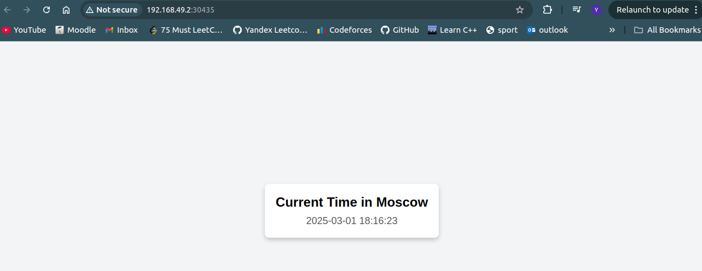
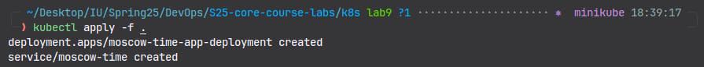
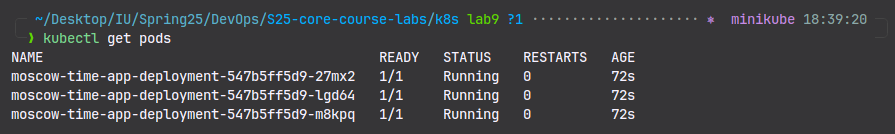
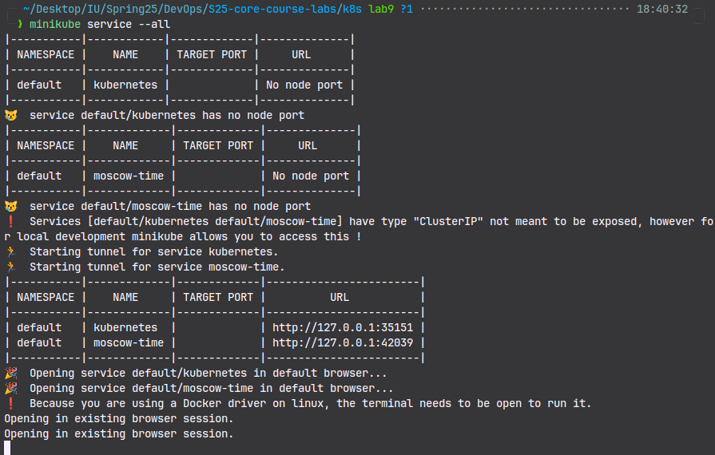
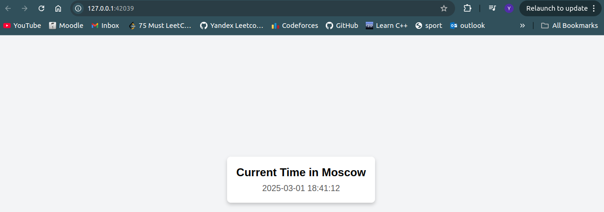

# Kubernetes Deployment and Service Exposure

## Step 1: Creating a Deployment

The following command creates a deployment named `moscow-time` using the Docker image `yoqub/app_python:latest`:

```bash
kubectl create deployment moscow-time --image=yoqub/app_python:latest
```

This command instructs Kubernetes to manage and deploy an application container based on the specified image.

## Step 2: Verifying the Deployment

To check the status of the deployment, use the following command:

```bash
kubectl get deployments
```

**Example Output:**

```bash
NAME          READY   UP-TO-DATE   AVAILABLE   AGE
moscow-time   0/1     1            0           6s
```

This indicates that the deployment has been created but the pod is not yet fully ready.

## Step 3: Retrieving the Pod Name

To get the name of the pod created by the deployment, execute:

```bash
kubectl get pods -o go-template --template '{{range .items}}{{.metadata.name}}{{"\n"}}{{end}}'
```

**Example Output:**

```bash
moscow-time-69c96f94d7-zp4w8
```

To store the pod name in an environment variable for future use, run:

```bash
export POD_NAME=$(kubectl get pods -o go-template --template '{{range .items}}{{.metadata.name}}{{"\n"}}{{end}}')
echo $POD_NAME
```

**Example Output:**

```bash
moscow-time-69c96f94d7-zp4w8
```

## Step 4: Exposing the Deployment as a Service

To expose the deployment as a service with a LoadBalancer type on port 5000, use:

```bash
kubectl expose deployment moscow-time --type=LoadBalancer --port=5000
```

**Example Output:**

```bash
service/moscow-time exposed
```

## Step 5: Accessing the Service

To access the service, use the `minikube` command to retrieve the assigned URL:

```bash
minikube service moscow-time
```

**Example Output:**

```bash
|-----------|-------------|-------------|---------------------------|
| NAMESPACE |    NAME     | TARGET PORT |            URL            |
|-----------|-------------|-------------|---------------------------|
| default   | moscow-time |        5000 | http://192.168.49.2:30435 |
|-----------|-------------|-------------|---------------------------|
🎉  Opening service default/moscow-time in default browser...
```

The application is now accessible at `http://192.168.49.2:30435`.



## Step 6: Checking the Status of Pods

To ensure the pod is running properly, execute:

```bash
kubectl get pods
```

**Example Output:**

```bash
NAME                           READY   STATUS    RESTARTS   AGE
moscow-time-69c96f94d7-zp4w8   1/1     Running   0          74m
```

## Step 7: Checking the Status of Services

To verify the status of services in the cluster, run:

```bash
kubectl get svc
```

**Example Output:**

```bash
NAME          TYPE           CLUSTER-IP      EXTERNAL-IP   PORT(S)          AGE
kubernetes    ClusterIP      10.96.0.1       <none>        443/TCP          83m
moscow-time   LoadBalancer   10.109.158.94   <pending>     5000:30435/TCP   8m12s
```

This output confirms that the `moscow-time` service is assigned an internal Cluster IP and exposed via a LoadBalancer, although the external IP is still pending.

## Step 8: Deleting the Service and Deployment

To remove the exposed service, execute:

```bash
kubectl delete service moscow-time
```

**Example Output:**

```bash
service "moscow-time" deleted
```

To delete the deployment and its associated pods, run:

```bash
kubectl delete deployment moscow-time
```

**Example Output:**

```bash
deployment.apps "moscow-time" deleted
```

## Summary

- Created a Kubernetes deployment running the `yoqub/app_python:latest` image.
- Verified the deployment and pod status.
- Exposed the deployment as a LoadBalancer service on port 5000.
- Retrieved the assigned URL and accessed the application.
- Deleted the service and deployment when no longer needed.

This guide provides a structured workflow to deploy, expose, monitor, and remove a Kubernetes-based application using Minikube.

## Declarative Kubernetes Manifests

- `cd k8s && kubectl apply -f .`



- `kubectl get pods`



- `minikube service --all`



- Application IP verification


