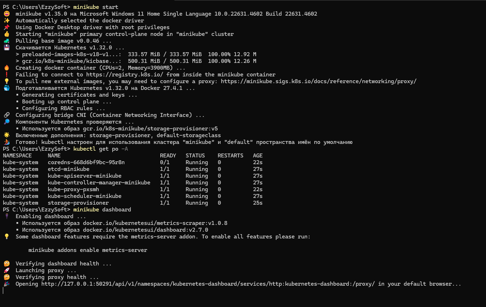
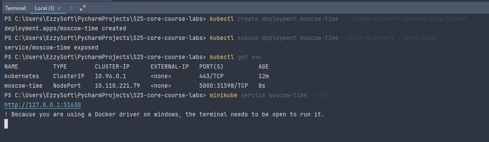
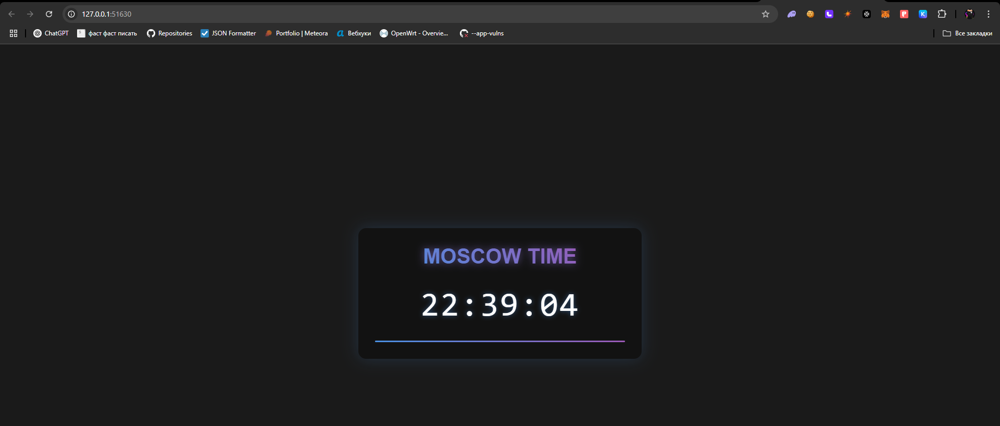
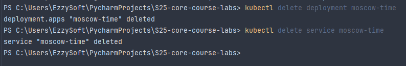
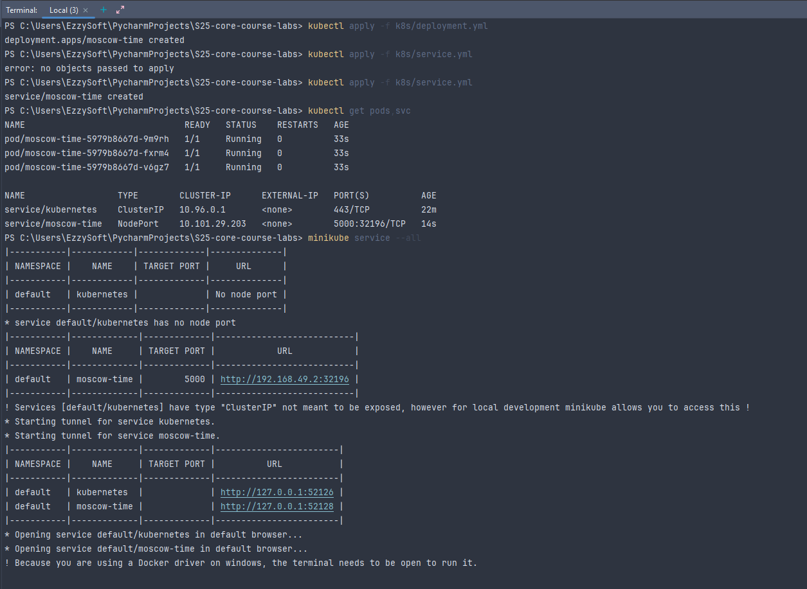
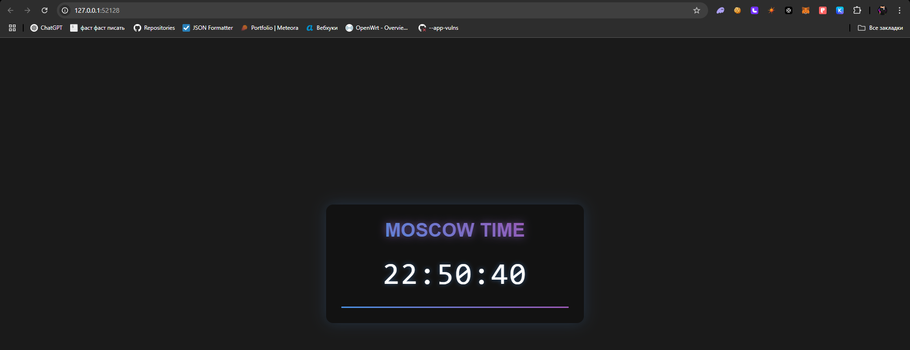

## Task 1: Kubernetes Setup and Basic Deployment

### Installed Kubernetes:



----

### Created and exposed Deployment object:



---

### Delete Deployment object:



## Task 2: Declarative Kubernetes Manifests)

### Deployment and Service:

---

#### `deployment.yml`:

```yaml
apiVersion: apps/v1
kind: Deployment
metadata:
  name: moscow-time
spec:
  replicas: 3
  selector:
    matchLabels:
      app: app
  template:
    metadata:
      labels:
        app: app
    spec:
      containers:
        - name: moscow-time
          image: ezzysoft/moscow-time:latest

          ports:
            - containerPort: 5000
```

#### `service.yml`:

```yaml
apiVersion: v1
kind: Service
metadata:
  name: moscow-time
spec:
  type: NodePort
  selector:
    app: app
  ports:
    - port: 5000
      targetPort: 5000
      protocol: TCP
```

---

### Deployed container:




### Output

```bash
PS C:\Users\EzzySoft\PycharmProjects\S25-core-course-labs> kubectl get pods,svc
NAME                               READY   STATUS    RESTARTS   AGE
pod/moscow-time-5979b8667d-9m9rh   1/1     Running   0          6m36s
pod/moscow-time-5979b8667d-fxrm4   1/1     Running   0          6m36s
pod/moscow-time-5979b8667d-v6gz7   1/1     Running   0          6m36s

NAME                  TYPE        CLUSTER-IP      EXTERNAL-IP   PORT(S)          AGE
service/kubernetes    ClusterIP   10.96.0.1       <none>        443/TCP          28m
service/moscow-time   NodePort    10.101.29.203   <none>        5000:32196/TCP   6m17s

```

Matched IP in `minikube service --all` and browser you can find above on screenshots.