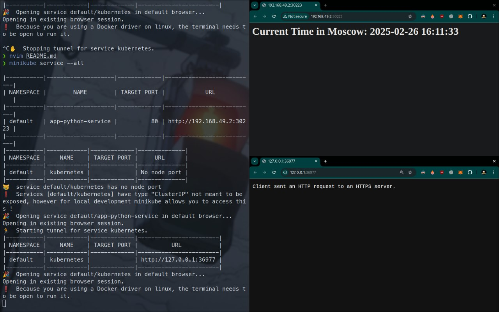

# Task 1
NAME                              READY   STATUS    RESTARTS   AGE
pod/app-python-867d49979d-8v5cv   1/1     Running   0          64s
pod/app-python-867d49979d-rwj2f   1/1     Running   0          64s

NAME                         TYPE        CLUSTER-IP     EXTERNAL-IP   PORT(S)        AGE
service/app-python-service   NodePort    10.101.61.40   <none>        80:31309/TCP   31s
service/kubernetes           ClusterIP   10.96.0.1      <none>        443/TCP        2m1s

# Task 2
NAME                              READY   STATUS    RESTARTS   AGE
pod/app-python-867d49979d-fwr76   1/1     Running   0          84s
pod/app-python-867d49979d-kbc4j   1/1     Running   0          84s
pod/app-python-867d49979d-l2v8l   1/1     Running   0          84s

NAME                         TYPE        CLUSTER-IP     EXTERNAL-IP   PORT(S)        AGE
service/app-python-service   NodePort    10.107.253.9   <none>        80:30223/TCP   53s
service/kubernetes           ClusterIP   10.96.0.1      <none>        443/TCP        11m


❯ minikube service --all

|-----------|--------------------|-------------|---------------------------|
| NAMESPACE |        NAME        | TARGET PORT |            URL            |
|-----------|--------------------|-------------|---------------------------|
| default   | app-python-service |          80 | http://192.168.49.2:30223 |
|-----------|--------------------|-------------|---------------------------|
|-----------|------------|-------------|--------------|
| NAMESPACE |    NAME    | TARGET PORT |     URL      |
|-----------|------------|-------------|--------------|
| default   | kubernetes |             | No node port |
|-----------|------------|-------------|--------------|
😿  service default/kubernetes has no node port
❗  Services [default/kubernetes] have type "ClusterIP" not meant to be exposed, however for local development minikube allows you to access this !
🎉  Opening service default/app-python-service in default browser...
Opening in existing browser session.
🏃  Starting tunnel for service kubernetes.
|-----------|------------|-------------|------------------------|
| NAMESPACE |    NAME    | TARGET PORT |          URL           |
|-----------|------------|-------------|------------------------|
| default   | kubernetes |             | http://127.0.0.1:36977 |
|-----------|------------|-------------|------------------------|
🎉  Opening service default/kubernetes in default browser...
Opening in existing browser session.
❗  Because you are using a Docker driver on linux, the terminal needs to be open to run it.



# Bonus

```bash
❯ cat /etc/hosts
# Static table lookup for hostnames.
# See hosts(5) for details.

127.0.0.1    localhost
::1          localhost
127.0.1.1    lanky.localdomain    lanky
127.0.0.1    gitlab.test.local
192.168.49.2 app.local nginx.local

❯ curl -I http://app.local
HTTP/1.1 503 Service Temporarily Unavailable
Date: Wed, 26 Feb 2025 13:25:42 GMT
Content-Type: text/html
Content-Length: 190
Connection: keep-alive

❯ curl -I http://nginx.local
HTTP/1.1 503 Service Temporarily Unavailable
Date: Wed, 26 Feb 2025 13:25:46 GMT
Content-Type: text/html
Content-Length: 190
Connection: keep-alive
```
