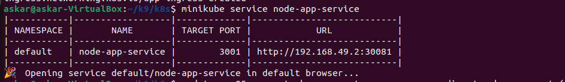

# Lab 9: Introduction to Kubernetes

In this lab we work with Kubernetes by setting up a local development environment with Minikube and deploying applications. We are deploying a Python application along with an extra Node.js application, exposing them via Services, and configuring Ingress for external access.


## Beginning Setup

**Loading python app from Docker in Minikube:** 


**Start Minikube:**  
   ```bash
   minikube start
   ```


---

## Kubernetes Setup and Basic Deployment

1. **Imperative Deployment:**  
   We use `kubectl create` to deploy Python application on the Minikube cluster.

    
   
2. **Expose the Application:**  
   We create a Service to expose the app outside the Kubernetes virtual network.

    
   
3. **Verification:**  
   Then we run the following to display pods and services:
   ```bash
   kubectl get pods,svc
   ```
    

    We also can veryfy by `minikube service flask-app`
    
    
    


## Declarative Kubernetes Manifests

### Python Application Deployment

- **deployment.yml**
  
  ```yaml
  apiVersion: apps/v1
  kind: Deployment
  metadata:
    name: python-app-deployment
    labels:
      app: python-app
  spec:
    replicas: 3
    selector:
      matchLabels:
        app: python-app
    template:
      metadata:
        labels:
          app: python-app
      spec:
        containers:
        - name: python-app
          image: twentythree3/flask-app:latest
          imagePullPolicy: IfNotPresent
          ports:
          - containerPort: 5001
          livenessProbe:
            httpGet:
              path: /health
              port: 5001
            initialDelaySeconds: 10
            periodSeconds: 10
          readinessProbe:
            httpGet:
              path: /health
              port: 5001
            initialDelaySeconds: 5
            periodSeconds: 5
  ```

- **service.yml**
  
  ```yaml
  apiVersion: v1
  kind: Service
  metadata:
    name: python-app-service
  spec:
    type: NodePort
    selector:
      app: python-app
    ports:
    - port: 5001
      targetPort: 5001
      nodePort: 30080
  ```

    After we applying these manifests with:
    ```bash
    kubectl apply -f k8s/deployment.yml
    kubectl apply -f k8s/service.yml
    ```
    and also check pods and svc by ` kubectl get pods,svc`

    

### Verification

We verify by `minikube service --all`.


---

## Bonus Task

To further enhance the deployment, we implemented additional manifests for a Node.js application and configured Ingress rules.

### Node.js Application Deployment

- **extra-deployment.yml**
  
  ```yaml
  apiVersion: apps/v1
  kind: Deployment
  metadata:
    name: node-app-deployment
    labels:
      app: node-app
  spec:
    replicas: 3
    selector:
      matchLabels:
        app: node-app
    template:
      metadata:
        labels:
          app: node-app
      spec:
        containers:
        - name: node-app
          image: twentythree3/myapp:latest
          imagePullPolicy: IfNotPresent
          ports:
          - containerPort: 3001
          livenessProbe:
            httpGet:
              path: /health
              port: 3001
            initialDelaySeconds: 10
            periodSeconds: 10
          readinessProbe:
            httpGet:
              path: /health
              port: 3001
            initialDelaySeconds: 5
            periodSeconds: 5
  ```

- **extra-service.yml**
  
  ```yaml
  apiVersion: v1
  kind: Service
  metadata:
    name: node-app-service
  spec:
    type: NodePort
    selector:
      app: node-app
    ports:
    - port: 3001
      targetPort: 3001
      nodePort: 30081
  ```

### Ingress Configuration

- **ingress.yml**
  
  ```yaml
  apiVersion: networking.k8s.io/v1
  kind: Ingress
  metadata:
    name: app-ingress
    annotations:
      nginx.ingress.kubernetes.io/rewrite-target: /
  spec:
    rules:
    - host: "app.local"
      http:
        paths:
        - path: /python
          pathType: Prefix
          backend:
            service:
              name: python-app-service
              port:
                number: 5001
        - path: /node
          pathType: Prefix
          backend:
            service:
              name: node-app-service
              port:
                number: 3001
  ```

Firsly, we are doing the same steps as with python app


Then we are enabling ingress by `minikube addons enable ingress` and applying the ingress with:

```bash
kubectl apply -f k8s/ingress.yml
```


After we are starting our node-app-service by `minikube service node-app-service`




Finally, let's verify the availability of  applications using `curl`:

```bash
curl http://app.local/python
curl http://app.local/node
```


---

## Verification

1. **Cluster State:**  
   We run the following command to see the current status of pods and services:
   ```bash
   kubectl get pods,svc
   ```
   
   

2. **Service Access:**  
   Use the command:
   ```bash
   minikube service --all
   ```

   

   

   


3. **Application Checks:**  
   Thanks to `curl` we verify that both applications are accessible confirms the proper configuration of Ingress rules.

   

---

## Cleanup

To maintain a tidy Kubernetes environment after testing, we remove all created resources:
```bash
kubectl delete service --all
```


