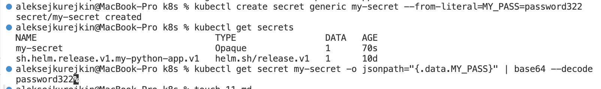

# Kubernetes

## Overview

This document outlines the steps taken to deploy the Moscow Time app to a local Kubernetes cluster using **Minikube** and **kubectl**.


## Creating a simple deployment and service


To create a deployment for our pod:

```bash
kubectl create deployment web-app --image=alimansour000/moscow-time-app:latest
```


Then we have to create a service to expose our app for external access:

```bash
kubectl expose deployment web-app --type=LoadBalancer --port=5000
```


**Pods and services:**

```bash
$ kubectl get pod,svc
```


to access our app we can use:

```bash
minikube service web-app
```


Cleanup:
```bash
kubectl delete -f deployment.yml
kubectl delete -f service.yml
```


## Manifest files

Just like before we have to have a deployment for our pod and a service, we can do that through deployment/service manifest files.


To apply our file we run:

```bash
$ kubectl apply -f deployment.yml 
```

```bash
$ kubectl apply -f service.yml 
```


**Pods and services:**

```bash
$ kubectl get pod,svc
```


```bash
$ minikube service --all
```


- **Kubernetes service:**


- **Application service:**
