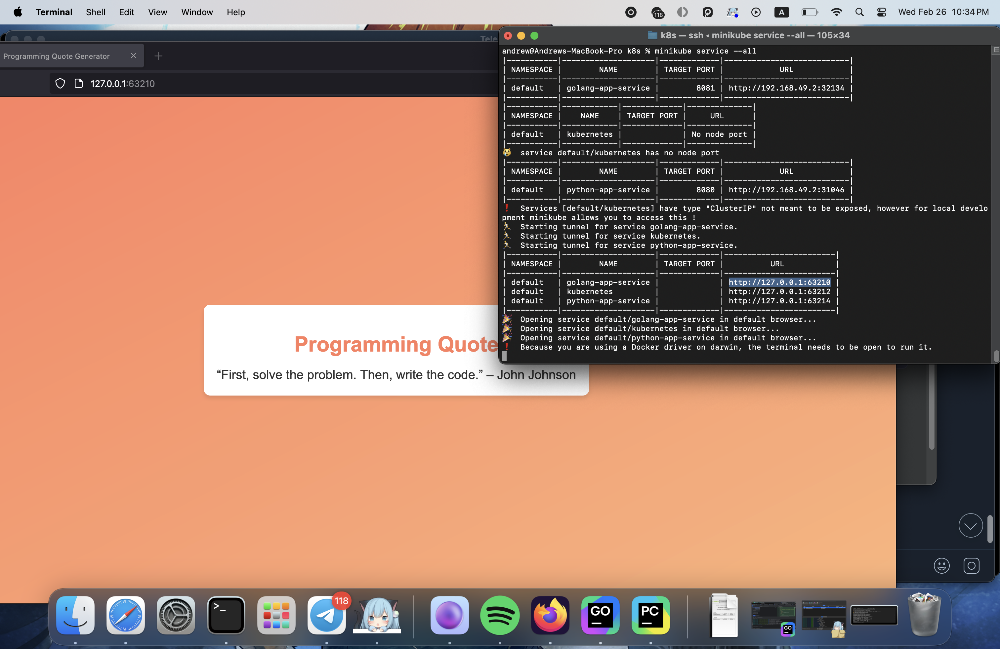

# Kubernetes

This document summarizes the tasks completed to learn basic Kubernetes concepts using **minikube**, **kubectl**, and related manifests. It covers both **imperative** (command-based) and **declarative** (manifest-based) approaches, plus an optional **Ingress** bonus.

---

## I. Prerequisites

- **minikube** installed and running (e.g., `minikube start`).
- **kubectl** installed and configured to talk with local minikube cluster.

---

## II. Task 1: Basic Deployment (Imperative)

1. **Create a Deployment**  
   ```bash
   kubectl create deployment first-node --image=azazaki/app_python
   ```
   and
   ```bash
   kubectl create deployment second-node --image=azazaki/app_golang
   ```
   **Output:**
   ```
   andrew@Andrews-MacBook-Pro k8s % kubectl create deployment first-node --image=azazaki/app_python
   deployment.apps/first-node created
   andrew@Andrews-MacBook-Pro k8s % kubectl create deployment second-node --image=azazaki/app_golang
   deployment.apps/second-node created
   ```
   - This starts a Pod running our python and golang applications.
2. **View the Deployment & Pod**
   ```bash
   kubectl get deployments
   kubectl get pods
   ```
   **Output:**
   ```
   andrew@Andrews-MacBook-Pro k8s % kubectl get deployments
   NAME          READY   UP-TO-DATE   AVAILABLE   AGE
   first-node    1/1     1            1           3m23s
   second-node   1/1     1            1           3m8s
   andrew@Andrews-MacBook-Pro k8s % kubectl get pods
   NAME                          READY   STATUS    RESTARTS   AGE
   first-node-77d64d987f-v7p4n   1/1     Running   0          3m26s
   second-node-798476dd7-7h7c7   1/1     Running   0          3m11s
   ```
   - Ensure the Pod shows `Running` (everything is good).
3. **Expose the Deployment (Service)**
   ```bash
   kubectl expose deployment first-node --type=NodePort --port=5001
   ```
   and
   ```bash
   kubectl expose deployment second-node --type=NodePort --port=8080
   ```
   **Outputs:**
   ```
   andrew@Andrews-MacBook-Pro k8s % kubectl expose deployment first-node --type=NodePort --port=5001
   service/first-node exposed
   andrew@Andrews-MacBook-Pro k8s % kubectl expose deployment second-node --type=NodePort --port=8080
   service/second-node exposed
   ```
   - Makes the `Pods` accessible on port 8080 and 8081 via a `Service`.
4. **Access the Applications**
   ```bash
   minikube service first-node
   ```
   
   and
   ```bash
   minikube service second-node
   ```
   
5. **Pods and services**
   ```bash
   kubectl get pods,svc
   ```
   **Output:**
   ```
   andrew@Andrews-MacBook-Pro k8s % kubectl get pods,svc
   NAME                               READY   STATUS    RESTARTS   AGE
   pod/first-node-5c56f8946d-4xw87    1/1     Running   0          21s
   pod/second-node-689744d7c8-knzpj   1/1     Running   0          13s
   
   NAME                  TYPE        CLUSTER-IP      EXTERNAL-IP   PORT(S)          AGE
   service/first-node    NodePort    10.97.112.73    <none>        5001:31132/TCP   2s
   service/kubernetes    ClusterIP   10.96.0.1       <none>        443/TCP          79m
   service/second-node   NodePort    10.98.236.235   <none>        8080:32698/TCP   7s
   ```
6. **Cleanup**
   ```bash
   kubectl delete deployment first-node
   kubectl delete service first-node
   ```
   and
   ```bash
   kubectl delete deployment second-node
   kubectl delete service second-node
   ```
   **Outputs:**
   ```
   andrew@Andrews-MacBook-Pro k8s % kubectl delete deployment first-node
   deployment.apps "first-node" deleted
   andrew@Andrews-MacBook-Pro k8s % kubectl delete service first-node
   service "first-node" deleted
   andrew@Andrews-MacBook-Pro k8s % kubectl delete deployment second-node
   deployment.apps "second-node" deleted
   andrew@Andrews-MacBook-Pro k8s % kubectl delete service second-node
   service "second-node" deleted
   ```

## III. Task 2: Declarative Manifests
1. Create a `python-deployment.yml`:
   ```yaml
   apiVersion: apps/v1
   kind: Deployment
   metadata:
     name: python-app-deployment
     labels:
       app: python-app
   spec:
     replicas: 3
     selector:
       matchLabels:
         app: python-app
     template:
       metadata:
         labels:
           app: python-app
       spec:
         containers:
           - name: python-app-container
             image: azazaki/app_python:latest
             ports:
               - containerPort: 5001
   ```
2. Create a `python-service.yml`:
   ```yaml
   apiVersion: v1
   kind: Service
   metadata:
     name: python-app-service
   spec:
     type: NodePort
     selector:
       app: python-app
     ports:
       - port: 8080
         targetPort: 5001
   ```
3. Create a `golang-deployment.yml`:
   ```yaml
   apiVersion: apps/v1
   kind: Deployment
   metadata:
     name: golang-app-deployment
     labels:
       app: golang-app
   spec:
     replicas: 3
     selector:
       matchLabels:
         app: golang-app
     template:
       metadata:
         labels:
           app: golang-app
       spec:
         containers:
           - name: golang-app-container
             image: azazaki/app_golang:latest
             ports:
               - containerPort: 8080
   ```
4. Create a `golang-service.yml`:
   ```yaml
   apiVersion: v1
   kind: Service
   metadata:
     name: golang-app-service
   spec:
     type: NodePort
     selector:
       app: golang-app
     ports:
       - port: 8081
         targetPort: 8080
   ```
5. **Apply the Manifests**
   ```bash
   kubectl apply -f python-deployment.yml
   kubectl apply -f python-service.yml
   ```
   and
   ```bash
   kubectl apply -f golang-deployment.yml
   kubectl apply -f golang-service.yml
   ```
   Outputs:
   ```
   andrew@Andrews-MacBook-Pro k8s %    kubectl apply -f python-deployment.yml
      kubectl apply -f python-service.yml
   deployment.apps/python-app-deployment created
   service/python-app-service created
   andrew@Andrews-MacBook-Pro k8s %    kubectl apply -f golang-deployment.yml
      kubectl apply -f golang-service.yml
   deployment.apps/golang-app-deployment created
   service/golang-app-service created
   ```
6. **Pods and Services**
      ```bash
   kubectl get pods,svc
   ```
   **Output:**
   ```
   andrew@Andrews-MacBook-Pro k8s % kubectl get pods,svc   
   NAME                                         READY   STATUS    RESTARTS   AGE
   pod/golang-app-deployment-7b7497cfc-85gbw    1/1     Running   0          17s
   pod/golang-app-deployment-7b7497cfc-jwgl5    1/1     Running   0          17s
   pod/golang-app-deployment-7b7497cfc-whnvm    1/1     Running   0          17s
   pod/python-app-deployment-75d9c89f6c-94t74   1/1     Running   0          21s
   pod/python-app-deployment-75d9c89f6c-slzdm   1/1     Running   0          21s
   pod/python-app-deployment-75d9c89f6c-xwl9v   1/1     Running   0          21s
   
   NAME                         TYPE        CLUSTER-IP       EXTERNAL-IP   PORT(S)          AGE
   service/golang-app-service   NodePort    10.99.218.69     <none>        8081:32134/TCP   17s
   service/kubernetes           ClusterIP   10.96.0.1        <none>        443/TCP          110m
   service/python-app-service   NodePort    10.101.148.238   <none>        8080:31046/TCP   21s
   ```
7. **Access via Minikube**
   ```bash
   minikube service --all
   ```
   **Output:**
   ```
   andrew@Andrews-MacBook-Pro k8s % minikube service --all   
   |-----------|--------------------|-------------|---------------------------|
   | NAMESPACE |        NAME        | TARGET PORT |            URL            |
   |-----------|--------------------|-------------|---------------------------|
   | default   | golang-app-service |        8081 | http://192.168.49.2:32134 |
   |-----------|--------------------|-------------|---------------------------|
   |-----------|------------|-------------|--------------|
   | NAMESPACE |    NAME    | TARGET PORT |     URL      |
   |-----------|------------|-------------|--------------|
   | default   | kubernetes |             | No node port |
   |-----------|------------|-------------|--------------|
   😿  service default/kubernetes has no node port
   |-----------|--------------------|-------------|---------------------------|
   | NAMESPACE |        NAME        | TARGET PORT |            URL            |
   |-----------|--------------------|-------------|---------------------------|
   | default   | python-app-service |        8080 | http://192.168.49.2:31046 |
   |-----------|--------------------|-------------|---------------------------|
   ❗  Services [default/kubernetes] have type "ClusterIP" not meant to be exposed, however for local development minikube allows you to access this !
   🏃  Starting tunnel for service golang-app-service.
   🏃  Starting tunnel for service kubernetes.
   🏃  Starting tunnel for service python-app-service.
   |-----------|--------------------|-------------|------------------------|
   | NAMESPACE |        NAME        | TARGET PORT |          URL           |
   |-----------|--------------------|-------------|------------------------|
   | default   | golang-app-service |             | http://127.0.0.1:63210 |
   | default   | kubernetes         |             | http://127.0.0.1:63212 |
   | default   | python-app-service |             | http://127.0.0.1:63214 |
   |-----------|--------------------|-------------|------------------------|
   🎉  Opening service default/golang-app-service in default browser...
   🎉  Opening service default/kubernetes in default browser...
   🎉  Opening service default/python-app-service in default browser...
   ❗  Because you are using a Docker driver on darwin, the terminal needs to be open to run it.
   ```
   GoLang Application:
   
   GoLang Application with a container name as a URL:
   
   Python Application:
   
   Python Application with a container name as a URL:
   
   **Note:** On Docker for Mac, the node IP (192.168.49.2) is not directly accessible from the host. So, I'm using container name `minikube.orb.local` :) (plus localhost is available)
8. **Cleanup**
   ```bash
   kubectl delete -f python-deployment.yml
   kubectl delete -f python-service.yml
   ```
   and
      ```bash
   kubectl delete -f golang-deployment.yml
   kubectl delete -f golang-service.yml
   ```
   **Output:**
   ```
   andrew@Andrews-MacBook-Pro k8s %    kubectl delete -f python-deployment.yml
      kubectl delete -f python-service.yml
   deployment.apps "python-app-deployment" deleted
   service "python-app-service" deleted
   andrew@Andrews-MacBook-Pro k8s %    kubectl delete -f golang-deployment.yml
      kubectl delete -f golang-service.yml
   deployment.apps "golang-app-deployment" deleted
   service "golang-app-service" deleted
   ```
   
## IV. Bonus
1. **Manifests for Extra App:**  
   Already did it in previous section :-)
2. **Ingress Manifests:**  
   Create `ingress.yml`  
   ```yaml
   apiVersion: networking.k8s.io/v1
   kind: Ingress
   metadata:
     name: ingress
   spec:
     ingressClassName: nginx
     rules:
       - host: python-app.local
         http:
           paths:
             - path: /
               pathType: Prefix
               backend:
                 service:
                   name: python-app-service
                   port:
                     number: 5001
   
       - host: golang-app.local
         http:
           paths:
             - path: /
               pathType: Prefix
               backend:
                 service:
                   name: golang-app-service
                   port:
                     number: 8080
   ```
3. **Enable the Ingress Addon**
   ```bash
   minikube addons enable ingress
   ```
   **Output:**
   ```
   andrew@Andrews-MacBook-Pro k8s % minikube addons enable ingress
   💡  ingress is an addon maintained by Kubernetes. For any concerns contact minikube on GitHub.
   You can view the list of minikube maintainers at: https://github.com/kubernetes/minikube/blob/master/OWNERS
   💡  After the addon is enabled, please run "minikube tunnel" and your ingress resources would be available at "127.0.0.1"
       ▪ Using image registry.k8s.io/ingress-nginx/kube-webhook-certgen:v1.4.4
       ▪ Using image registry.k8s.io/ingress-nginx/controller:v1.11.3
       ▪ Using image registry.k8s.io/ingress-nginx/kube-webhook-certgen:v1.4.4
   🔎  Verifying ingress addon...
   🌟  The 'ingress' addon is enabled
   ```
4. **Apply the Ingress Manifest**
   ```bash
   kubectl apply -f ingress.yml
   ```
   **Output:**
   ```yaml
   andrew@Andrews-MacBook-Pro k8s % kubectl apply -f ingress.yml
   
   ingress.networking.k8s.io/ingress created
   ```
5. **Verify**
   ```bash
   kubectl get ingress
   kubectl get pods -n ingress-nginx
   ```
   Output:
   ```
   andrew@Andrews-MacBook-Pro k8s % kubectl get ingress
   NAME      CLASS   HOSTS                               ADDRESS        PORTS   AGE
   ingress   nginx   python-app.local,golang-app.local   192.168.49.2   80      2m9s
   andrew@Andrews-MacBook-Pro k8s % kubectl get pods -n ingress-nginx
   
   NAME                                        READY   STATUS      RESTARTS   AGE
   ingress-nginx-admission-create-fpvwb        0/1     Completed   0          7m23s
   ingress-nginx-admission-patch-jjwwz         0/1     Completed   0          7m23s
   ingress-nginx-controller-56d7c84fd4-c4rmr   1/1     Running     0          7m23s
   ```
   - Ensure the ingress-nginx controller Pod is running.
6. **Test Access**
   - Get the minikube IP:
     ```bash
     minikube ip
     ```
     **Output:**
     ```
     andrew@Andrews-MacBook-Pro k8s % minikube ip
     192.168.49.2
     ```
   - Use `curl --resolve` to map the hostnames to the minikube IP:
     ```bash
     curl --resolve "python-app.local:80:192.168.49.2" http://python-app.local
     ```
     
     and
     ```bash
     curl --resolve "golang-app.local:80:192.168.49.2" http://golang-app.local
     ```
     
     **Success!!**  
   With this setup, traffic to python-app.local routes to the Python service on port 5001, and traffic to golang-app.local routes to the Go service on port 8080, all managed by the NGINX Ingress controller in minikube.