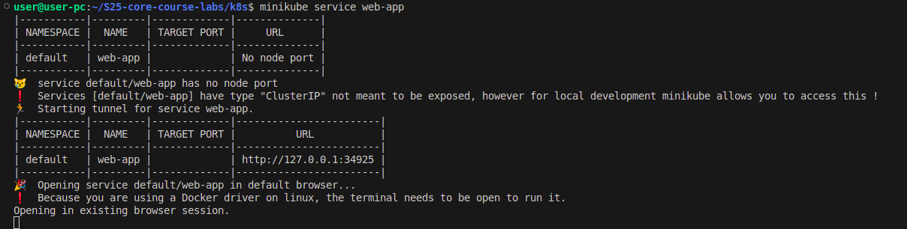
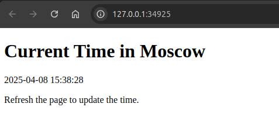

# Task 1
## Deploying app:

## Accessing app:

## Output for `kubectl get pods,svc`:
-

## Removing resources:

# Task 2
## Setup:

- `kubectl get pods,svc` output:
- % kubectl get pods,svc
NAME                                 READY   STATUS    RESTARTS   AGE
pod/my-python-app-6c79c69855-97mkw   1/1     Running   0          10m
pod/my-python-app-6c79c69855-f4hj7   1/1     Running   0          10m
pod/my-python-app-6c79c69855-sch9b   1/1     Running   0          10m

NAME                    TYPE        CLUSTER-IP      EXTERNAL-IP   PORT(S)          AGE
service/kubernetes      ClusterIP   10.96.0.1       <none>        443/TCP          9h
service/my-python-app   NodePort    10.102.235.31   <none>        5000:32503/TCP   4m33s

- `minikube service --all` output:

- Result from browser:

