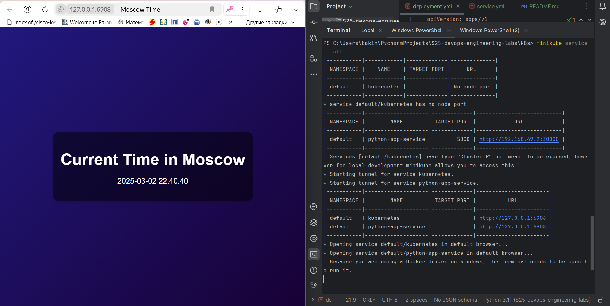

# Introduction to Kubernetes

## Task 1: Kubernetes Setup and Basic Deployment

### Kubernetes Node Status

To verify that Minikube is running and a Kubernetes node is available, the following command was executed:

```sh
kubectl get nodes
```

**Output:**

```plaintext
NAME       STATUS   ROLES           AGE     VERSION
minikube   Ready    control-plane   2m30s   v1.32.0
```

### Kubernetes Deployment and Service Status

The following command was executed to check the status of running pods and services:

```sh
kubectl get pods,svc
```

**Output:**

```plaintext
NAME                              READY   STATUS    RESTARTS   AGE
pod/moscow-time-app-5db479b68b-vqfr8   1/1     Running   0          7m48s

NAME                 TYPE           CLUSTER-IP      EXTERNAL-IP   PORT(S)        AGE
service/moscow-time-app   LoadBalancer   10.112.42.200        80:30913/TCP   7m42s
service/kubernetes   ClusterIP      10.96.0.1               443/TCP        8m22s
```

## Task 2: Declarative Kubernetes Manifests

For deploying the application, two Kubernetes manifest files were created:

- **Deployment Configuration File**: Defines the deployment details, including a replica count of 3.
- **Service Definition File**: Configures the service for the application.

### Kubernetes Pods and Service Status

The following command was executed to verify the deployment and services:

```sh
kubectl get pods,svc
```

**Output:**

```plaintext
NAME                                         READY   STATUS    RESTARTS   AGE
pod/moscow-time-app-699d7d6cc8-8c9x7              1/1     Running   0          7m18s
pod/moscow-time-app-699d7d6cc8-8r4zc              1/1     Running   0          7m18s
pod/moscow-time-app-699d7d6cc8-jthzk              1/1     Running   0          7m18s

NAME                         TYPE        CLUSTER-IP     EXTERNAL-IP   PORT(S)   AGE
service/kubernetes           ClusterIP   10.96.0.1              443/TCP   15m
service/python-app-service   ClusterIP   10.102.43.70           81/TCP    7m10s
```

### Minikube Service Output

To verify the service accessibility, the following command was executed:

```sh
minikube service --all
```

**Output:**

```plaintext
|-----------|------------|-------------|--------------|
| NAMESPACE |    NAME    | TARGET PORT |     URL      |
|-----------|------------|-------------|--------------|
| default   | kubernetes |             | No node port |
|-----------|------------|-------------|--------------|
* service default/kubernetes has no node port
|-----------|--------------------|-------------|---------------------------|
| NAMESPACE |        NAME        | TARGET PORT |            URL            |       
|-----------|--------------------|-------------|---------------------------|       
| default   | python-app-service |        5000 | http://192.168.49.2:30000 |       

|-----------|--------------------|-------------|---------------------------|       
! Services [default/kubernetes] have type "ClusterIP" not meant to be exposed, however for local development minikube allows you to access this !
* Starting tunnel for service kubernetes.
* Starting tunnel for service python-app-service.
|-----------|--------------------|-------------|-----------------------|
| NAMESPACE |        NAME        | TARGET PORT |          URL          |
|-----------|--------------------|-------------|-----------------------|
| default   | kubernetes         |             | http://127.0.0.1:6906 |
| default   | python-app-service |             | http://127.0.0.1:6908 |
|-----------|--------------------|-------------|-----------------------|
* Opening service default/kubernetes in default browser...
* Opening service default/python-app-service in default browser...
! Because you are using a Docker driver on windows, the terminal needs to be open to run it.
```

### Screenshot Verification


