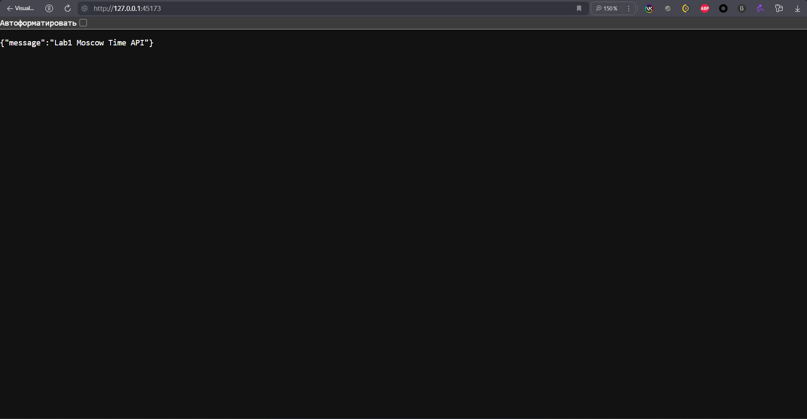

# Kubernetes Report

## Deploy Application

Create a Deployment resource

```bash
kubectl create deployment python-app-node --image=raydenoir/app_python:distroless
```

Create a Service resource

```bash
kubectl expose deployment python-app-node --type=LoadBalancer --port=8080
```

#1 Output of `kubectl get pods,svc`:

```text
NAME                                   READY   STATUS    RESTARTS   AGE
pod/python-app-node-59df7fb86d-v2llx   1/1     Running   0          16s

NAME                      TYPE           CLUSTER-IP      EXTERNAL-IP   PORT(S)          AGE
service/kubernetes        ClusterIP      10.96.0.1       <none>        443/TCP          21m
service/python-app-node   LoadBalancer   10.101.46.239   <pending>     8080:30152/TCP   7s
```

Remove the Deployment and Service resources

```bash
kubectl delete deployment python-app-node
kubectl delete service python-app-node
```

#2 Output of `kubectl get pods,svc`:

```text
NAME                             READY   STATUS    RESTARTS   AGE
pod/app-python-887864798-4tc4r   1/1     Running   0          4s
pod/app-python-887864798-jh9tc   1/1     Running   0          4s
pod/app-python-887864798-ljr5k   1/1     Running   0          4s

NAME                         TYPE        CLUSTER-IP   EXTERNAL-IP   PORT(S)          AGE
service/kubernetes           ClusterIP   10.96.0.1    <none>        443/TCP          44m
service/python-app-service   NodePort    10.96.19.1   <none>        8000:31549/TCP   3s
```

Output of `minikube service --all`:

```text
|-----------|------------|-------------|--------------|
| NAMESPACE |    NAME    | TARGET PORT |     URL      |
|-----------|------------|-------------|--------------|
| default   | kubernetes |             | No node port |
|-----------|------------|-------------|--------------|
😿  service default/kubernetes has no node port
|-----------|--------------------|-------------|---------------------------|
| NAMESPACE |        NAME        | TARGET PORT |            URL            |
|-----------|--------------------|-------------|---------------------------|
| default   | python-app-service |        8000 | http://192.168.49.2:31549 |
|-----------|--------------------|-------------|---------------------------|
❗  Services [default/kubernetes] have type "ClusterIP" not meant to be exposed, however for local development minikube allows you to access this !
🏃  Starting tunnel for service kubernetes.
🏃  Starting tunnel for service python-app-service.
|-----------|--------------------|-------------|------------------------|
| NAMESPACE |        NAME        | TARGET PORT |          URL           |
|-----------|--------------------|-------------|------------------------|
| default   | kubernetes         |             | http://127.0.0.1:44709 |
| default   | python-app-service |             | http://127.0.0.1:37357 |
|-----------|--------------------|-------------|------------------------|
🎉  Opening service default/kubernetes in default browser...
👉  http://127.0.0.1:44709
🎉  Opening service default/python-app-service in default browser...
👉  http://127.0.0.1:37357
❗  Because you are using a Docker driver on linux, the terminal needs to be open to run it.
```

Kubernetes opened in browser using tunnel from WSL:


Python App opened in browser using tunnel from WSL:



