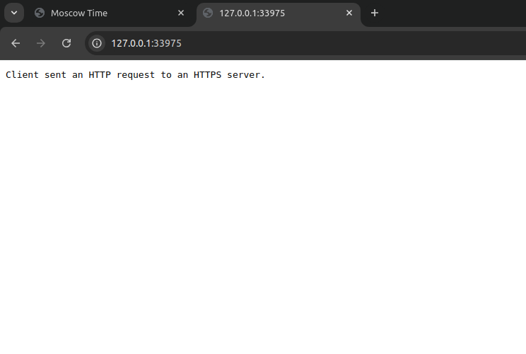

# Kubernetes

## Overview

This document will provide an overview of Kubernetes setup basics and manifests

## Creating a simple deployment and service

We first have to create a deployment for our pod:

```bash
kubectl create deployment web-app --image=hayderuni/moscow-time-flask:latest
```

Then we have to create a service to expose our app for external access:

```bash
kubectl expose deployment web-app --type=LoadBalancer --port=5000
```

**Pods and services:**

```bash
$ kubectl get pod,svc
NAME                           READY   STATUS    RESTARTS   AGE
pod/web-app-65c5b78866-8k9hn   1/1     Running   0          16m

NAME                 TYPE           CLUSTER-IP      EXTERNAL-IP   PORT(S)          AGE
service/kubernetes   ClusterIP      10.96.0.1       <none>        443/TCP          46m
service/web-app      LoadBalancer   10.108.92.199   <pending>     5000:32436/TCP   12m
```

to access our app we can use:

```bash
minikube service web-app
```

## Manifest files

Just like before we have to have a deployment for our pod and a service, we can do that through deployment/service manifest files.

References:

- [Creating a deployment file](https://kubernetes.io/docs/tasks/manage-kubernetes-objects/declarative-config/)
- [Creating a service file](https://kubernetes.io/docs/concepts/services-networking/service/)

To apply our file we run:

```bash
$ kubectl apply -f deployment.yml 
deployment.apps/web-app created
```

```bash
$ kubectl apply -f service.yml 
service/web-app-service created
```

**Pods and services:**

```bash
$ kubectl get pod,svc
NAME                          READY   STATUS    RESTARTS   AGE
pod/web-app-785f957b7-h79xh   1/1     Running   0          3m35s
pod/web-app-785f957b7-sdxdv   1/1     Running   0          3m35s
pod/web-app-785f957b7-skgp6   1/1     Running   0          3m35s

NAME                      TYPE           CLUSTER-IP       EXTERNAL-IP   PORT(S)          AGE
service/kubernetes        ClusterIP      10.96.0.1        <none>        443/TCP          123m
service/web-app-service   LoadBalancer   10.106.105.232   <pending>     5000:30007/TCP   3m31s
```

```bash
$ minikube service --all
|-----------|------------|-------------|--------------|
| NAMESPACE |    NAME    | TARGET PORT |     URL      |
|-----------|------------|-------------|--------------|
| default   | kubernetes |             | No node port |
|-----------|------------|-------------|--------------|
😿  service default/kubernetes has no node port
|-----------|-----------------|-------------|---------------------------|
| NAMESPACE |      NAME       | TARGET PORT |            URL            |
|-----------|-----------------|-------------|---------------------------|
| default   | web-app-service |        5000 | http://<IP>:30007 |
|-----------|-----------------|-------------|---------------------------|
❗  Services [default/kubernetes] have type "ClusterIP" not meant to be exposed, however for local development minikube allows you to access this !
🎉  Opening service default/web-app-service in default browser...
🏃  Starting tunnel for service kubernetes.
|-----------|------------|-------------|------------------------|
| NAMESPACE |    NAME    | TARGET PORT |          URL           |
|-----------|------------|-------------|------------------------|
| default   | kubernetes |             | http://127.0.0.1:33975 |
|-----------|------------|-------------|------------------------|
🎉  Opening service default/kubernetes in default browser...
❗  Because you are using a Docker driver on linux, the terminal needs to be open to run it.
```

- **Kubernetes service:**

    

- **Application service:**

    
