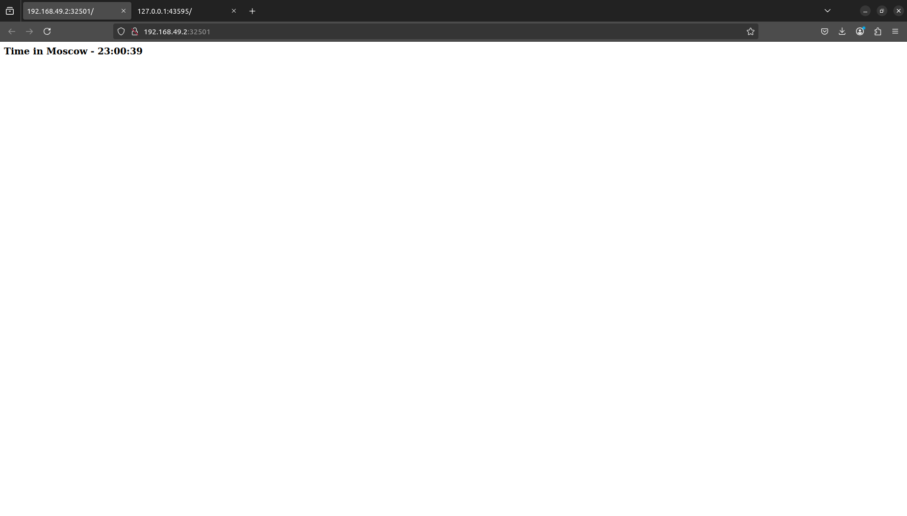

# Kubernetes

## Task 1

**Deploying**

```bash
azeeez@azeeez:~/Desktop/courses/devops/kdi/S25-core-course-labs/k8s$ kubectl create deployment python-app --image=azeeeez/python_moscow_time --port=5000

deployment.apps/python-app created
```

**Check if it is running**

```bash
azeeez@azeeez:~/Desktop/courses/devops/kdi/S25-core-course-labs/k8s$ kubectl get deployments

NAME         READY   UP-TO-DATE   AVAILABLE   AGE
python-app   1/1     1            1           15s

azeeez@azeeez:~/Desktop/courses/devops/kdi/S25-core-course-labs/k8s$ kubectl get pods

NAME                          READY   STATUS    RESTARTS   AGE
python-app-6d76cc799f-c7z5g   1/1     Running   0          22s
```

**Exposing**

```bash
azeeez@azeeez:~/Desktop/courses/devops/kdi/S25-core-course-labs/k8s$ kubectl expose deployment python-app --type=LoadBalancer --port=5000

service/python-app exposed
```

**Check if exposed**

```bash
azeeez@azeeez:~/Desktop/courses/devops/kdi/S25-core-course-labs/k8s$ minikube service python-app

|-----------|------------|-------------|---------------------------|
| NAMESPACE |    NAME    | TARGET PORT |            URL            |
|-----------|------------|-------------|---------------------------|
| default   | python-app |        5000 | http://192.168.49.2:30583 |
|-----------|------------|-------------|---------------------------|
🎉  Opening service default/python-app in default browser...

```

**If we try to open the link in the browser we see:**


**Running** `kubectl get pods,svc`:

```bash
azeeez@azeeez:~/Desktop/courses/devops/kdi/S25-core-course-labs/k8s$ kubectl get pods,svc
NAME                              READY   STATUS    RESTARTS   AGE
pod/python-app-6d76cc799f-c7z5g   1/1     Running   0          4m29s

NAME                 TYPE           CLUSTER-IP      EXTERNAL-IP   PORT(S)          AGE
service/kubernetes   ClusterIP      10.96.0.1       <none>        443/TCP          9m10s
service/python-app   LoadBalancer   10.98.119.247   <pending>     5000:30583/TCP   97s
```

## Task 2

**Running** `kubectl get pods,svc`:

```bash
azeeez@azeeez:~/Desktop/courses/devops/kdi/S25-core-course-labs/k8s$ kubectl get pods,svc
NAME                                                 READY   STATUS    RESTARTS   AGE
pod/python-moscow-time-deployment-5d8744f79f-4mn56   1/1     Running   0          7m1s
pod/python-moscow-time-deployment-5d8744f79f-jvxv9   1/1     Running   0          7m1s
pod/python-moscow-time-deployment-5d8744f79f-p8rlc   1/1     Running   0          7m1s

NAME                                 TYPE           CLUSTER-IP      EXTERNAL-IP   PORT(S)          AGE
service/kubernetes                   ClusterIP      10.96.0.1       <none>        443/TCP          31m
service/python-moscow-time-service   LoadBalancer   10.106.35.220   <pending>     5000:32501/TCP   6m56s
```

**Running** `minikube service --all`:

```bash
azeeez@azeeez:~/Desktop/courses/devops/kdi/S25-core-course-labs/k8s$ minikube service --all
|-----------|------------|-------------|--------------|
| NAMESPACE |    NAME    | TARGET PORT |     URL      |
|-----------|------------|-------------|--------------|
| default   | kubernetes |             | No node port |
|-----------|------------|-------------|--------------|
😿  service default/kubernetes has no node port
|-----------|----------------------------|-------------|---------------------------|
| NAMESPACE |            NAME            | TARGET PORT |            URL            |
|-----------|----------------------------|-------------|---------------------------|
| default   | python-moscow-time-service |        5000 | http://192.168.49.2:32501 |
|-----------|----------------------------|-------------|---------------------------|
❗  Services [default/kubernetes] have type "ClusterIP" not meant to be exposed, however for local development minikube allows you to access this !
🎉  Opening service default/python-moscow-time-service in default browser...
🏃  Starting tunnel for service kubernetes.
|-----------|------------|-------------|------------------------|
| NAMESPACE |    NAME    | TARGET PORT |          URL           |
|-----------|------------|-------------|------------------------|
| default   | kubernetes |             | http://127.0.0.1:39477 |
|-----------|------------|-------------|------------------------|
🎉  Opening service default/kubernetes in default browser...
❗  Because you are using a Docker driver on linux, the terminal needs to be open to run it.
```

**Screenshot**



## Bonus task

**Curl for python app**

```bash
azeeez@azeeez:~/Desktop/courses/devops/kdi/S25-core-course-labs/k8s$ curl http://192.168.49.2:32501/

    <html>
        <body>
            <h3>Time in Moscow - 23:20:10</h3>
        </body>
    </html>
```

**Curl for go app**

```bash
azeeez@azeeez:~/Desktop/courses/devops/kdi/S25-core-course-labs/k8s$ curl http://192.168.49.2:31350/

    <html>
        <body>
            <h3>Time in Moscow - 23:19:58</h3>
        </body>
    </html>
```
