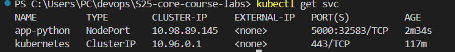
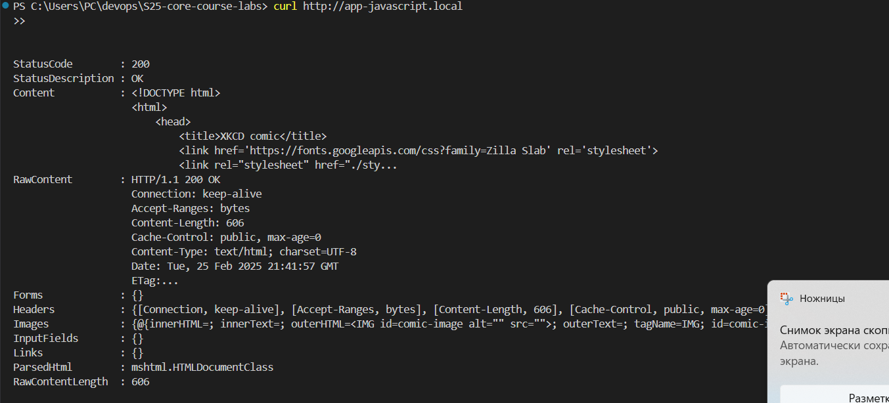

# Kubernetes

## Task 1

To deploy the app I used:

```bash
kubectl create deployment app-python --image=kira354/app_python-distroless:latest
kubectl expose deployment app-python --type=NodePort --port=5000
```


**Outputs from kubectl get pods,svc commands**



**Cleanup**


## Task 2

I created deployment.yml and service.yml inside k8s folder. Then deployed using:

```bash
kubectl apply -f k8s/
```

**Outputs from kubectl get pods,svc commands**


**The output of the `minikube service --all` command and the result from my browser**


## Bonus Task

Firstly, I did the same steps for app_javascript and created development_js.yml and service_js.yml.

**Outputs from kubectl get pods,svc commands**


**Checked output of the `minikube service --all` command in browser**


Secondly, I worked on ingress manifests for both apps and created ingress.yml:

```yml
apiVersion: networking.k8s.io/v1
kind: Ingress
metadata:
  name: app-python-ingress
spec:
  rules:
  - host: app-python.local
    http:
      paths:
      - path: /
        pathType: Prefix
        backend:
          service:
            name: app-python-service
            port:
              number: 5000
  - host: app-javascript.local
    http:
      paths:
      - path: /
        pathType: Prefix
        backend:
          service:
            name: app-javascript-service
            port:
              number: 3000
```

**Application Availability Check**:

- run the tunnel:

```bash
minikube tunnel
```

- added host addresses to /etc/hosts:

```bash
127.0.0.1 app-python.local
127.0.0.1 app-javascript.local  
```

**Curl commands to verify the availability of applications**



**Checking in browser**


