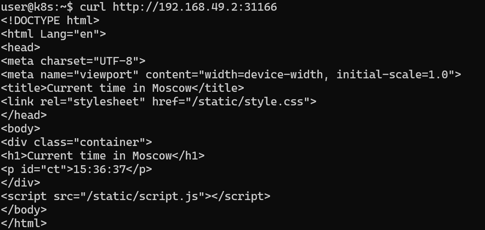

# Kubernetes Deployment


## Kubernetes Setup and Basic Deployment

```sh
# Create a deployment named 'python-app' using specified Docker image
kubectl create deployment python-app --image=petrel312/flask_app:latest
```
```sh
# Check deployment status
kubectl get deployments
NAME         READY   UP-TO-DATE   AVAILABLE   AGE
python-app   1/1     1            1           64m
```
```sh
# Expose the deployment to make it accessible via NodePort on port 5000
kubectl expose deployment python-app --type=NodePort --port=5000
```

## Check that the app is running:
```sh
# Get service URL (open it in browser)
minikube service python-app --url
http://192.168.49.2:31166
```

```sh
|-----------|------------|-------------|---------------------------|
| NAMESPACE |    NAME    | TARGET PORT |            URL            |
|-----------|------------|-------------|---------------------------|
| default   | python-app |        5000 | http://192.168.49.2:31166 |
|-----------|------------|-------------|---------------------------|
🎉  Opening service default/python-app in default browser...
👉  http://192.168.49.2:31166
```

## Output for `kubectl get pods,svc`:
```sh
# Check current pods and services
kubectl get pods,svc

NAME                              READY   STATUS    RESTARTS      AGE
pod/python-app-5d9667f55b-mnssh   1/1     Running   1 (23m ago)   66m

NAME                 TYPE        CLUSTER-IP     EXTERNAL-IP   PORT(S)          AGE
service/kubernetes   ClusterIP   10.96.0.1      <none>        443/TCP          70m
service/python-app   NodePort    10.97.49.146   <none>        5000:31166/TCP   65m
```

## Delete deployment:
```sh
# Remove the deployment
kubectl delete deployment python-app
deployment.apps "python-app" deleted
```

## Declarative Kubernetes Manifests

```bash
# Apply all manifests in the current directory (deployment.yml, service.yml)
kubectl apply -f .
deployment.apps/python-app created
service/python-app configured
```

```bash
# Check that new pods and services were created
kubectl get pods,svc
NAME                              READY   STATUS    RESTARTS   AGE
pod/python-app-6d8dbb66cd-9w6m8   1/1     Running   0          28s
pod/python-app-6d8dbb66cd-ch26l   1/1     Running   0          28s
pod/python-app-6d8dbb66cd-wnhbw   1/1     Running   0          28s
pod/python-app-6d8dbb66cd-x7qtk   1/1     Running   0          28s

NAME                 TYPE        CLUSTER-IP     EXTERNAL-IP   PORT(S)          AGE
service/kubernetes   ClusterIP   10.96.0.1      <none>        443/TCP          84m
service/python-app   NodePort    10.97.49.146   <none>        5000:31166/TCP   80m
```

```bash
# List all services and their URLs in Minikube
minikube service --all
|-----------|------------|-------------|--------------|
| NAMESPACE |    NAME    | TARGET PORT |     URL      |
|-----------|------------|-------------|--------------|
| default   | kubernetes |             | No node port |
|-----------|------------|-------------|--------------|
😿  service default/kubernetes has no node port
|-----------|------------|-------------|---------------------------|
| NAMESPACE |    NAME    | TARGET PORT |            URL            |
|-----------|------------|-------------|---------------------------|
| default   | python-app |        5000 | http://192.168.49.2:31166 |
|-----------|------------|-------------|---------------------------|
❗  Services [default/kubernetes] have type "ClusterIP" not meant to be exposed, however for local development minikube allows you to access this !
🎉  Opening service default/python-app in default browser...
👉  http://192.168.49.2:31166
🏃  Starting tunnel for service kubernetes.
|-----------|------------|-------------|------------------------|
| NAMESPACE |    NAME    | TARGET PORT |          URL           |
|-----------|------------|-------------|------------------------|
| default   | kubernetes |             | http://127.0.0.1:36947 |
|-----------|------------|-------------|------------------------|
🎉  Opening service default/kubernetes in default browser...
👉  http://127.0.0.1:36947
❗  Because you are using a Docker driver on linux, the terminal needs to be open to run it.
```



