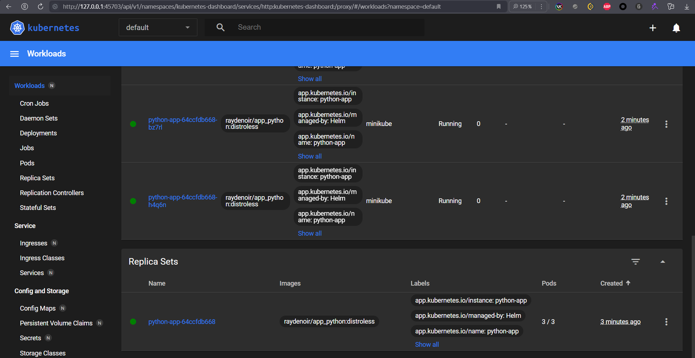
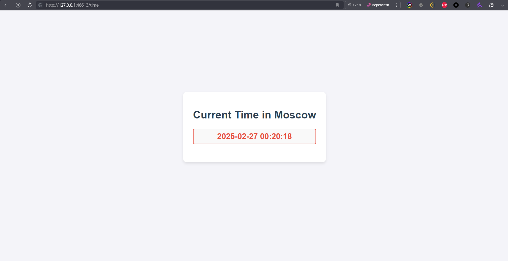

## Task 1
### Step 3
- Created a **Deployment** in Minikube using:
```sh
kubectl create deployment fastapi-mt --image=iucd/fastapi-mt:latest --port=8000
```
- Exposed the deployment using: 
```sh
kubectl expose deployment fastapi-mt --type=NodePort --port=8000
```
- Forwarded ports for easier access:
```sh
kubectl port-forward service/fastapi-mt 8000:8000
```
1. 

### Step 5:
- Checked k8s resources status:
```sh
kubectl get pods,svc
```
```text
NAME                             READY   STATUS    RESTARTS   AGE
pod/fastapi-mt-b6d999f75-8x82v   1/1     Running   0          3m45s

NAME                 TYPE        CLUSTER-IP     EXTERNAL-IP   PORT(S)          AGE  
service/fastapi-mt   NodePort    10.104.63.29   <none>        8000:30352/TCP   3m42s
service/kubernetes   ClusterIP   10.96.0.1      <none>        443/TCP          11m
```
1. 

### Step 6:
- Cleanup made:
```sh
kubectl delete deployment fastapi-mt
kubectl delete service fastapi-mt
```
1. 

## Task 2
### Step 1
- Created `deployment.yml`:
```yaml
apiVersion: apps/v1
kind: Deployment
metadata:
  name: fastapi-mt-deployment
  labels:
    app: fastapi-mt
spec:
  replicas: 3
  selector:
    matchLabels:
      app: fastapi-mt
  template:
    metadata:
      labels:
        app: fastapi-mt
    spec:
      containers:
      - name: fastapi-mt
        image: iucd/fastapi-mt:latest
        ports:
        - containerPort: 8000
```
### Step 2
- Created `service.yml`:
```yaml
apiVersion: v1
kind: Service
metadata:
  name: fastapi-mt-service
spec:
  type: NodePort
  selector:
    app: fastapi-mt
  ports:
    - protocol: TCP
      port: 8000
      targetPort: 8000
      nodePort: 30000
```
### Step 3
- Applied `deployment.yml` and `service.yml`.
- Checked k8s status
```text
NAME                                        READY   STATUS    RESTARTS   AGE
pod/fastapi-mt-deployment-b6d999f75-fvdzr   1/1     Running   0          23s
pod/fastapi-mt-deployment-b6d999f75-l2r6f   1/1     Running   0          23s
pod/fastapi-mt-deployment-b6d999f75-zh5s6   1/1     Running   0          23s  
NAME                         TYPE        CLUSTER-IP       EXTERNAL-IP   PORT(S)          AGE
service/fastapi-mt-service   NodePort    10.107.110.143   <none>        8000:30000/TCP   19s
service/kubernetes           ClusterIP   10.96.0.1        <none>        443/TCP          30m
```
1. 

- Checked minikube service:
```bash
minikube service --all
```
1. 

## Bonus Task
### Step 1
- Created `gin-deployment.yml` & `gin-service.yml` for an additional application.

### Step 2
- Created `ingress.yml` for **fastapi-mt** and **gin-mt**:
```yaml
apiVersion: networking.k8s.io/v1
kind: Ingress
metadata:
  name: lab9-bonus-ingress
  annotations:
    nginx.ingress.kubernetes.io/rewrite-target: /
spec:
  ingressClassName: nginx
  rules:
  - host: lab9.bonus
    http:
      paths:
      - path: /fastapi
        pathType: Prefix
        backend:
          service:
            name: fastapi-mt-service
            port:
              number: 8000
      - path: /gin
        pathType: Prefix
        backend:
          service:
            name: gin-mt-service
            port:
              number: 8080
```
- Applied ingress:


- Added **minikube ip | lab9.bonus** to /etc/hosts 

### Step 3
- Checked availability using:
```sh
curl -i http://lab9.bonus/fastapi
curl -i http://lab9.bonus/gin
```
1.  
2. 

### Steps to reproduce bonus task:
1. ```bash
   git clone https://github.com/creepydanunity/S25-core-course-labs.git
   cd S25-core-course-labs
   git checkout lab9
   ```
2. ```bash
   minikube start
   minikube addons enable ingress
   ```
3. ```bash
   minikube ip # e.g 192.168.49.2
   ```
4. Add minikube ip to /etc/hosts # e.g. 192.168.49.2 lab9.bonus

5. ```bash
   docker pull iucd/fastapi-mt:latest
   docker pull iucd/gin-mt:latest
   ```
6. ```bash
   kubectl apply -f fastapi-deployment.yml
   kubectl apply -f fastapi-service.yml
   kubectl apply -f gin-deployment.yml
   kubectl apply -f gin-service.yml
   kubectl apply -f ingress.yml
   ```
7. ```bash
   curl -i http://lab9.bonus/fastapi
   curl -i http://lab9.bonus/gin
   ```
