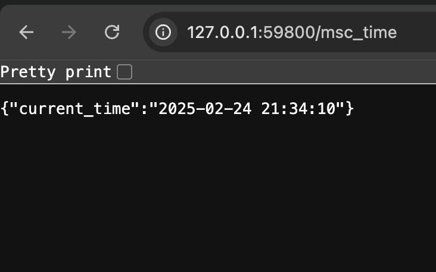

# Kubernetes

## Task 1: Kubernetes Setup and Basic Deployment

```txt
(venv) ➜  S25-core-course-labs git:(Lab-9) ✗ kubectl create deployment --image netpo4ki/python-web:latest python-web --port 8000
deployment.apps/python-web created
```

```txt
(venv) ➜  S25-core-course-labs git:(Lab-9) ✗ kubectl expose deployment python-web --type=LoadBalancer --port=8000
service/python-web exposed
```

```txt
(venv) ➜  S25-core-course-labs git:(Lab-9) ✗ kubectl get svc
NAME         TYPE           CLUSTER-IP      EXTERNAL-IP   PORT(S)          AGE
kubernetes   ClusterIP      10.96.0.1       <none>        443/TCP          11m
python-web   LoadBalancer   10.103.101.89   <pending>     8000:32507/TCP   7m29s
```

```txt
(venv) ➜  S25-core-course-labs git:(Lab-9) ✗ minikube service python-web
|-----------|------------|-------------|---------------------------|
| NAMESPACE |    NAME    | TARGET PORT |            URL            |
|-----------|------------|-------------|---------------------------|
| default   | python-web |        8000 | http://192.168.49.2:32507 |
|-----------|------------|-------------|---------------------------|
🏃  Starting tunnel for service python-web.
|-----------|------------|-------------|------------------------|
| NAMESPACE |    NAME    | TARGET PORT |          URL           |
|-----------|------------|-------------|------------------------|
| default   | python-web |             | http://127.0.0.1:63115 |
|-----------|------------|-------------|------------------------|
🎉  Opening service default/python-web in default browser...
❗  Because you are using a Docker driver on darwin, the terminal needs to be open to run it.
```



```txt
(venv) ➜  S25-core-course-labs git:(Lab-9) ✗ kubectl get pods,svc
NAME                             READY   STATUS    RESTARTS   AGE
pod/python-web-5cf857dd9-mwz9z   1/1     Running   0          13m

NAME                 TYPE           CLUSTER-IP      EXTERNAL-IP   PORT(S)          AGE
service/kubernetes   ClusterIP      10.96.0.1       <none>        443/TCP          14m
service/python-web   LoadBalancer   10.103.101.89   <pending>     8000:32507/TCP   10m
```

```txt
(venv) ➜  S25-core-course-labs git:(Lab-9) ✗ kubectl delete service python-web
service "python-web" deleted
```

```txt
(venv) ➜  S25-core-course-labs git:(Lab-9) ✗ kubectl delete deployments.apps python-web
deployment.apps "python-web" deleted
```

## Task 2: Declarative Kubernetes Manifests

```txt
(venv) ➜  S25-core-course-labs git:(Lab-9) ✗ kubectl apply -f k8s/python-deployment.k8s.yml 
deployment.apps/python-app-deployment created
```

```txt
(venv) ➜  S25-core-course-labs git:(Lab-9) ✗ kubectl apply -f k8s/python-service.k8s.yml 
service/python-app-service created
```

```txt
(venv) ➜  S25-core-course-labs git:(Lab-9) ✗ kubectl get pods,svc
NAME                                        READY   STATUS    RESTARTS   AGE
pod/python-app-deployment-5cf857dd9-d2wx9   1/1     Running   0          27s
pod/python-app-deployment-5cf857dd9-l8nk5   1/1     Running   0          27s
pod/python-app-deployment-5cf857dd9-p5lm6   1/1     Running   0          27s

NAME                         TYPE        CLUSTER-IP      EXTERNAL-IP   PORT(S)   AGE
service/kubernetes           ClusterIP   10.96.0.1       <none>        443/TCP   70s
service/python-app-service   ClusterIP   10.98.153.219   <none>        8081/TCP    9s
```

```txt
(venv) ➜  S25-core-course-labs git:(Lab-9) ✗ minikube service --all
|-----------|------------|-------------|--------------|
| NAMESPACE |    NAME    | TARGET PORT |     URL      |
|-----------|------------|-------------|--------------|
| default   | kubernetes |             | No node port |
|-----------|------------|-------------|--------------|
😿  service default/kubernetes has no node port
|-----------|--------------------|-------------|--------------|
| NAMESPACE |        NAME        | TARGET PORT |     URL      |
|-----------|--------------------|-------------|--------------|
| default   | python-app-service |             | No node port |
|-----------|--------------------|-------------|--------------|
😿  service default/python-app-service has no node port
❗  Services [default/kubernetes default/python-app-service] have type "ClusterIP" not meant to be exposed, however for local development minikube allows you to access this !
🏃  Starting tunnel for service kubernetes.
🏃  Starting tunnel for service python-app-service.
|-----------|--------------------|-------------|------------------------|
| NAMESPACE |        NAME        | TARGET PORT |          URL           |
|-----------|--------------------|-------------|------------------------|
| default   | kubernetes         |             | http://127.0.0.1:64027 |
| default   | python-app-service |             | http://127.0.0.1:64028 |
|-----------|--------------------|-------------|------------------------|
🎉  Opening service default/kubernetes in default browser...
🎉  Opening service default/python-app-service in default browser...
❗  Because you are using a Docker driver on darwin, the terminal needs to be open to run it.
```


## Bonus Task: Additional Configuration and Ingress

### Manifests for Go App

```txt
(venv) ➜  S25-core-course-labs git:(Lab-9) ✗ kubectl apply -f k8s/go-deployment.k8s.yml 
deployment.apps/go-app-deployment created
```

```txt
(venv) ➜  S25-core-course-labs git:(Lab-9) ✗ kubectl apply -f k8s/go-service.k8s.yml 
service/go-app-service created
```

```txt
(venv) ➜  S25-core-course-labs git:(Lab-9) ✗ kubectl get pods,svc                           

NAME                                     READY   STATUS    RESTARTS   AGE
pod/go-app-deployment-67bf7f4f7c-5qjrj   1/1     Running   0          5m9s
pod/go-app-deployment-67bf7f4f7c-9zcx9   1/1     Running   0          5m3s
pod/go-app-deployment-67bf7f4f7c-v4d9g   1/1     Running   0          5m6s

NAME                     TYPE        CLUSTER-IP      EXTERNAL-IP   PORT(S)    AGE
service/go-app-service   ClusterIP   10.105.56.214   <none>        8082/TCP   43m
service/kubernetes       ClusterIP   10.96.0.1       <none>        443/TCP    44m
```

```txt
(venv) ➜  S25-core-course-labs git:(Lab-9) ✗ minikube service --all                         
|-----------|----------------|-------------|--------------|
| NAMESPACE |      NAME      | TARGET PORT |     URL      |
|-----------|----------------|-------------|--------------|
| default   | go-app-service |             | No node port |
|-----------|----------------|-------------|--------------|
😿  service default/go-app-service has no node port
|-----------|------------|-------------|--------------|
| NAMESPACE |    NAME    | TARGET PORT |     URL      |
|-----------|------------|-------------|--------------|
| default   | kubernetes |             | No node port |
|-----------|------------|-------------|--------------|
😿  service default/kubernetes has no node port
❗  Services [default/go-app-service default/kubernetes] have type "ClusterIP" not meant to be exposed, however for local development minikube allows you to access this !
🏃  Starting tunnel for service go-app-service.
🏃  Starting tunnel for service kubernetes.
|-----------|----------------|-------------|------------------------|
| NAMESPACE |      NAME      | TARGET PORT |          URL           |
|-----------|----------------|-------------|------------------------|
| default   | go-app-service |             | http://127.0.0.1:50787 |
| default   | kubernetes     |             | http://127.0.0.1:50788 |
|-----------|----------------|-------------|------------------------|
🎉  Opening service default/go-app-service in default browser...
🎉  Opening service default/kubernetes in default browser...
❗  Because you are using a Docker driver on darwin, the terminal needs to be open to run it.
```


### Ingress Manifests

```txt
(venv) ➜  S25-core-course-labs git:(Lab-9) ✗ kubectl apply -f k8s/ingress.k8s.yml 
ingress.networking.k8s.io/app-ingress created
```

```txt
(venv) ➜  S25-core-course-labs git:(Lab-9) ✗ kubectl get ingress
NAME          CLASS    HOSTS                           ADDRESS   PORTS   AGE
app-ingress   <none>   python-app.local,go-app.local             80      10s
```

```txt
(venv) ➜  S25-core-course-labs git:(Lab-9) ✗ minikube tunnel
✅  Tunnel successfully started

📌  NOTE: Please do not close this terminal as this process must stay alive for the tunnel to be accessible ...

❗  The service/ingress app-ingress requires privileged ports to be exposed: [80 443]
🔑  sudo permission will be asked for it.
🏃  Starting tunnel for service app-ingress.
```

### Python App

```txt
(venv) ➜  S25-core-course-labs git:(Lab-9) ✗ curl --resolve "python-app.local:80:127.0.0.1" -i http://python-app.local 
HTTP/1.1 200 OK
Date: Thu, 27 Feb 2025 03:45:48 GMT
Content-Type: application/json
Content-Length: 48
Connection: keep-alive

{"current_time_in_moscow":"2025-02-27 06:45:48"}% 
```

### Go App

```txt
(venv) ➜  S25-core-course-labs git:(Lab-9) ✗ curl --resolve "go-app.local:80:127.0.0.1" -i http://go-app.local
HTTP/1.1 200 OK
Date: Thu, 27 Feb 2025 03:46:50 GMT
Content-Type: text/plain; charset=utf-8
Content-Length: 43
Connection: keep-alive

Current time in Moscow: 2025-02-27 06:46:50%  
```