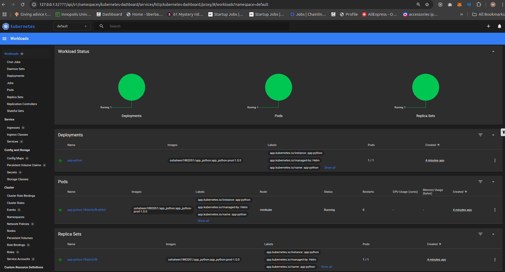
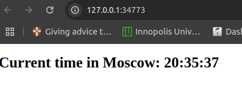
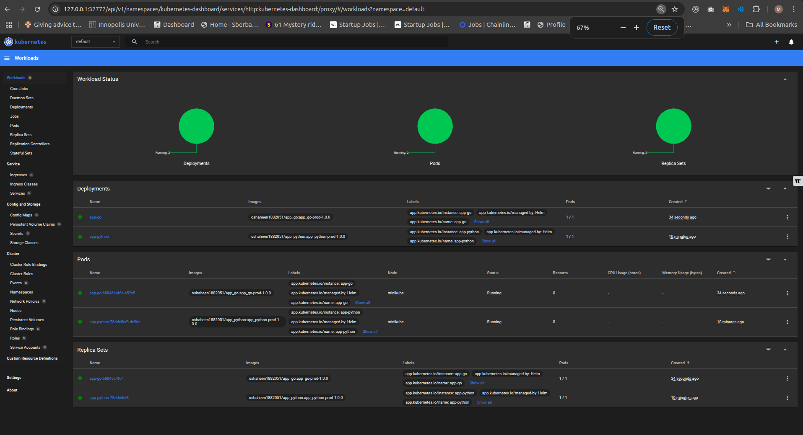
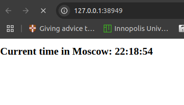

# Lab 10: Introduction to Helm

## Overview

This document outlines the steps taken to complete Lab 10, focusing on Helm setup, chart creation, deployment, and Helm chart hooks.

---

## Task 1: Helm Setup and Chart Creation

### 1. Installing Helm

To install Helm, follow the official documentation:

- [Helm Installation](https://helm.sh/docs/intro/install/)
- [Chart Repository Initialization](https://helm.sh/docs/intro/quickstart/#initialize-a-helm-chart-repository)

### 2. Creating a Helm Chart

A Helm chart for the application was generated using the following command:

```sh
helm create app-python
```

- The default repository, tag, and port in the `values.yaml` file were updated.

### 3. Installing the Helm Chart

```sh
helm install app-python app-python/
```

#### Output

```out
NAME: app-python
LAST DEPLOYED: Tue Feb 25 20:28:38 2025
NAMESPACE: default
STATUS: deployed
REVISION: 1
NOTES:
1. Get the application URL by running these commands:
  export POD_NAME=$(kubectl get pods --namespace default -l "app.kubernetes.io/name=app-python,app.kubernetes.io/instance=app-python" -o jsonpath="{.items[0].metadata.name}")
  export CONTAINER_PORT=$(kubectl get pod --namespace default $POD_NAME -o jsonpath="{.spec.containers[0].ports[0].containerPort}")
  echo "Visit http://127.0.0.1:8080 to use your application"
  kubectl --namespace default port-forward $POD_NAME 8080:$CONTAINER_PORT
```

To verify the application's health, check the Minikube dashboard:

```sh
minikube dashboard
```



### 4. Accessing the Application

The application can be accessed using the following command:

```sh
minikube service app-python
```

```log
|-----------|------------|-------------|--------------|
| NAMESPACE |    NAME    | TARGET PORT |     URL      |
|-----------|------------|-------------|--------------|
| default   | app-python |             | No node port |
|-----------|------------|-------------|--------------|
😿  service default/app-python has no node port
❗  Services [default/app-python] have type "ClusterIP" not meant to be exposed, however for local development minikube allows you to access this !
🏃  Starting tunnel for service app-python.
|-----------|------------|-------------|------------------------|
| NAMESPACE |    NAME    | TARGET PORT |          URL           |
|-----------|------------|-------------|------------------------|
| default   | app-python |             | http://127.0.0.1:34773 |
|-----------|------------|-------------|------------------------|
🎉  Opening service default/app-python in default browser...
/snap/core20/current/lib/x86_64-linux-gnu/libstdc++.so.6: version `GLIBCXX_3.4.29' not found (required by /lib/x86_64-linux-gnu/libproxy.so.1)
Failed to load module: /home/mohamad/snap/code/common/.cache/gio-modules/libgiolibproxy.so
❗  Because you are using a Docker driver on linux, the terminal needs to be open to run it.
Opening in existing browser session.
```



### 5. Listing Pods and Services

```sh
kubectl get pods,svc
```

```log
NAME                             READY   STATUS    RESTARTS   AGE
pod/app-python-78ddc5cf8-q99rd   1/1     Running   0          10m

NAME                 TYPE        CLUSTER-IP      EXTERNAL-IP   PORT(S)    AGE
service/app-python   ClusterIP   10.104.188.43   <none>        5000/TCP   10m
service/kubernetes   ClusterIP   10.96.0.1       <none>        443/TCP    24h
```

---

## Task 2: Helm Chart Hooks

### 1. Implementing Pre-install and Post-install Hooks

Pre-install and post-install hooks were added with a simple `sleep 20` command.

### 3. Listing Pods with Hooks

```sh
kubectl get po
```

```log
NAME                         READY   STATUS      RESTARTS   AGE
app-python-78ddc5cf8-sn6rm   1/1     Running     0          5m9s
postinstall-hook             0/1     Completed   0          5m9s
preinstall-hook              0/1     Completed   0          5m40s
```

### 4. Describing Pre-install and Post-install Hook

```sh
kubectl describe po preinstall-hook
```

```log
kubectl describe po preinstall-hook
Name:             preinstall-hook
Namespace:        default
Priority:         0
Service Account:  default
Node:             minikube/192.168.49.2
Start Time:       Tue, 25 Feb 2025 21:30:28 +0300
Labels:           <none>
Annotations:      helm.sh/hook: pre-install
Status:           Succeeded
IP:               10.244.0.40
IPs:
  IP:  10.244.0.40
Containers:
  pre-install-container:
    Container ID:  docker://9101678ada429ca1756df2603a80ee85e0b35fff7a729ed79429c7e612774e7e
    Image:         busybox
    Image ID:      docker-pullable://busybox@sha256:498a000f370d8c37927118ed80afe8adc38d1edcbfc071627d17b25c88efcab0
    Port:          <none>
    Host Port:     <none>
    Command:
      sh
      -c
      echo The pre-install hook is running && sleep 20
    State:          Terminated
      Reason:       Completed
      Exit Code:    0
      Started:      Tue, 25 Feb 2025 21:30:37 +0300
      Finished:     Tue, 25 Feb 2025 21:30:57 +0300
    Ready:          False
    Restart Count:  0
    Environment:    <none>
    Mounts:
      /var/run/secrets/kubernetes.io/serviceaccount from kube-api-access-bhwf9 (ro)
Conditions:
  Type                        Status
  PodReadyToStartContainers   False 
  Initialized                 True 
  Ready                       False 
  ContainersReady             False 
  PodScheduled                True 
Volumes:
  kube-api-access-bhwf9:
    Type:                    Projected (a volume that contains injected data from multiple sources)
    TokenExpirationSeconds:  3607
    ConfigMapName:           kube-root-ca.crt
    ConfigMapOptional:       <nil>
    DownwardAPI:             true
QoS Class:                   BestEffort
Node-Selectors:              <none>
Tolerations:                 node.kubernetes.io/not-ready:NoExecute op=Exists for 300s
                             node.kubernetes.io/unreachable:NoExecute op=Exists for 300s
Events:
  Type    Reason     Age    From               Message
  ----    ------     ----   ----               -------
  Normal  Scheduled  7m42s  default-scheduler  Successfully assigned default/preinstall-hook to minikube
  Normal  Pulling    7m42s  kubelet            Pulling image "busybox"
  Normal  Pulled     7m34s  kubelet            Successfully pulled image "busybox" in 8.31s (8.31s including waiting). Image size: 4269694 bytes.
  Normal  Created    7m34s  kubelet            Created container: pre-install-container
  Normal  Started    7m34s  kubelet            Started container pre-install-container
```

```sh
kubectl describe po postinstall-hook
```

```log
Name:             postinstall-hook
Namespace:        default
Priority:         0
Service Account:  default
Node:             minikube/192.168.49.2
Start Time:       Tue, 25 Feb 2025 21:30:59 +0300
Labels:           <none>
Annotations:      helm.sh/hook: post-install
Status:           Succeeded
IP:               10.244.0.42
IPs:
  IP:  10.244.0.42
Containers:
  post-install-container:
    Container ID:  docker://6b780ed7a110cc3013981a59d9411a001a142106429752528c2724eaab2bf19f
    Image:         busybox
    Image ID:      docker-pullable://busybox@sha256:498a000f370d8c37927118ed80afe8adc38d1edcbfc071627d17b25c88efcab0
    Port:          <none>
    Host Port:     <none>
    Command:
      sh
      -c
      echo The post-install hook is running && sleep 15
    State:          Terminated
      Reason:       Completed
      Exit Code:    0
      Started:      Tue, 25 Feb 2025 21:31:02 +0300
      Finished:     Tue, 25 Feb 2025 21:31:17 +0300
    Ready:          False
    Restart Count:  0
    Environment:    <none>
    Mounts:
      /var/run/secrets/kubernetes.io/serviceaccount from kube-api-access-5qfqq (ro)
Conditions:
  Type                        Status
  PodReadyToStartContainers   False 
  Initialized                 True 
  Ready                       False 
  ContainersReady             False 
  PodScheduled                True 
Volumes:
  kube-api-access-5qfqq:
    Type:                    Projected (a volume that contains injected data from multiple sources)
    TokenExpirationSeconds:  3607
    ConfigMapName:           kube-root-ca.crt
    ConfigMapOptional:       <nil>
    DownwardAPI:             true
QoS Class:                   BestEffort
Node-Selectors:              <none>
Tolerations:                 node.kubernetes.io/not-ready:NoExecute op=Exists for 300s
                             node.kubernetes.io/unreachable:NoExecute op=Exists for 300s
Events:
  Type    Reason     Age    From               Message
  ----    ------     ----   ----               -------
  Normal  Scheduled  7m36s  default-scheduler  Successfully assigned default/postinstall-hook to minikube
  Normal  Pulling    7m36s  kubelet            Pulling image "busybox"
  Normal  Pulled     7m34s  kubelet            Successfully pulled image "busybox" in 2.692s (2.692s including waiting). Image size: 4269694 bytes.
  Normal  Created    7m34s  kubelet            Created container: post-install-container
  Normal  Started    7m34s  kubelet            Started container post-install-container

```

```sh
kubectl get pods,svc
```

```log
NAME                             READY   STATUS      RESTARTS   AGE
pod/app-python-78ddc5cf8-sn6rm   1/1     Running     0          8m59s
pod/postinstall-hook             0/1     Completed   0          8m59s
pod/preinstall-hook              0/1     Completed   0          9m30s

NAME                 TYPE        CLUSTER-IP     EXTERNAL-IP   PORT(S)    AGE
service/app-python   ClusterIP   10.108.85.45   <none>        5000/TCP   8m59s
service/kubernetes   ClusterIP   10.96.0.1      <none>        443/TCP    25h
```

### 5. Hook Delete Policy

A hook delete policy was implemented to remove hooks after execution.

```sh
kubectl get po
```

```log
NAME                         READY   STATUS    RESTARTS   AGE
app-python-78ddc5cf8-dc9kz   1/1     Running   0          79s
```

---

## Bonus Task: Helm Library Chart

### 1. Creating an Additional Helm Chart

A Helm chart for the go application was generated using the following command:

```sh
helm create app-go
```

- The default repository, tag, and port in the `values.yaml` file were updated.

### 2. Installing the Helm Chart

```sh
helm install app-go app-go/
```

```out
NAME: app-go
LAST DEPLOYED: Tue Feb 25 22:17:36 2025
NAMESPACE: default
STATUS: deployed
REVISION: 1
NOTES:
1. Get the application URL by running these commands:
  export POD_NAME=$(kubectl get pods --namespace default -l "app.kubernetes.io/name=app-go,app.kubernetes.io/instance=app-go" -o jsonpath="{.items[0].metadata.name}")
  export CONTAINER_PORT=$(kubectl get pod --namespace default $POD_NAME -o jsonpath="{.spec.containers[0].ports[0].containerPort}")
  echo "Visit http://127.0.0.1:8080 to use your application"
  kubectl --namespace default port-forward $POD_NAME 8080:$CONTAINER_PORT
```

To verify the application's health, check the Minikube dashboard:

```sh
minikube dashboard
```



### 3. Accessing the Application

The application can be accessed using the following command:

```sh
minikube service app-go
```

```log
|-----------|--------|-------------|--------------|
| NAMESPACE |  NAME  | TARGET PORT |     URL      |
|-----------|--------|-------------|--------------|
| default   | app-go |             | No node port |
|-----------|--------|-------------|--------------|
😿  service default/app-go has no node port
❗  Services [default/app-go] have type "ClusterIP" not meant to be exposed, however for local development minikube allows you to access this !
🏃  Starting tunnel for service app-go.
|-----------|--------|-------------|------------------------|
| NAMESPACE |  NAME  | TARGET PORT |          URL           |
|-----------|--------|-------------|------------------------|
| default   | app-go |             | http://127.0.0.1:38949 |
|-----------|--------|-------------|------------------------|
🎉  Opening service default/app-go in default browser...
/snap/core20/current/lib/x86_64-linux-gnu/libstdc++.so.6: version `GLIBCXX_3.4.29' not found (required by /lib/x86_64-linux-gnu/libproxy.so.1)
Failed to load module: /home/mohamad/snap/code/common/.cache/gio-modules/libgiolibproxy.so
❗  Because you are using a Docker driver on linux, the terminal needs to be open to run it.
Opening in existing browser session.
```



### 4. Listing Pods and Services

```sh
kubectl get pods,svc
```

```log
NAME                             READY   STATUS    RESTARTS   AGE
pod/app-go-68846c4f64-s52x5      1/1     Running   0          2m29s
pod/app-python-78ddc5cf8-dc9kz   1/1     Running   0          12m

NAME                 TYPE        CLUSTER-IP      EXTERNAL-IP   PORT(S)    AGE
service/app-go       ClusterIP   10.109.11.123   <none>        3000/TCP   2m29s
service/app-python   ClusterIP   10.99.116.82    <none>        5000/TCP   12m
service/kubernetes   ClusterIP   10.96.0.1       <none>        443/TCP    25h
```

### 5. Implementing Pre-install and Post-install Hooks

Pre-install and post-install hooks were added with a simple `sleep 20` command.

### 6. Listing Pods with Hooks

```sh
kubectl get po
```

```log
NAME                         READY   STATUS      RESTARTS   AGE
app-go-68846c4f64-xds5p      1/1     Running     0          33s
app-python-78ddc5cf8-dc9kz   1/1     Running     0          20m
postinstall-hook             0/1     Completed   0          33s
preinstall-hook              0/1     Completed   0          55s
```

### 7. Describing Pre-install and Post-install Hook

```sh
kubectl describe po preinstall-hook
```

```log
Name:             preinstall-hook
Namespace:        default
Priority:         0
Service Account:  default
Node:             minikube/192.168.49.2
Start Time:       Tue, 25 Feb 2025 22:26:51 +0300
Labels:           <none>
Annotations:      helm.sh/hook: pre-install
Status:           Succeeded
IP:               10.244.0.53
IPs:
  IP:  10.244.0.53
Containers:
  pre-install-container:
    Container ID:  docker://8037152e4299ec680ca8b77bd43a2ae0744e78e6c85578be95ffdd37633bb838
    Image:         busybox
    Image ID:      docker-pullable://busybox@sha256:498a000f370d8c37927118ed80afe8adc38d1edcbfc071627d17b25c88efcab0
    Port:          <none>
    Host Port:     <none>
    Command:
      sh
      -c
      echo The pre-install hook is running && sleep 20
    State:          Terminated
      Reason:       Completed
      Exit Code:    0
      Started:      Tue, 25 Feb 2025 22:26:52 +0300
      Finished:     Tue, 25 Feb 2025 22:27:12 +0300
    Ready:          False
    Restart Count:  0
    Environment:    <none>
    Mounts:
      /var/run/secrets/kubernetes.io/serviceaccount from kube-api-access-nhk8l (ro)
Conditions:
  Type                        Status
  PodReadyToStartContainers   False 
  Initialized                 True 
  Ready                       False 
  ContainersReady             False 
  PodScheduled                True 
Volumes:
  kube-api-access-nhk8l:
    Type:                    Projected (a volume that contains injected data from multiple sources)
    TokenExpirationSeconds:  3607
    ConfigMapName:           kube-root-ca.crt
    ConfigMapOptional:       <nil>
    DownwardAPI:             true
QoS Class:                   BestEffort
Node-Selectors:              <none>
Tolerations:                 node.kubernetes.io/not-ready:NoExecute op=Exists for 300s
                             node.kubernetes.io/unreachable:NoExecute op=Exists for 300s
Events:
  Type    Reason     Age   From               Message
  ----    ------     ----  ----               -------
  Normal  Scheduled  116s  default-scheduler  Successfully assigned default/preinstall-hook to minikube
  Normal  Pulled     116s  kubelet            Container image "busybox" already present on machine
  Normal  Created    116s  kubelet            Created container: pre-install-container
  Normal  Started    116s  kubelet            Started container pre-install-container
```

```sh
kubectl describe po postinstall-hook
```

```log
Name:             postinstall-hook
Namespace:        default
Priority:         0
Service Account:  default
Node:             minikube/192.168.49.2
Start Time:       Tue, 25 Feb 2025 22:27:13 +0300
Labels:           <none>
Annotations:      helm.sh/hook: post-install
Status:           Succeeded
IP:               10.244.0.55
IPs:
  IP:  10.244.0.55
Containers:
  post-install-container:
    Container ID:  docker://c385e6f13dfe2cc46ac69d9f39f6bab96ca83b923fa72d7f661a98d3ed227adc
    Image:         busybox
    Image ID:      docker-pullable://busybox@sha256:498a000f370d8c37927118ed80afe8adc38d1edcbfc071627d17b25c88efcab0
    Port:          <none>
    Host Port:     <none>
    Command:
      sh
      -c
      echo The post-install hook is running && sleep 15
    State:          Terminated
      Reason:       Completed
      Exit Code:    0
      Started:      Tue, 25 Feb 2025 22:27:16 +0300
      Finished:     Tue, 25 Feb 2025 22:27:31 +0300
    Ready:          False
    Restart Count:  0
    Environment:    <none>
    Mounts:
      /var/run/secrets/kubernetes.io/serviceaccount from kube-api-access-r4ddx (ro)
Conditions:
  Type                        Status
  PodReadyToStartContainers   False 
  Initialized                 True 
  Ready                       False 
  ContainersReady             False 
  PodScheduled                True 
Volumes:
  kube-api-access-r4ddx:
    Type:                    Projected (a volume that contains injected data from multiple sources)
    TokenExpirationSeconds:  3607
    ConfigMapName:           kube-root-ca.crt
    ConfigMapOptional:       <nil>
    DownwardAPI:             true
QoS Class:                   BestEffort
Node-Selectors:              <none>
Tolerations:                 node.kubernetes.io/not-ready:NoExecute op=Exists for 300s
                             node.kubernetes.io/unreachable:NoExecute op=Exists for 300s
Events:
  Type    Reason     Age   From               Message
  ----    ------     ----  ----               -------
  Normal  Scheduled  119s  default-scheduler  Successfully assigned default/postinstall-hook to minikube
  Normal  Pulling    119s  kubelet            Pulling image "busybox"
  Normal  Pulled     117s  kubelet            Successfully pulled image "busybox" in 2.213s (2.213s including waiting). Image size: 4269694 bytes.
  Normal  Created    117s  kubelet            Created container: post-install-container
  Normal  Started    117s  kubelet            Started container post-install-container

```

### 8. Hook Delete Policy

A hook delete policy was implemented to remove hooks after execution.

```sh
kubectl get po
```

```log
NAME                         READY   STATUS    RESTARTS   AGE
app-go-68846c4f64-m28rj      1/1     Running   0          45s
app-python-78ddc5cf8-dc9kz   1/1     Running   0          24m
```

### 9. Implementing a Library Chart

A library chart was created to include a "labels" template to avoid redundancy between charts.

```sh
helm dependency update app-python
```

```log
Saving 1 charts
Deleting outdated charts
```

```sh
helm dependency update app-go
```

```log
Saving 1 charts
Deleting outdated charts
```

```sh
helm install --name-template=app-python app-python
```

```log
NAME: app-python
LAST DEPLOYED: Wed Feb 26 09:55:33 2025
NAMESPACE: default
STATUS: deployed
REVISION: 1
NOTES:
1. Get the application URL by running these commands:
  export POD_NAME=$(kubectl get pods --namespace default -l "app.kubernetes.io/name=app-python,app.kubernetes.io/instance=app-python" -o jsonpath="{.items[0].metadata.name}")
  export CONTAINER_PORT=$(kubectl get pod --namespace default $POD_NAME -o jsonpath="{.spec.containers[0].ports[0].containerPort}")
  echo "Visit http://127.0.0.1:8080 to use your application"
```

```sh
helm install --name-template=app-go app-go
```

```log
NAME: app-go
LAST DEPLOYED: Wed Feb 26 09:56:54 2025
NAMESPACE: default
STATUS: deployed
REVISION: 1
NOTES:
1. Get the application URL by running these commands:
  export POD_NAME=$(kubectl get pods --namespace default -l "app.kubernetes.io/name=app-go,app.kubernetes.io/instance=app-go" -o jsonpath="{.items[0].metadata.name}")
  export CONTAINER_PORT=$(kubectl get pod --namespace default $POD_NAME -o jsonpath="{.spec.containers[0].ports[0].containerPort}")
  echo "Visit http://127.0.0.1:8080 to use your application"
  kubectl --namespace default port-forward $POD_NAME 8080:$CONTAINER_PORT
```
