## Task 1: Helm Setup and Chart Creation

Screenshots demonstrate that I successfully installed Helm, configured Helm Chart for `moscow-time-app`
and installed Helm Chart on my Minikube cluster:

- Created Helm Chart
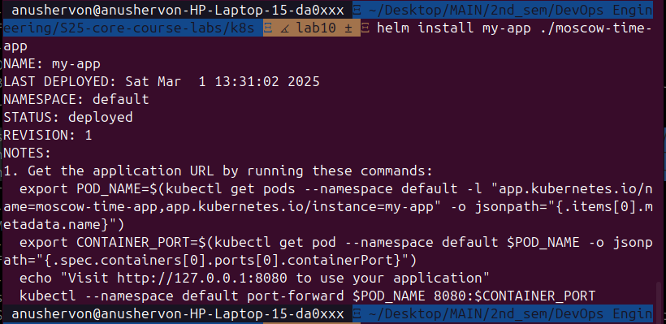

- Display of created Helm chart: 
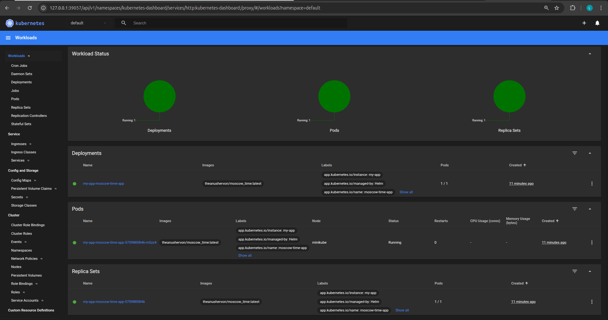
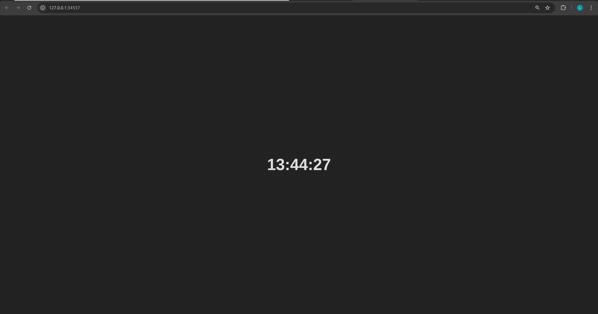

- Output for `kubectl get pods, svc`
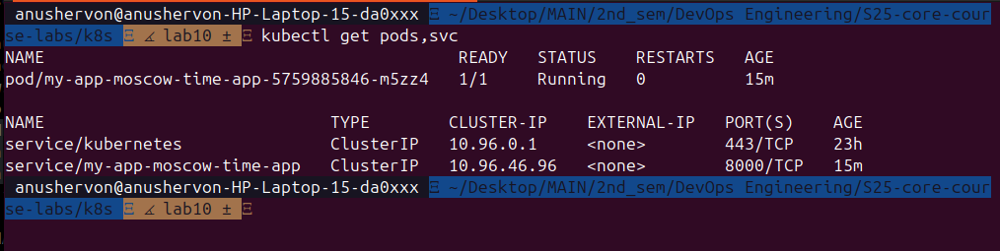

## Task2: Helm Chart Hooks

### Output of commands: 

`helm lint moscow-time-app`
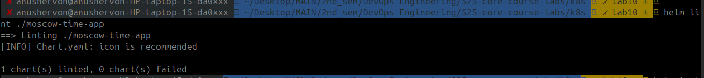

`helm install --dry-run helm-hooks <your_chart_name>`
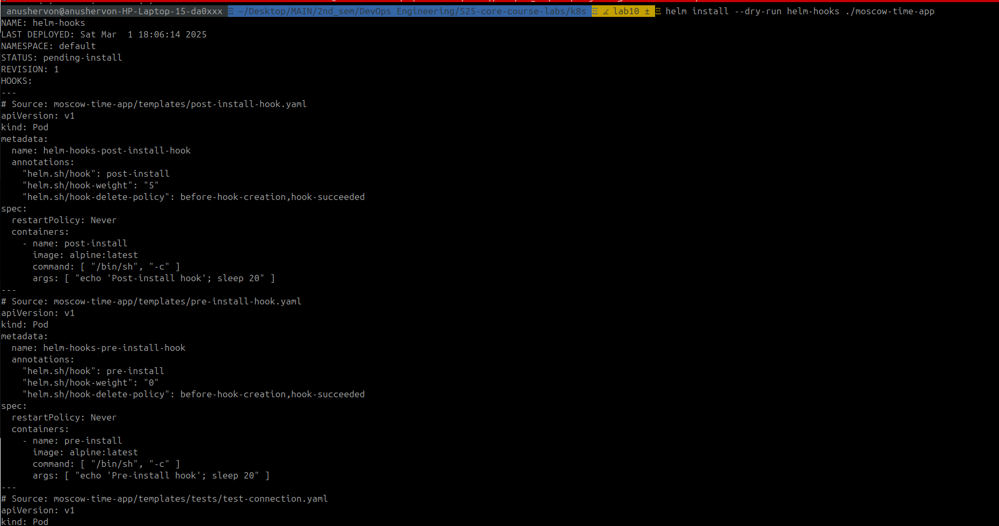

`kubectl get po --watch`
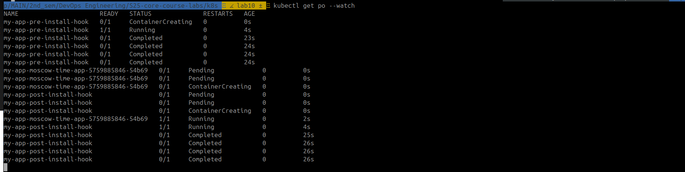

`kubectl describe po my-app-pre-install-hook`
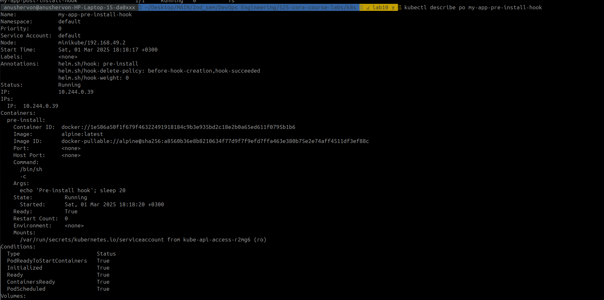
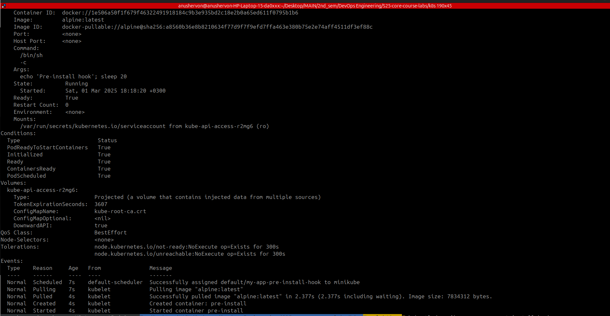

`kubectl describe po my-app-post-install-hook`

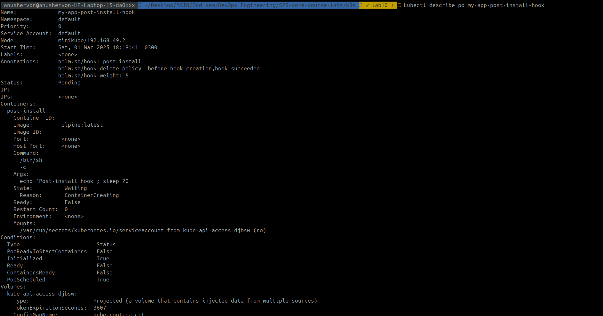
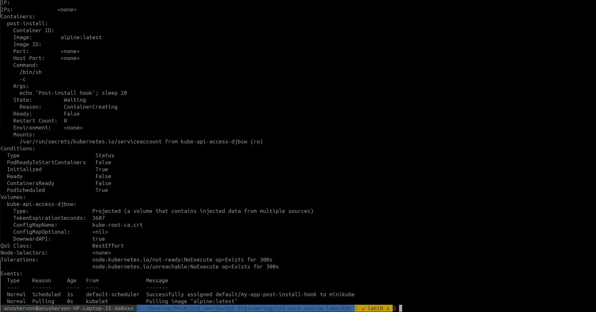