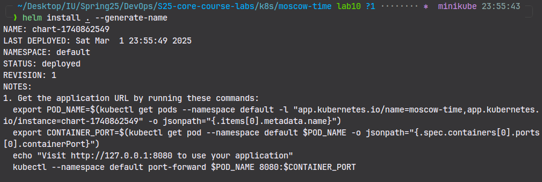
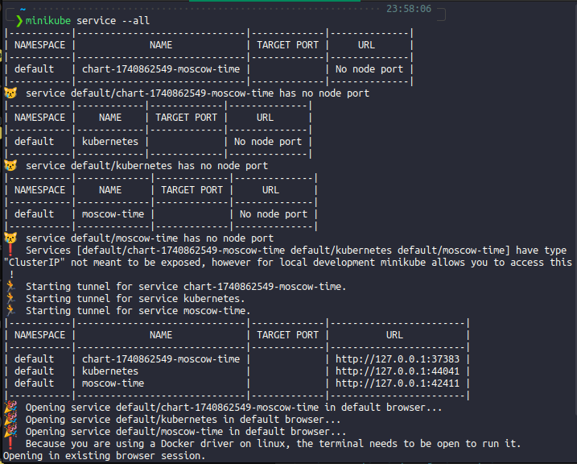
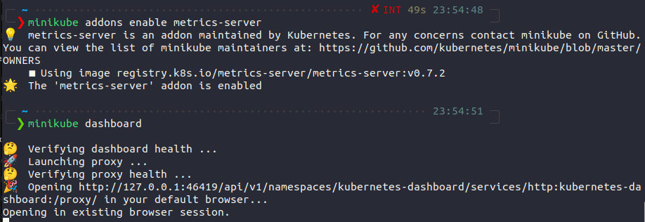
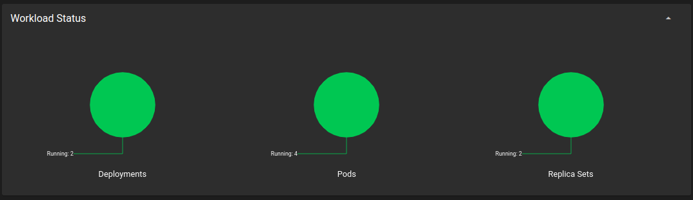
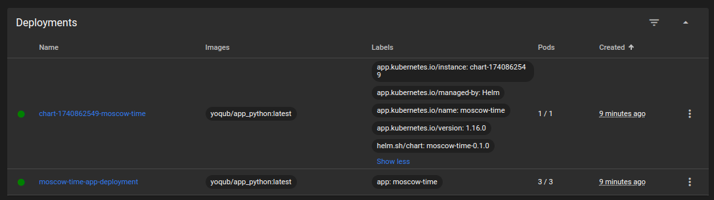
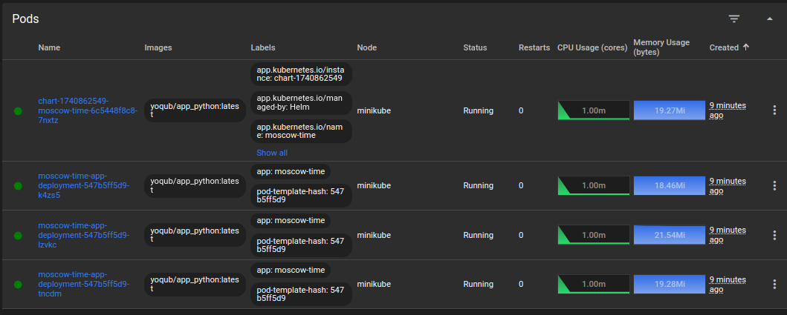
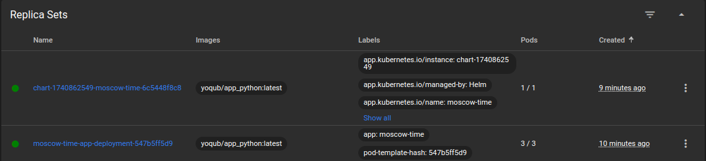
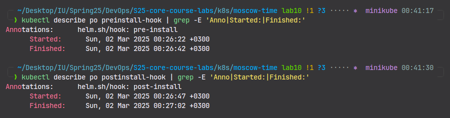
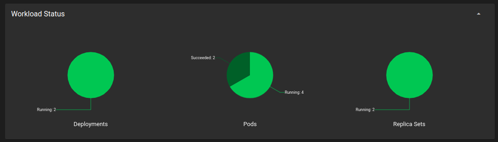

# Helm Chart Deployment Documentation

## Creating and Deploying a Helm Chart

1. **Navigate to the Kubernetes Configuration Directory:**

   ```sh
   cd k8s
   ```

2. **Create a New Helm Chart Named `moscow-time`:**

   ```sh
   helm create moscow-time
   ```

3. **Navigate to the Newly Created Helm Chart Directory:**

   ```sh
   cd moscow-time
   ```

4. **Install the Helm Chart:**

   ```sh
   helm install . --generate-name
   ```

   **Expected Output:**
   

## Exposing Services in Minikube

1. **List All Services Running in Minikube:**

   ```sh
   minikube service --all
   ```

   **Expected Output:**
   

2. **Access the Minikube Dashboard:**

   ```sh
   minikube dashboard
   ```

   **Expected Output:**
   
   
   
   
   

---

This document outlines the steps to create and deploy a Helm chart within a Kubernetes Minikube environment. The outputs will be confirmed with screenshots during execution.

## Helm Chart Hooks

- `helm install helm-hooks .`

**Expected Output:**

```sh
NAME: helm-hooks
LAST DEPLOYED: Sun Mar  2 00:26:16 2025
NAMESPACE: default
STATUS: deployed
REVISION: 1
NOTES:
1. Get the application URL by running these commands:
  export POD_NAME=$(kubectl get pods --namespace default -l "app.kubernetes.io/name=moscow-time,app.kubernetes.io/instance=helm-hooks" -o jsonpath="{.items[0].metadata.name}")
  export CONTAINER_PORT=$(kubectl get pod --namespace default $POD_NAME -o jsonpath="{.spec.containers[0].ports[0].containerPort}")
  echo "Visit http://127.0.0.1:8080 to use your application"
  kubectl --namespace default port-forward $POD_NAME 8080:$CONTAINER_PORT
```

- `kubectl get pods`
  **Expected Output:**

```sh
NAME                                            READY   STATUS      RESTARTS   AGE
chart-1740862549-moscow-time-6c5448f8c8-7nxtz   1/1     Running     0          31m
helm-hooks-moscow-time-558dcc9768-7fw4l         1/1     Running     0          51s
moscow-time-app-deployment-547b5ff5d9-k4zs5     1/1     Running     0          31m
moscow-time-app-deployment-547b5ff5d9-lzvkc     1/1     Running     0          31m
moscow-time-app-deployment-547b5ff5d9-tncdm     1/1     Running     0          31m
postinstall-hook                                0/1     Completed   0          51s
preinstall-hook                                 0/1     Completed   0          78s
```

- `kubectl describe po preinstall-hook`
  **Expected Output:**

```sh
Name:             preinstall-hook
Namespace:        default
Priority:         0
Service Account:  default
Node:             minikube/192.168.49.2
Start Time:       Sun, 02 Mar 2025 00:26:17 +0300
Labels:           <none>
Annotations:      helm.sh/hook: pre-install
Status:           Succeeded
IP:               10.244.0.10
IPs:
  IP:  10.244.0.10
Containers:
  pre-install-container:
    Container ID:  docker://7c6c3879fd87823586d87bf20995fb3b6e0a664b3ab26b85a76ca0e3e5fae061
    Image:         busybox
    Image ID:      docker-pullable://busybox@sha256:498a000f370d8c37927118ed80afe8adc38d1edcbfc071627d17b25c88efcab0
    Port:          <none>
    Host Port:     <none>
    Command:
      sh
      -c
      echo The pre-install hook is running && sleep 20
    State:          Terminated
      Reason:       Completed
      Exit Code:    0
      Started:      Sun, 02 Mar 2025 00:26:22 +0300
      Finished:     Sun, 02 Mar 2025 00:26:42 +0300
    Ready:          False
    Restart Count:  0
    Environment:    <none>
    Mounts:
      /var/run/secrets/kubernetes.io/serviceaccount from kube-api-access-mm9h4 (ro)
Conditions:
  Type                        Status
  PodReadyToStartContainers   False
  Initialized                 True
  Ready                       False
  ContainersReady             False
  PodScheduled                True
Volumes:
  kube-api-access-mm9h4:
    Type:                    Projected (a volume that contains injected data from multiple sources)
    TokenExpirationSeconds:  3607
    ConfigMapName:           kube-root-ca.crt
    ConfigMapOptional:       <nil>
    DownwardAPI:             true
QoS Class:                   BestEffort
Node-Selectors:              <none>
Tolerations:                 node.kubernetes.io/not-ready:NoExecute op=Exists for 300s
                             node.kubernetes.io/unreachable:NoExecute op=Exists for 300s
Events:
  Type    Reason     Age    From               Message
  ----    ------     ----   ----               -------
  Normal  Scheduled  3m24s  default-scheduler  Successfully assigned default/preinstall-hook to minikube
  Normal  Pulling    3m24s  kubelet            Pulling image "busybox"
  Normal  Pulled     3m19s  kubelet            Successfully pulled image "busybox" in 4.883s (4.883s including waiting). Image size: 4269694 bytes.
  Normal  Created    3m19s  kubelet            Created container: pre-install-container
  Normal  Started    3m19s  kubelet            Started container pre-install-container
```

- `kubectl describe po postinstall-hook`

**Expected Output:**

```sh
Name:             postinstall-hook
Namespace:        default
Priority:         0
Service Account:  default
Node:             minikube/192.168.49.2
Start Time:       Sun, 02 Mar 2025 00:26:44 +0300
Labels:           <none>
Annotations:      helm.sh/hook: post-install
Status:           Succeeded
IP:               10.244.0.12
IPs:
  IP:  10.244.0.12
Containers:
  post-install-container:
    Container ID:  docker://c694e22bd0d7a9976b88599fd86a5031e5e9a1739454258a4563f87ae9bbd559
    Image:         busybox
    Image ID:      docker-pullable://busybox@sha256:498a000f370d8c37927118ed80afe8adc38d1edcbfc071627d17b25c88efcab0
    Port:          <none>
    Host Port:     <none>
    Command:
      sh
      -c
      echo The post-install hook is running && sleep 15
    State:          Terminated
      Reason:       Completed
      Exit Code:    0
      Started:      Sun, 02 Mar 2025 00:26:47 +0300
      Finished:     Sun, 02 Mar 2025 00:27:02 +0300
    Ready:          False
    Restart Count:  0
    Environment:    <none>
    Mounts:
      /var/run/secrets/kubernetes.io/serviceaccount from kube-api-access-blndc (ro)
Conditions:
  Type                        Status
  PodReadyToStartContainers   False
  Initialized                 True
  Ready                       False
  ContainersReady             False
  PodScheduled                True
Volumes:
  kube-api-access-blndc:
    Type:                    Projected (a volume that contains injected data from multiple sources)
    TokenExpirationSeconds:  3607
    ConfigMapName:           kube-root-ca.crt
    ConfigMapOptional:       <nil>
    DownwardAPI:             true
QoS Class:                   BestEffort
Node-Selectors:              <none>
Tolerations:                 node.kubernetes.io/not-ready:NoExecute op=Exists for 300s
                             node.kubernetes.io/unreachable:NoExecute op=Exists for 300s
Events:
  Type    Reason     Age    From               Message
  ----    ------     ----   ----               -------
  Normal  Scheduled  8m40s  default-scheduler  Successfully assigned default/postinstall-hook to minikube
  Normal  Pulling    8m39s  kubelet            Pulling image "busybox"
  Normal  Pulled     8m37s  kubelet            Successfully pulled image "busybox" in 2.208s (2.208s including waiting). Image size: 4269694 bytes.
  Normal  Created    8m37s  kubelet            Created container: post-install-container
  Normal  Started    8m37s  kubelet            Started container post-install-container
```

**TLDR:**



**Updated Charts:**


