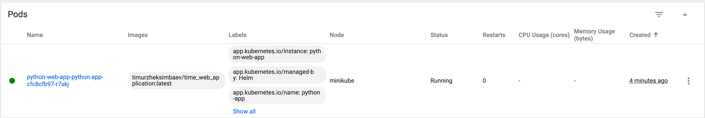
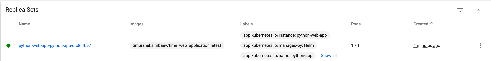

# Helm Chart Documentation

This document contains documentation for the Helm charts created for the Moscow Time applications.

## Setup Process

### Installing Helm

Install helm 

```bash
brew install helm
```

### Creating a Helm Chart for the Python Application

A Helm chart was created for the Python Moscow Time application:

```bash
cd k8s
helm create python-app
```

The generated files were modified to match our application requirements:

1. Updated `values.yaml` with our container image and configuration
2. Added Helm hooks for pre-install and post-install operations


## Deployment Process

The Helm chart was installed with:

```bash
helm install python-web-app ./python-app
```

## Verification Output

### Installed Helm Releases

```bash
$ helm list
NAME            NAMESPACE       REVISION        UPDATED                                 STATUS          CHART                   APP VERSION
python-web-app  default         1               2025-02-26 19:22:41.229401 +0300 MSK    deployed        python-app-0.1.0        1.16.0   
```

### Kubernetes Resources

```bash
$ kubectl get pods,svc
NAME                                            READY   STATUS    RESTARTS   AGE
pod/my-python-app-64cf657b4f-gv679              1/1     Running   0          3m25s
pod/python-moscow-time-689648c449-6876c         1/1     Running   0          5m20s
pod/python-moscow-time-689648c449-7kc5j         1/1     Running   0          5m20s
pod/python-moscow-time-689648c449-b7rm4         1/1     Running   0          5m20s
pod/python-web-app-python-app-cfc8cfb97-x6wbq   1/1     Running   0          13m

NAME                                TYPE        CLUSTER-IP      EXTERNAL-IP   PORT(S)    AGE
service/kubernetes                  ClusterIP   10.96.0.1       <none>        443/TCP    3h48m
service/python-web-app-python-app   ClusterIP   10.111.69.148   <none>        3000/TCP   13m
```






## Hook Details

### Linting 
```bash
$ helm lint python-app
==> Linting python-app
[INFO] Chart.yaml: icon is recommended

1 chart(s) linted, 0 chart(s) failed
```


### Installing hooks
```bash
$ helm install helm-hooks python-app
NAME: helm-hooks
LAST DEPLOYED: Wed Feb 26 19:56:22 2025
NAMESPACE: default
STATUS: deployed
REVISION: 1
NOTES:
1. Get the application URL by running these commands:
  export POD_NAME=$(kubectl get pods --namespace default -l "app.kubernetes.io/name=python-app,app.kubernetes.io/instance=helm-hooks" -o jsonpath="{.items[0].metadata.name}")
  export CONTAINER_PORT=$(kubectl get pod --namespace default $POD_NAME -o jsonpath="{.spec.containers[0].ports[0].containerPort}")
  echo "Visit http://127.0.0.1:8080 to use your application"
  kubectl --namespace default port-forward $POD_NAME 8080:$CONTAINER_PORT
```

### Checking pods 
```bash
$ kubectl get po
NAME                                        READY   STATUS    RESTARTS   AGE
helm-hooks-python-app-b6958b96c-sg9dp       1/1     Running   0          67s
python-web-app-python-app-cfc8cfb97-r7skj   1/1     Running   0          17m
```

### Checking hooks 
```bash
$ kubectl describe po helm-hooks-python-app-b6958b96c-sg9dp
Name:             helm-hooks-python-app-b6958b96c-sg9dp
Namespace:        default
Priority:         0
Service Account:  helm-hooks-python-app
Node:             minikube/10.0.2.15
Start Time:       Wed, 26 Feb 2025 19:56:49 +0300
Labels:           app.kubernetes.io/instance=helm-hooks
                  app.kubernetes.io/managed-by=Helm
                  app.kubernetes.io/name=python-app
                  app.kubernetes.io/version=1.16.0
                  helm.sh/chart=python-app-0.1.0
                  pod-template-hash=b6958b96c
Annotations:      <none>
Status:           Running
IP:               10.244.0.52
IPs:
  IP:           10.244.0.52
Controlled By:  ReplicaSet/helm-hooks-python-app-b6958b96c
Containers:
  python-app:
    Container ID:   docker://5a83cfc73d09313b8f7527766986b6137c25c93fc25fa3c0c194e5e7a3e9f826
    Image:          timurzheksimbaev/time_web_application:latest
    Image ID:       docker-pullable://timurzheksimbaev/time_web_application@sha256:105e39972b3a1949215ac43874b7613281e2722bc21bc53d54be562adc51457f
    Port:           3000/TCP
    Host Port:      0/TCP
    State:          Running
      Started:      Wed, 26 Feb 2025 19:56:49 +0300
    Ready:          True
    Restart Count:  0
    Liveness:       http-get http://:http/ delay=0s timeout=1s period=10s #success=1 #failure=3
    Readiness:      http-get http://:http/ delay=0s timeout=1s period=10s #success=1 #failure=3
    Environment:    <none>
    Mounts:
      /var/run/secrets/kubernetes.io/serviceaccount from kube-api-access-n7jf5 (ro)
Conditions:
  Type                        Status
  PodReadyToStartContainers   True 
  Initialized                 True 
  Ready                       True 
  ContainersReady             True 
  PodScheduled                True 
Volumes:
  kube-api-access-n7jf5:
    Type:                    Projected (a volume that contains injected data from multiple sources)
    TokenExpirationSeconds:  3607
    ConfigMapName:           kube-root-ca.crt
    ConfigMapOptional:       <nil>
    DownwardAPI:             true
QoS Class:                   BestEffort
Node-Selectors:              <none>
Tolerations:                 node.kubernetes.io/not-ready:NoExecute op=Exists for 300s
                             node.kubernetes.io/unreachable:NoExecute op=Exists for 300s
```


