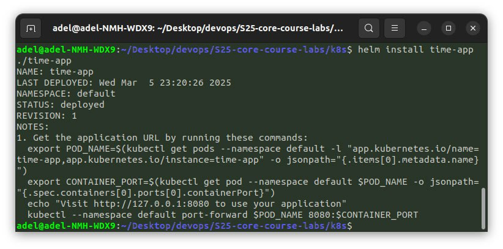

# Helm

## Lab 10: Introduction to Helm

## Task 1: Helm Setup and Chart Creation

The following screenshots demonstrate that I successfully installed Helm, configured Helm Chart for `time-app`
and installed Helm Chart on my Minikube cluster:

## Task 2: Helm Chart Hooks

The following screenshots demonstate that I successfully implemented
pre-install and post-install Helm Chart Hooks for `time-app`:

Previous creenshot was captured during following command:

