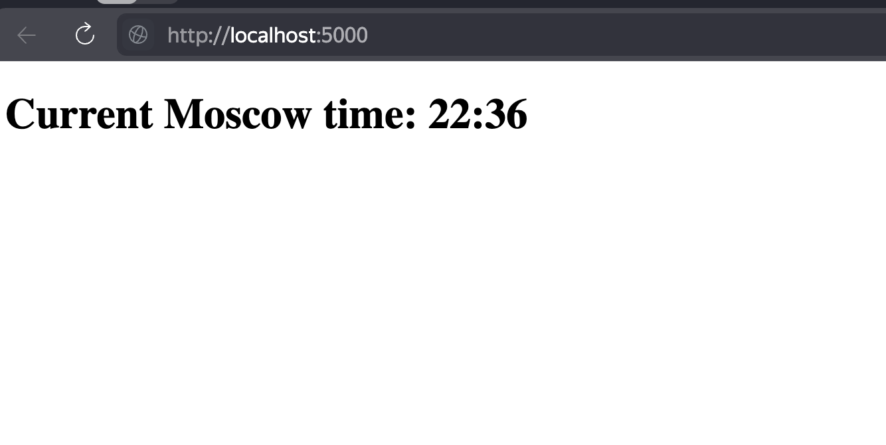

## Framework selection

I use flask framework. Reasons why:

* I am familiar with this framework for creating web apps.
* It is simple for this kind of web applications
* I don't have to make difficult structure for it, I wrote only 2 files to make app work (might even did all in one file)

## Code standards

* I created a file structure 
```
README.md       app_python      lab1.md         lab2.md         lab3.md         lab4.md

./app_python:
PYTHON.md       doc             main.py         templates

./app_python/doc:
img

./app_python/doc/img:
console.png     webapp.png

./app_python/templates:
index.html
```
* I created a virtual env for python (it is ignored by git)
* I created .gitignore file to keep code clean
* requirements.txt are on place, it is easy for user to download all needed dependencies
* For all others code standards code is too small yet to show it
* Tests are in pictures below, I don't really know how to check the correctness of a time



