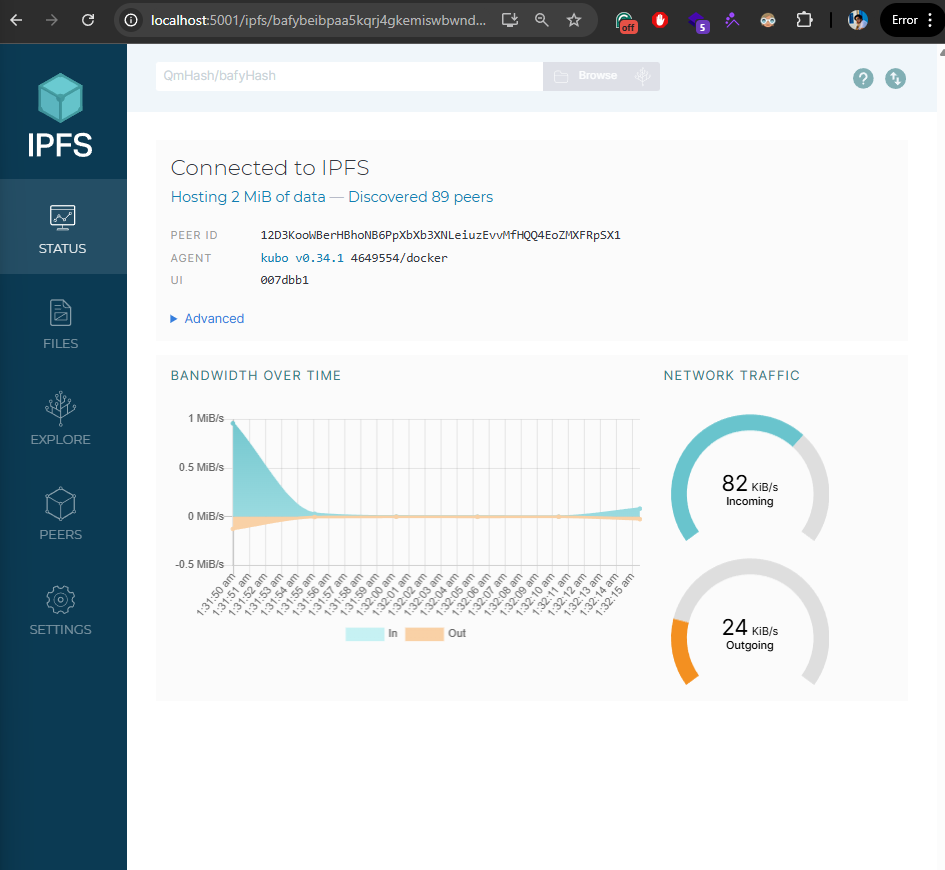
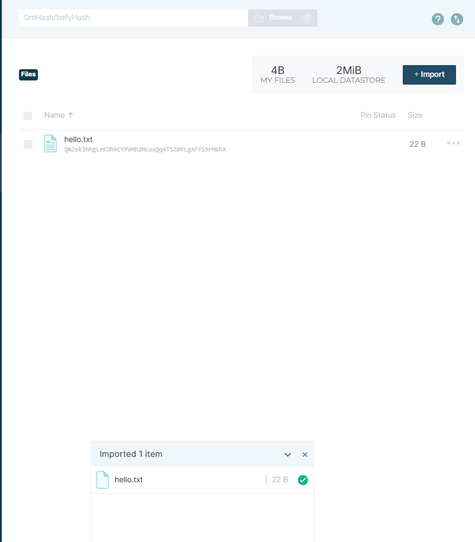
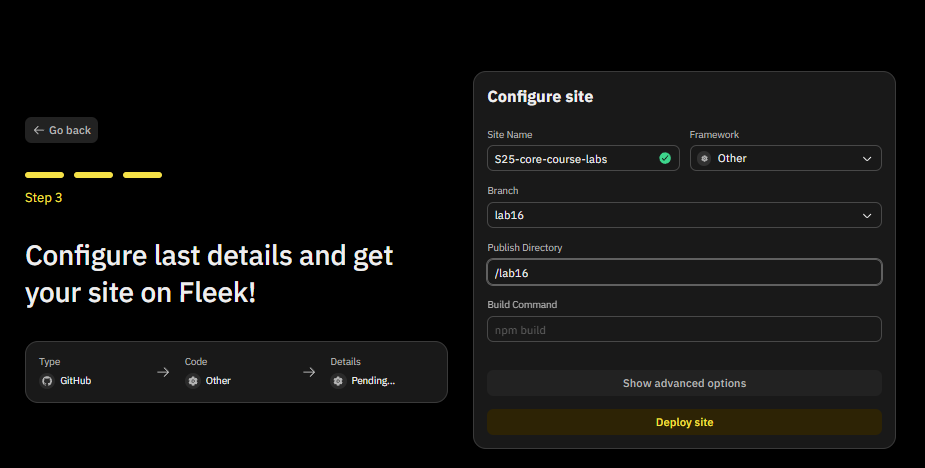
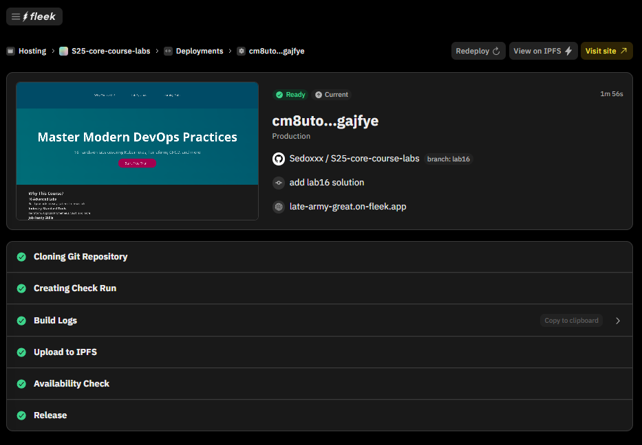
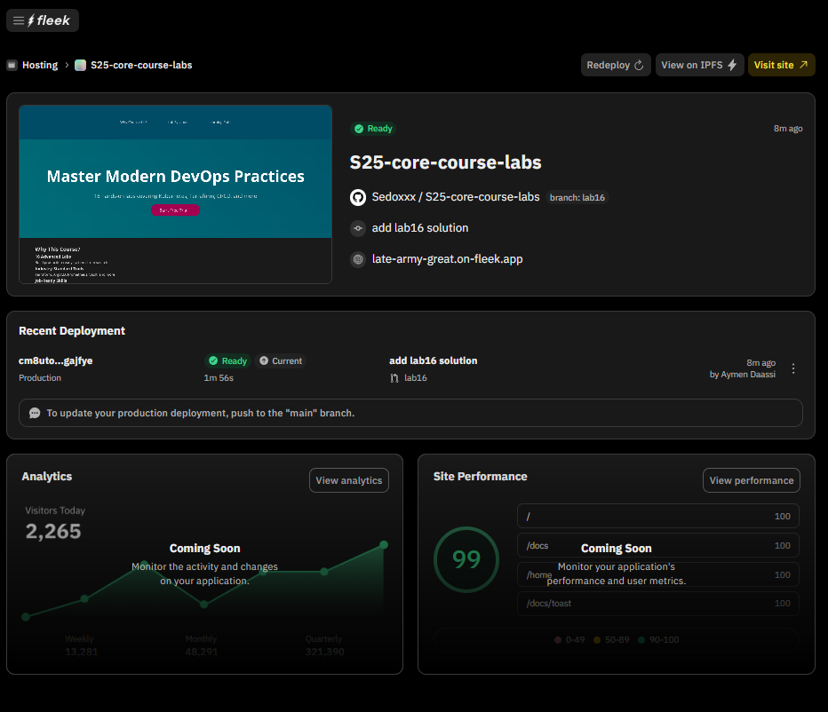
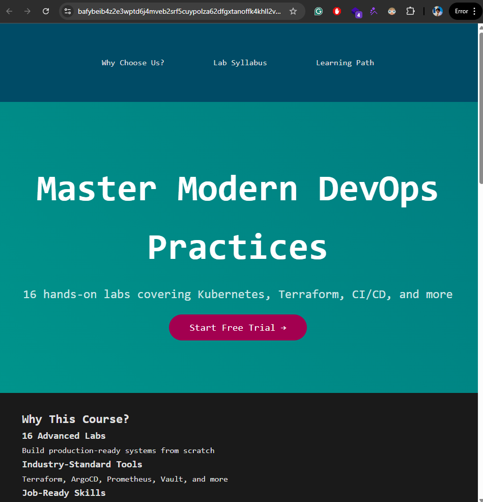

# Lab 16 : IPFS and Fleek

## Task 1: IPFS Gateway Using Docker

1. **Pull the IPFS Docker image:**
    ```bash
    docker pull ipfs/go-ipfs
    ```

2. **Run the IPFS Docker container:**
    ```bash
    $ docker run -d --name ipfs_host -v /path/to/folder/with/file:/export -v ipfs_data:/data/ipfs -p 8080:8080 -p 4001:4001 -p 5001:5001 ipfs/go-ipfs
537c46f57013ed95e797134f5cf0c701dae86e48f363e3728977964329a4305d
    ```
3. **Verify the IPFS container is running:**
    ```bash
    docker ps
    ```

4. **Open the IPFS Gateway:**
    ```bash
    http://localhost:5001/webui
    ```


5. **Upload a file to IPFS:**


Hash: QmZek3hhgLeKUh4CYPVMh2McoxQq4TSZmYLgAFYS9rM6hX
Link: https://ipfs.io/ipfs/QmZek3hhgLeKUh4CYPVMh2McoxQq4TSZmYLgAFYS9rM6hX
CloudFlare Link : https://cloudflare-ipfs.com/ipfs/QmZek3hhgLeKUh4CYPVMh2McoxQq4TSZmYLgAFYS9rM6hX
Dweb Link : https://bafybeificmf5trd3jzkts4u3rfa75oaedo6upjldjqfi4gzajo42vvia2i.ipfs.dweb.link?filename=hello.txt


6. **Connected Peers:**


## Task 2: Fleek Project Setup

1. **Setup the Fleek Project:**



2. **Deploy the project:**



3. **Verify the Deployment:**






Link : https://dweb.link/ipfs/bafybeib4z2e3wptd6j4mveb2srf5cuypolza62dfgxtanoffk4khll2vpe

Hash : bafybeib4z2e3wptd6j4mveb2srf5cuypolza62dfgxtanoffk4khll2vpe

