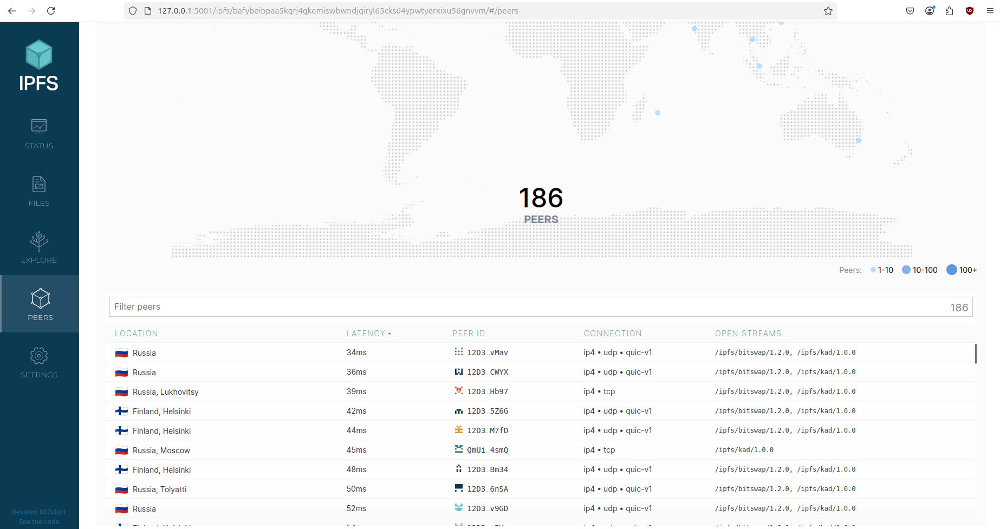
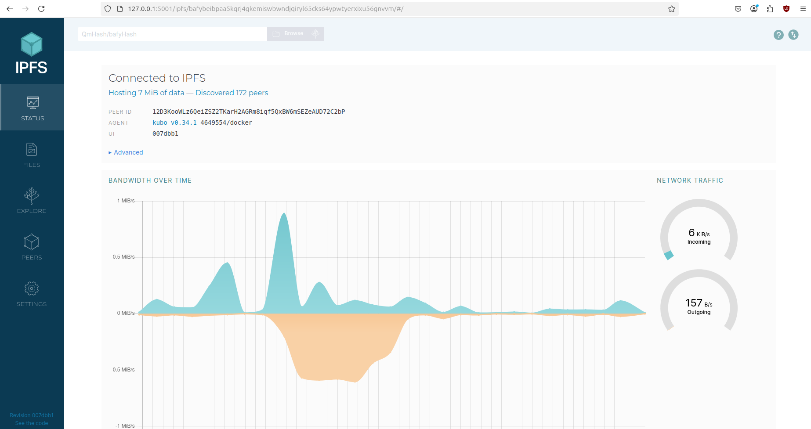
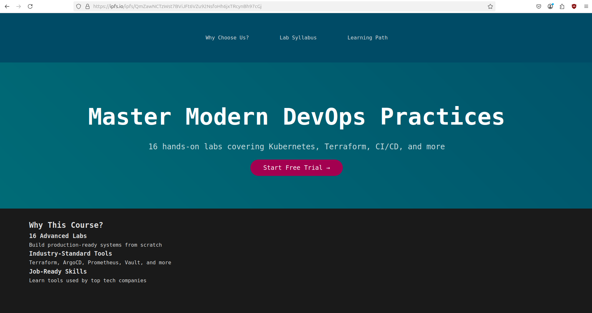

# Lab 16

## Task 1

Information about peers (the value from 70 to 250):

And information about bandwidth

The html file I added to the ipfs had
`QmZawNCTzWst7BViJFt6VZu92NsfoHh6jxTRcynBh97cGj` CID
I used this link to open this html file
`https://ipfs.io/ipfs/QmZawNCTzWst7BViJFt6VZu92NsfoHh6jxTRcynBh97cGj`

Here is the result:

## Task 2

I guess I need to just share this link
`https://lab16.on.fleek.co`

