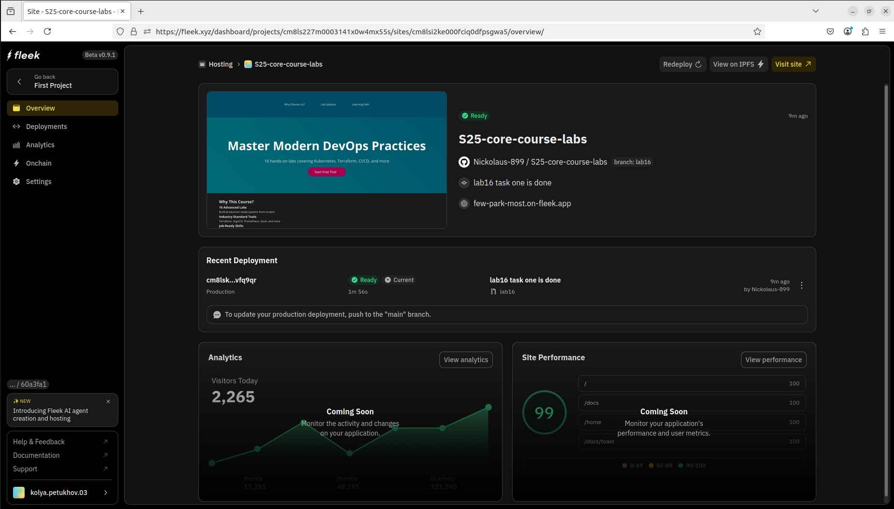
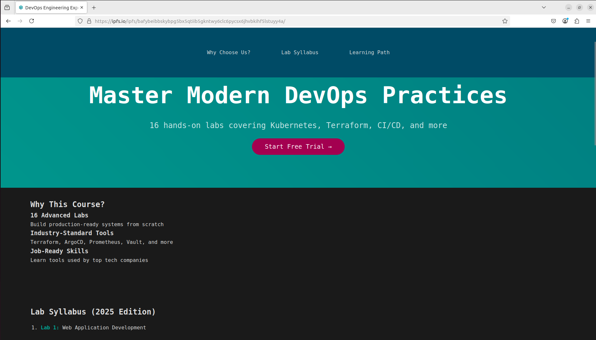

# IPFS

I have pulled and ran IPFS container

# Status

# Uploaded file

# Access file

*I have used Cloudflare IPFS Gateway*

**Hash**: QmQzCQn4puG4qu8PVysxZmscmQ5vT1ZXpqo7f58Uh9QfyY\
**URL**: https://ipfs.io/ipfs/QmQzCQn4puG4qu8PVysxZmscmQ5vT1ZXpqo7f58Uh9QfyY

# Fleek

I uploaded a website (lab16) to fleek.xyz

**Hash**: bafybeibbskybpg5bx5qtiib5gkntwy6clc6pycsx6jhvbkihf5lstuyy4a\
**URL**: https://ipfs.io/ipfs/bafybeibbskybpg5bx5qtiib5gkntwy6clc6pycsx6jhvbkihf5lstuyy4a/
