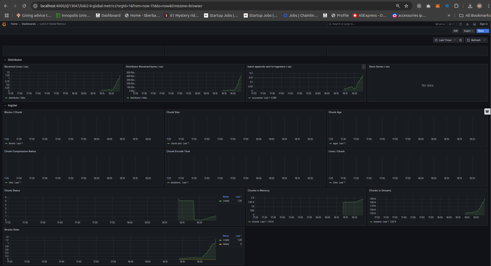
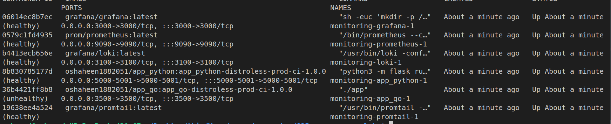

# Lab 8: Monitoring with Prometheus

## Overview

In this lab, I set up Prometheus, configured it to collect metrics from Loki and other services, and created Grafana dashboards for visualization. Additionally, I enhanced the `docker-compose.yml` file with health checks and memory limits, and integrated application metrics for both Python and Go applications.

---

## Task 1: Prometheus Setup

### 1. Learn About Prometheus

- I read the following resources to understand Prometheus:
  - [Prometheus Overview](https://prometheus.io/docs/introduction/overview/)
  - [Prometheus Naming Best Practices](https://prometheus.io/docs/practices/naming/)

### 2. Integration with Docker Compose

- I expanded the `docker-compose.yml` file to include Prometheus. Here’s the relevant snippet:

  ```yaml
  prometheus:
    image: prom/prometheus:latest
    volumes:
      - "./prometheus.yml:/etc/prometheus/prometheus.yml"
    command: --config.file=/etc/prometheus/prometheus.yml
    networks:
      - loki
    ports:
      - 9090:9090
    mem_limit: "1g"
    healthcheck:
      test: ["CMD", "curl", "-f", "http://localhost:9090/targetss"]
      interval: 30s
      timeout: 10s
      retries: 3
  ```

### 3. Prometheus Configuration

- I configured Prometheus to scrape metrics from Loki and itself. Here’s the `prometheus.yml` configuration:

  ```yaml
  scrape_configs:
    - job_name: prometheus
      static_configs:
        - targets: ['localhost:9090']
    - job_name: loki
      static_configs:
        - targets: ['loki:3100']
  ```

### 4. Verify Prometheus Targets

- I accessed `http://localhost:9090/targets` to verify that Prometheus is correctly scraping metrics. All targets are "UP" as shown below:
  

---

## Task 2: Dashboard and Configuration Enhancements

### 1. Grafana Dashboards

- I set up Grafana dashboards for both Loki and Prometheus:
  - **Loki Dashboard**: I used the example dashboard [Loki Logs Dashboard](https://grafana.com/grafana/dashboards/13407).
    
    
    

  - **Prometheus Dashboard**: I used the example dashboard [Prometheus 2.0 Overview](https://grafana.com/grafana/dashboards/3662).
    
    

### 2. Service Configuration Updates

- I enhanced the `docker-compose.yml` file with the following:
  - **Log Rotation**: Added log rotation for all services using the `json-file` driver.
  - **Memory Limits**: Specified memory limits for each container

### 3. Metrics Gathering

- I extended Prometheus to gather metrics from all services:
  - **Python Application**: Exposed metrics on `http://localhost:5001/metrics`.
  - **Go Application**: Exposed metrics on `http://localhost:3000/metrics`.

---

## Bonus Task: Metrics and Health Checks

### 1. Application Metrics

- I integrated Prometheus metrics into both the Python and Go applications:
  - **Python**: Used the `prometheus_client` library to expose metrics.
  - **Go**: Used the `prometheus/client_golang` library to expose metrics.

### 2. Obtain Application Metrics

- I configured Prometheus to scrape metrics from the applications:

  ```yaml
  scrape_configs:
    - job_name: prometheus
      static_configs:
        - targets: ['localhost:9090']
    
    - job_name: loki
      static_configs:
        - targets: ['loki:3100']
    
    - job_name: promtail
      static_configs:
        - targets: ['promtail:9080']

    - job_name: app_python
      static_configs:
        - targets: ['app_python:5001']

    - job_name: app_go
      static_configs:
        - targets: ['app_go:3500']

    - job_name: grafana
      static_configs:
        - targets: ['grafana:3000']
  ```

- Verified running of all targts inside `docker-compse.yml`:
  

### 4. Health Checks

- I added health checks to the `docker-compose.yml` file for all services. For example:

  ```yaml
  app_python:
    healthcheck:
      test: ["CMD", "curl", "-f", "http://localhost:5000"]
      interval: 30s
      timeout: 10s
      retries: 3
  app_go:
    healthcheck:
      test: ["CMD", "curl", "-f", "http://localhost:3000"]
      interval: 30s
      timeout: 10s
      retries: 3
  ```

- Verified health checks using `docker ps`:
  
