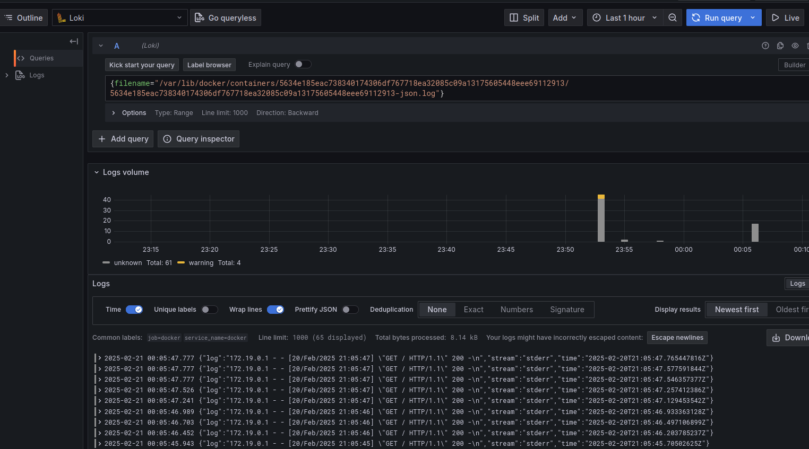

# Logging

## Overview

This document outlines the setup and operation of the logging stack, which includes **Promtail**, **Loki**, and **Grafana**, configured using Docker Compose. These tools work together to collect, store, and visualize logs from my application.

## Components

- **Promtail**: Collects and ships logs to Loki.
- **Loki**: Stores and indexes logs in a scalable manner.
- **Grafana**: Provides a UI to query and visualize the logs stored in Loki.

## Setup

1. **Folder Structure**: A folder named `monitoring` is created in the project directory.
2. **docker-compose.yml**: Defines services for Promtail, Loki, and Grafana.
3. **Configuration Files**: Custom configuration for Promtail to point to Loki.

## Screenshots

- List of pulled and running Docker containers

- Logs of python app

- Logs of "docker" job
