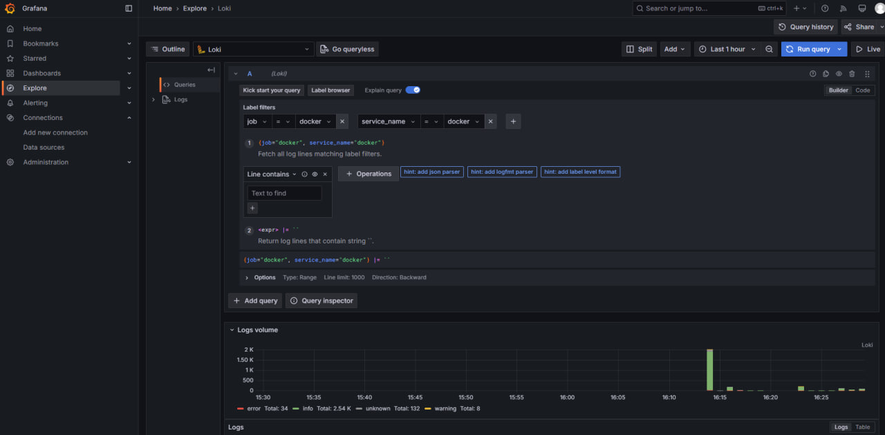
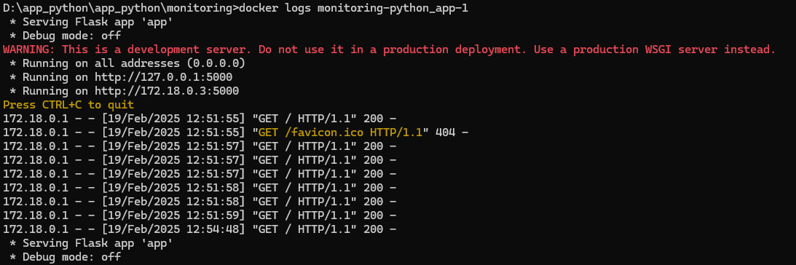

# Logging

This stack collects and displays logs in a Dockerized environment.

## Components

1. **Loki** – Stores and indexes logs.
2. **Promtail** – Collects logs from files and sends them to Loki.
3. **Grafana** – Displays logs in a user-friendly interface.

## How It Works

1. **Log Generation** – Containers generate logs stored in `/var/lib/docker/containers/*/*log`.
2. **Log Collection** – Promtail reads log files, adds labels, and sends them to Loki.
3. **Log Storage** – Loki stores logs with metadata.
4. **Log Visualization** – Grafana connects to Loki, allowing users to search and analyze logs.

## Setup and Verification

1. Start the stack:
   ```bash
   docker-compose up -d
   ```
2. Generate logs by interacting with the Python application.
3. Open Grafana (`http://localhost:3000`), enter `{job="docker"}` in **Explore**, and verify that logs appear.

## Results

### Grafana-loki logs



### flask-app logs

```bash
docker logs monitoring-python_app-1
```


