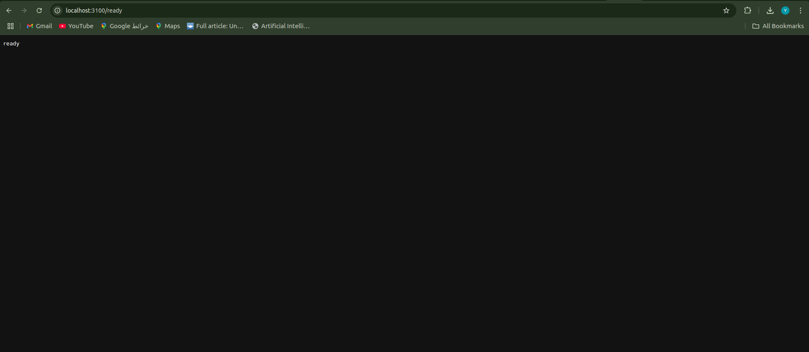
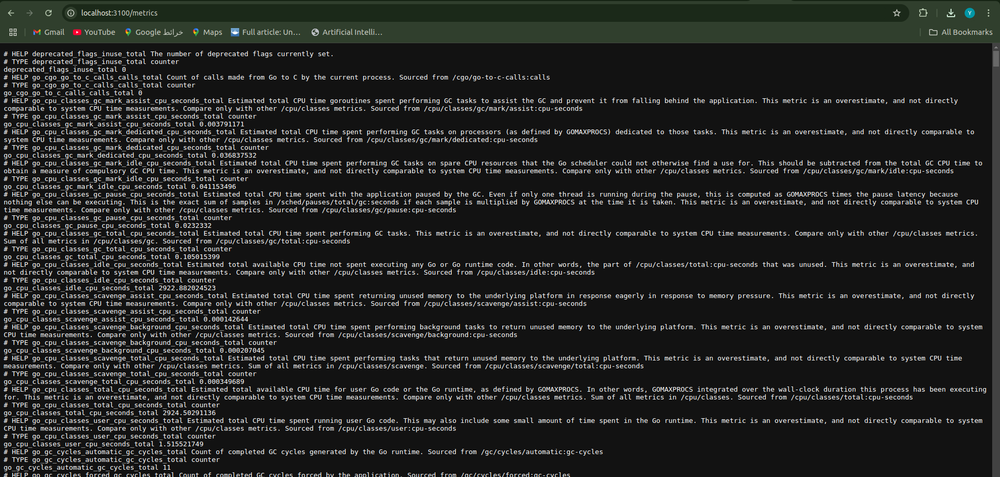

## Component Details

### 1. Loki Configuration
- **Image**: `grafana/loki:2.9.1`
- **Port**: 3100
- **Storage**: Local filesystem at `/loki`
- **Key Features**:
  - No authentication (`auth_enabled: false`)
  - Filesystem storage for both indexes and chunks
  - 10MB/s ingestion rate limit
  - No retention policy (all logs kept indefinitely)
- **Configuration File**: `loki-config.yml`

### 2. Promtail Configuration
- **Image**: `grafana/promtail:2.9.1`
- **Port**: 9080
- **Scraping**:
  - Monitors all `.log` files in `/var/log`
  - Labels logs with `job: varlogs`
- **Forwarding**:
  - Sends logs to Loki at `http://loki:3100`
  - Batch size: 1MB
  - Batch wait: 5 seconds
- **Configuration File**: `promtail-config.yml`

### 3. Grafana Configuration
- **Image**: `grafana/grafana:latest`
- **Port**: 3000 (mapped to host)
- **Authentication**:
  - Default admin password: `admin`
- **Storage**: Persistent volume for Grafana data

## Docker Compose Setup
```yaml
version: "3.8"

services:
  loki:
    image: grafana/loki:2.9.1
    volumes:
      - ./loki-data:/loki
    command: -config.file=/etc/loki/local-config.yaml

  promtail:
    image: grafana/promtail:2.9.1
    volumes:
      - ./promtail-config.yml:/etc/promtail/config.yml
      - /var/log:/var/log

  grafana:
    image: grafana/grafana:latest
    ports:
      - "3000:3000"
    environment:
      - GF_SECURITY_ADMIN_PASSWORD=admin

✗ docker-compose ps
NAME                IMAGE                    COMMAND                  SERVICE    CREATED       STATUS       PORTS
grafana             grafana/grafana:latest   "/run.sh"                grafana    3 hours ago   Up 3 hours   0.0.0.0:3000->3000/tcp
monitoring-loki-1   grafana/loki:2.9.1       "/usr/bin/loki -conf…"   loki       3 hours ago   Up 3 hours   3100/tcp
promtail            grafana/promtail:2.9.1   "/usr/bin/promtail -…"   promtail   3 hours ago   Up 3 hours   

➜  monitoring git:(lab14-python) ✗ docker logs promtail
level=info ts=2025-04-24T11:46:00.921796968Z caller=promtail.go:133 msg="Reloading configuration file" md5sum=7bdb50762bd31b9b3a9c4b1f7d62f8f1
level=info ts=2025-04-24T11:46:00.924113426Z caller=server.go:322 http=[::]:9080 grpc=[::]:40269 msg="server listening on addresses"
level=info ts=2025-04-24T11:46:00.928461426Z caller=main.go:174 msg="Starting Promtail" version="(version=2.9.1, branch=HEAD, revision=d9d5ed4a1)"
level=warn ts=2025-04-24T11:46:00.928537718Z caller=promtail.go:263 msg="enable watchConfig"
level=info ts=2025-04-24T11:46:05.930661721Z caller=filetargetmanager.go:361 msg="Adding target" key="/var/log/*.log:{job=\"varlogs\"}"
level=info ts=2025-04-24T11:46:05.951044637Z caller=filetarget.go:313 msg="watching new directory" directory=/var/log
level=info ts=2025-04-24T11:46:05.952504887Z caller=tailer.go:145 component=tailer msg="tail routine: started" path=/var/log/fsck_apfs_error.log
level=info ts=2025-04-24T11:46:05.952644346Z caller=tailer.go:145 component=tailer msg="tail routine: started" path=/var/log/fsck_apfs.log
level=info ts=2025-04-24T11:46:05.952703846Z caller=tailer.go:145 component=tailer msg="tail routine: started" path=/var/log/alf.log
ts=2025-04-24T11:46:05.953737387Z caller=log.go:168 level=info msg="Seeked /var/log/fsck_hfs.log - &{Offset:0 Whence:0}"
ts=2025-04-24T11:46:05.953767304Z caller=log.go:168 level=info msg="Seeked /var/log/alf.log - &{Offset:0 Whence:0}"
ts=2025-04-24T11:46:05.953585137Z caller=log.go:168 level=info msg="Seeked /var/log/fsck_apfs.log - &{Offset:0 Whence:0}"
ts=2025-04-24T11:46:05.954219846Z caller=log.go:168 level=info msg="Seeked /var/log/shutdown_monitor.log - &{Offset:0 Whence:0}"
level=info ts=2025-04-24T11:46:05.954647846Z caller=tailer.go:145 component=tailer msg="tail routine: started" path=/var/log/fsck_hfs.log
level=info ts=2025-04-24T11:46:05.954708387Z caller=tailer.go:145 component=tailer msg="tail routine: started" path=/var/log/install.log
level=info ts=2025-04-24T11:46:05.954742304Z caller=tailer.go:145 component=tailer msg="tail routine: started" path=/var/log/shutdown_monitor.log
level=info ts=2025-04-24T11:46:05.954869012Z caller=tailer.go:145 component=tailer msg="tail routine: started" path=/var/log/system.log
level=info ts=2025-04-24T11:46:05.955264262Z caller=tailer.go:145 component=tailer msg="tail routine: started" path=/var/log/wifi.log
ts=2025-04-24T11:46:05.956220179Z caller=log.go:168 level=info msg="Seeked /var/log/fsck_apfs_error.log - &{Offset:0 Whence:0}"
ts=2025-04-24T11:46:05.956267679Z caller=log.go:168 level=info msg="Seeked /var/log/install.log - &{Offset:0 Whence:0}"
ts=2025-04-24T11:46:05.956401887Z caller=log.go:168 level=info msg="Seeked /var/log/system.log - &{Offset:0 Whence:0}"
ts=2025-04-24T11:46:05.956446304Z caller=log.go:168 level=info msg="Seeked /var/log/wifi.log - &{Offset:0 Whence:0}"
level=warn ts=2025-04-24T11:46:06.516805762Z caller=client.go:419 component=client host=loki:3100 msg="error sending batch, will retry" status=429 tenant= error="server returned HTTP status 429 Too Many Requests (429): Ingestion rate limit exceeded for user fake (limit: 4194304 bytes/sec) while attempting to ingest '7235' lines totaling '1048271' bytes, reduce log volume or contact your Loki administrator to see if the limit can be increased"
level=warn ts=2025-04-24T11:46:07.777524846Z caller=client.go:419 component=client host=loki:3100 msg="error sending batch, will retry" status=429 tenant= error="server returned HTTP status 429 Too Many Requests (429): Ingestion rate limit exceeded for user fake (limit: 4194304 bytes/sec) while attempting to ingest '9043' lines totaling '1048558' bytes, reduce log volume or contact your Loki administrator to see if the limit can be increased"
level=warn ts=2025-04-24T11:46:09.002800389Z caller=client.go:419 component=client host=loki:3100 msg="error sending batch, will retry" status=429 tenant= error="server returned HTTP status 429 Too Many Requests (429): Ingestion rate limit exceeded for user fake (limit: 4194304 bytes/sec) while attempting to ingest '5893' lines totaling '1048467' bytes, reduce log volume or contact your Loki administrator to see if the limit can be increased"
level=warn ts=2025-04-24T11:46:09.6790495Z caller=client.go:419 component=client host=loki:3100 msg="error sending batch, will retry" status=429 tenant= error="server returned HTTP status 429 Too Many Requests (429): Ingestion rate limit exceeded for user fake (limit: 4194304 bytes/sec) while attempting to ingest '7284' lines totaling '1048416' bytes, reduce log volume or contact your Loki administrator to see if the limit can be increased"
level=warn ts=2025-04-24T11:46:10.500013167Z caller=client.go:419 component=client host=loki:3100 msg="error sending batch, will retry" status=429 tenant= error="server returned HTTP status 429 Too Many Requests (429): Ingestion rate limit exceeded for user fake (limit: 4194304 bytes/sec) while attempting to ingest '6651' lines totaling '1048476' bytes, reduce log volume or contact your Loki administrator to see if the limit can be increased"
level=warn ts=2025-04-24T11:46:11.412085292Z caller=client.go:419 component=client host=loki:3100 msg="error sending batch, will retry" status=429 tenant= error="server returned HTTP status 429 Too Many Requests (429): Ingestion rate limit exceeded for user fake (limit: 4194304 bytes/sec) while attempting to ingest '6826' lines totaling '1048463' bytes, reduce log volume or contact your Loki administrator to see if the limit can be increased"
level=warn ts=2025-04-24T11:46:12.506489001Z caller=client.go:419 component=client host=loki:3100 msg="error sending batch, will retry" status=429 tenant= error="server returned HTTP status 429 Too Many Requests (429): Ingestion rate limit exceeded for user fake (limit: 4194304 bytes/sec) while attempting to ingest '7707' lines totaling '1048567' bytes, reduce log volume or contact your Loki administrator to see if the limit can be increased"
level=warn ts=2025-04-24T11:46:13.245035251Z caller=client.go:419 component=client host=loki:3100 msg="error sending batch, will retry" status=429 tenant= error="server returned HTTP status 429 Too Many Requests (429): Ingestion rate limit exceeded for user fake (limit: 4194304 bytes/sec) while attempting to ingest '6556' lines totaling '1048426' bytes, reduce log volume or contact your Loki administrator to see if the limit can be increased"
level=warn ts=2025-04-24T11:46:14.017837502Z caller=client.go:419 component=client host=loki:3100 msg="error sending batch, will retry" status=429 tenant= error="server returned HTTP status 429 Too Many Requests (429): Ingestion rate limit exceeded for user fake (limit: 4194304 bytes/sec) while attempting to ingest '8280' lines totaling '1048488' bytes, reduce log volume or contact your Loki administrator to see if the limit can be increased"
level=warn ts=2025-04-24T11:46:15.106355627Z caller=client.go:419 component=client host=loki:3100 msg="error sending batch, will retry" status=429 tenant= error="server returned HTTP status 429 Too Many Requests (429): Ingestion rate limit exceeded for user fake (limit: 4194304 bytes/sec) while attempting to ingest '6841' lines totaling '1048430' bytes, reduce log volume or contact your Loki administrator to see if the limit can be increased"
level=warn ts=2025-04-24T11:46:16.038902461Z caller=client.go:419 component=client host=loki:3100 msg="error sending batch, will retry" status=429 tenant= error="server returned HTTP status 429 Too Many Requests (429): Ingestion rate limit exceeded for user fake (limit: 4194304 bytes/sec) while attempting to ingest '7336' lines totaling '1048465' bytes, reduce log volume or contact your Loki administrator to see if the limit can be increased"
level=info ts=2025-04-24T12:11:06.657766637Z caller=filetargetmanager.go:181 msg="received file watcher event" name=/var/log/CoreCapture op=CREATE
level=warn ts=2025-04-24T12:13:12.815392875Z caller=client.go:419 component=client host=loki:3100 msg="error sending batch, will retry" status=500 tenant= error="server returned HTTP status 500 Internal Server Error (500): at least 1 live replicas required, could only find 0 - unhealthy instances: 172.18.0.2:9095"
level=warn ts=2025-04-24T12:13:13.572663459Z caller=client.go:419 component=client host=loki:3100 msg="error sending batch, will retry" status=500 tenant= error="server returned HTTP status 500 Internal Server Error (500): at least 1 live replicas required, could only find 0 - unhealthy instances: 172.18.0.2:9095"
level=warn ts=2025-04-24T12:13:15.052485501Z caller=client.go:419 component=client host=loki:3100 msg="error sending batch, will retry" status=500 tenant= error="server returned HTTP status 500 Internal Server Error (500): at least 1 live replicas required, could only find 0 - unhealthy instances: 172.18.0.2:9095"
level=info ts=2025-04-24T13:03:56.690394054Z caller=filetargetmanager.go:181 msg="received file watcher event" name=/var/log/fsck_apfs_error.log op=CREATE
ts=2025-04-24T13:03:56.783986638Z caller=log.go:168 level=info msg="Re-opening moved/deleted file /var/log/fsck_apfs_error.log ..."
ts=2025-04-24T13:03:56.790844888Z caller=log.go:168 level=info msg="Successfully reopened /var/log/fsck_apfs_error.log"




