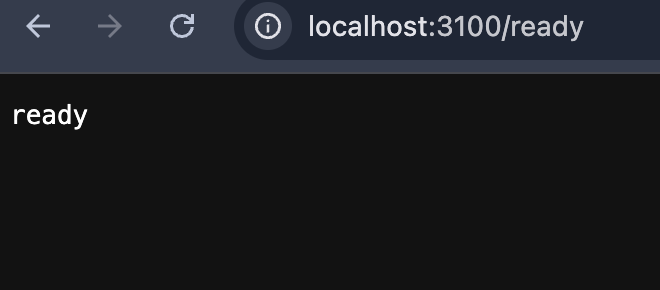
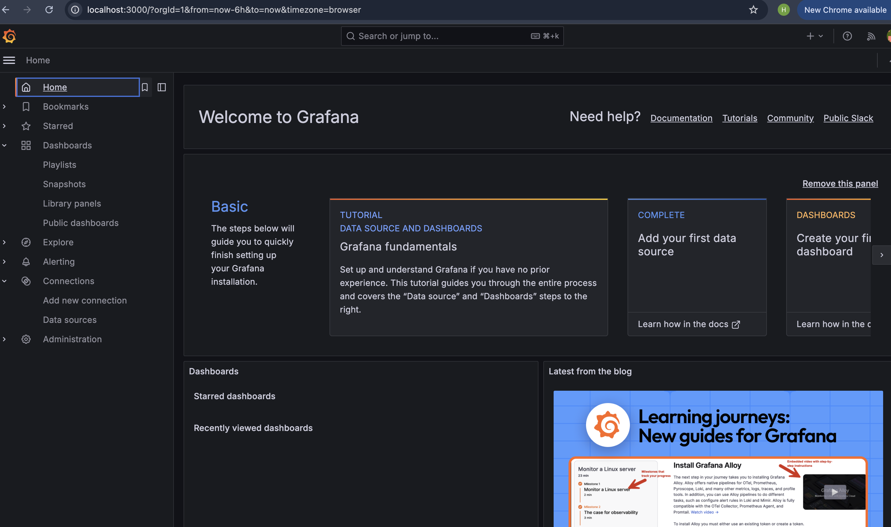
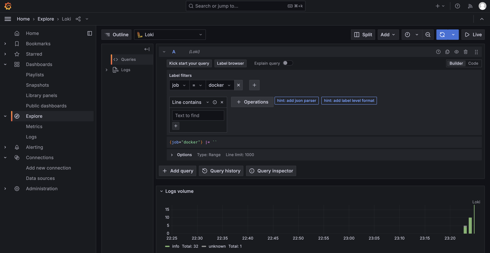
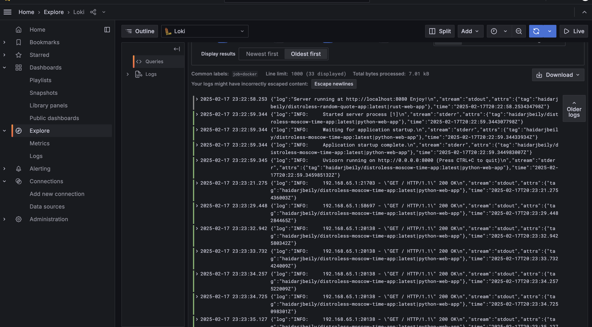

# Lab 7: Monitoring and Logging Implementation

This report details the implementation of a comprehensive monitoring and logging solution using Grafana Loki, Promtail, and Docker Compose. The setup enables centralized log aggregation and monitoring for multiple containerized applications.

## Architecture Overview

The monitoring stack consists of the following components:

### Core Services

- **Loki** (grafana/loki:latest)
  - Log aggregation system that stores and indexes logs
  - Uses default local configuration for simplicity and quick setup
  - Exposed on port 3100 for Promtail ingestion

- **Promtail** (grafana/promtail:2.9.3)
  - Log collection agent that ships logs to Loki
  - Custom configuration to collect Docker container logs
  - Uses container tag templating for proper log identification
  - Configured pipeline stages for log parsing and metric extraction

- **Grafana** (grafana/grafana:11.4.1)
  - Visualization and querying interface
  - Auto-provisioned Loki datasource
  - Anonymous access enabled for easy demonstration
  - Exposed on port 3000

### Monitored Applications

- **Python Web App** (Moscow Time Service)
  - FastAPI application showing Moscow time
  - Container logs tagged with image name and container name
  - Exposed on port 8000

- **Rust Web App** (Random Quote Service)
  - Actix-web application serving random quotes
  - Container logs tagged for identification
  - Exposed on port 8080

## Demonstration of Monitoring Stack Running via Docker Compose

The following screenshots demonstrate that our monitoring stack is successfully running via Docker Compose.

### Loki Service

### Grafana Dashboard

### Example of Query

### Example of Query Results

