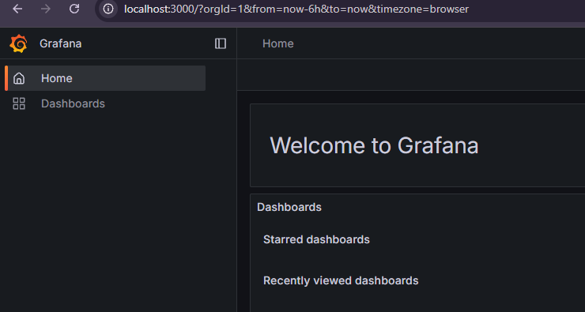
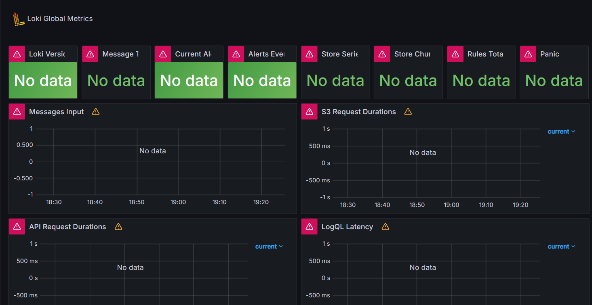
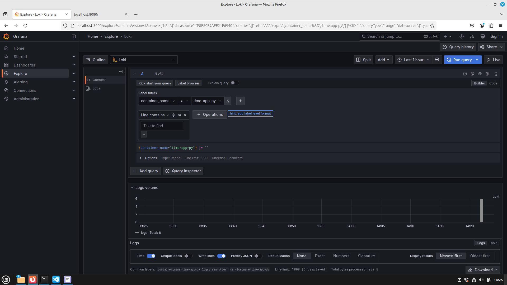

## Stack

* **Grafana** — software system for data visualisation and analysis.
In current stack it is used to explore logs and, for example, to easily find errors using user-friendly interface.

* **Loki** — log aggregation system for Grafana.
In current stack it is used to store logs and search through them.

* **Promtail** — agent that ships the content of local logs to Loki.
In current stack it is used to provide logs from `time-app-py` application to Loki, so they can be explored.

## Logs

