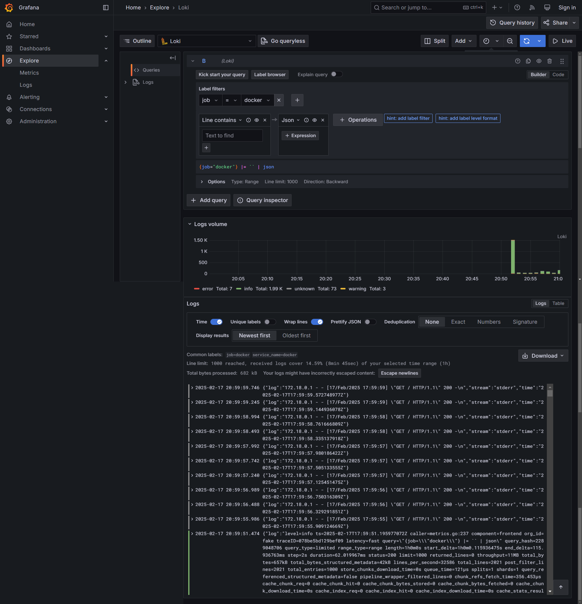

# Logging

## Overview

This logging setup consists of Loki, Promtail, and Grafana, enabling efficient log collection, storage, and monitoring for debugging purposes.

## Components

### Loki
Loki is a scalable log aggregator that indexes and stores logs in a time-series database.
- It runs with the configuration file located at `/etc/loki/local-config.yaml`.
- Stores logs persistently in the `loki-data` volume.
- Listens on port `3100` for incoming log data.

### Promtail
Promtail is a log collection agent that gathers logs from Docker containers and sends them to Loki.
- `promtail.yml` - configuration file.
- Tracks scraped log files from `/var/lib/docker/containers/*/*log`, maintaining progress in `/tmp/positions.yaml`.
- Sends logs to Loki via `http://loki:3100/api/prom/push`.
- Listens for HTTP requests on port `9080`.

### Grafana
Grafana provides a user interface for log visualization, querying Loki and displaying dashboards.
- Enables querying and monitoring of logs in real-time.
- Anonymous access with admin privileges.
- Accessible via port `3000`.

## Example of work (screenshots)

### Running Containers

### All Logs

### Python App Logs

