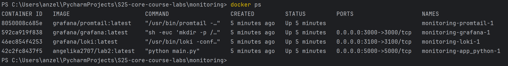
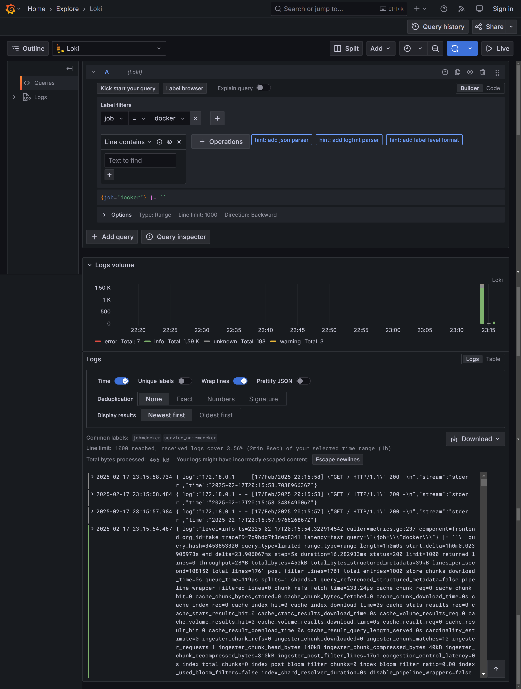
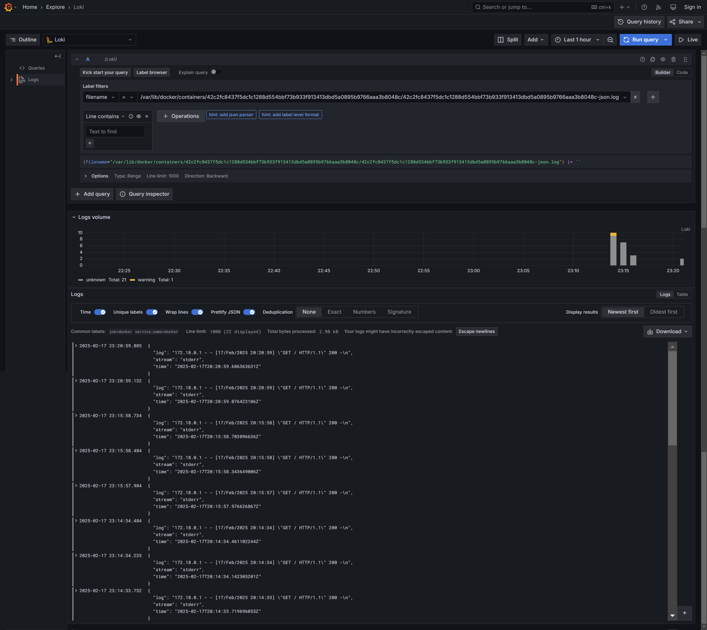

# Logging

## Overview

The logging system includes Loki, Promtail, and Grafana, providing efficient log collection, storage, and visualization.

## Components

### Loki

- Scalable log storage and indexing system.
- Runs using the configuration file: `/etc/loki/local-config.yaml`
- Listening on port 3100 for incoming logs.
- Persists logs in the loki-data volume
- Uses a time-series database for log storage.

### Promtail

- Gathering logs from containers and forwards them to Loki.
- Using configuration file promtail.yml.
- Key settings:
  - Listening HTTP requests on port 9080.
  - Monitors scanned log files from `/var/lib/docker/docker/containers/*/*log` and saves the progress in the `/tmp/positions.yaml` file.
  - Sending logs to Loki at `http://loki:3100/api/prom/push`.

### Grafana

- Provides a UI for querying and monitoring.
- Fetches logs from Loki and shows it in dashboards.
- Listens on port 3000.
- Working without authentication.

## Screenshots

### Docker Containers

### All Logs

### App Logs

