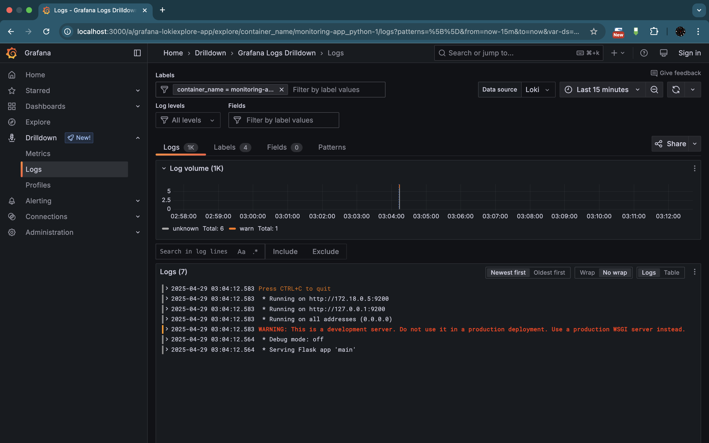

# LOGGING

## Lab 7: Monitoring and Logging

### Overview
In this lab, a logging stack using **Promtail**, **Loki**, and **Grafana** was set up using Docker Compose. The objective was to collect logs from various containers (including the application container) and visualize them in Grafana.

### Logging Stack Components

#### 1. **Promtail**
- **Role:** Promtail is responsible for discovering and scraping log files from containers and host paths. It then sends the log data to Loki.
- **Configuration:**  
  - Promtail uses Docker service discovery to automatically find containers using the Docker socket.
  - The configuration file (`promtail-config.yml`) defines scrape jobs, relabeling rules, and client settings to push logs to Loki.

#### 2. **Loki**
- **Role:** Loki is a log aggregation system that stores logs and makes them searchable. It is optimized for efficiency and integrates well with Grafana.
- **Configuration:**  
  - Loki runs without a separate configuration file, relying on default settings and command-line arguments.

#### 3. **Grafana**
- **Role:** Grafana provides the web interface to visualize the logs collected by Loki. It allows users to create dashboards, query logs, and set up alerts.
- **Configuration:**  
  - Grafana is set up with a default admin password (`admin`) and is connected to Loki as a data source.
  - Users can create custom dashboards to display logs, metrics, and other data from Loki.
- **Key Settings:**
  - Data source configuration: The Loki URL is set to `http://loki:3100`.

#### 4. **Application Container (app_python)**
- **Role:** This container runs the Python web application that displays the current time in Moscow. It generates log output which is captured by Promtail.
- **Integration:**  
  - The application container is connected to the same Docker network as Loki, Promtail, and Grafana, ensuring logs can be collected seamlessly.
  - Promtail automatically discovers and forwards logs from this container to Loki.

### Docker Compose Configuration
The entire logging stack along with the application is defined in a single `docker-compose.yml` file located in the `monitoring` folder. This file sets up the following services:
- **loki:** The log aggregation service.
- **promtail:** The log forwarder.
- **grafana:** The visualization and monitoring tool.
- **app_python:** The sample application container.

### Screenshots

1. **Screenshot 1: Logs from the `app_python` container**  
   

2. **Screenshot 2: Logs from the `loki` container**  
   

3. **Screenshot 3: Logs from the `promtail` container**  
   

4. **Screenshot 4: Logs from the `grafana` container or a Grafana dashboard view**  
   
