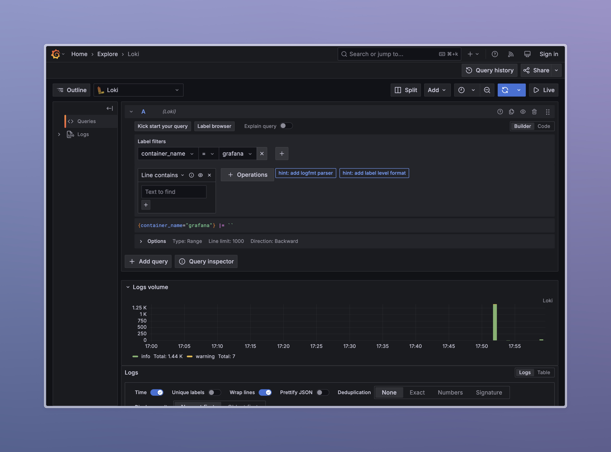
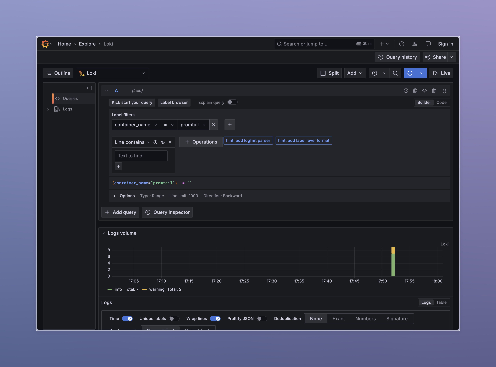
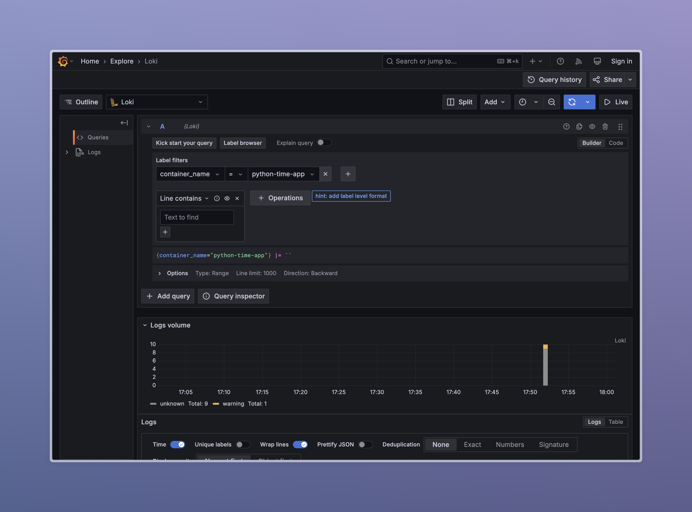

# Logging Stack

The logging stack consists of Promtail, Loki, and Grafana to collect, store, and visualize logs from python web app.

## Components

* **Grafana** — a tool for visualizing and analyzing data.  
  It is used to explore logs and quickly identify issues using an intuitive interface.

* **Loki** — a log aggregation system designed for Grafana.  
  It is used to store logs and enable fast, efficient searching.

* **Promtail** — an agent that collects and sends logs to Loki.  
  It is used to gather logs from the `web_app` application and forward them to Loki for analysis.

## Screenshots

