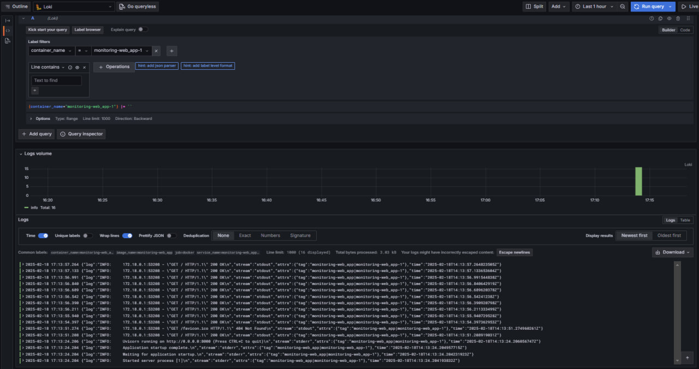
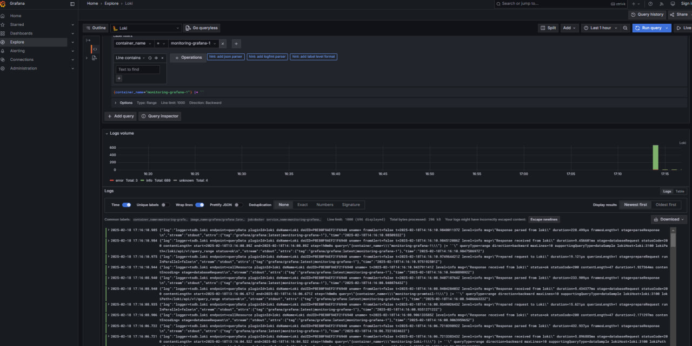
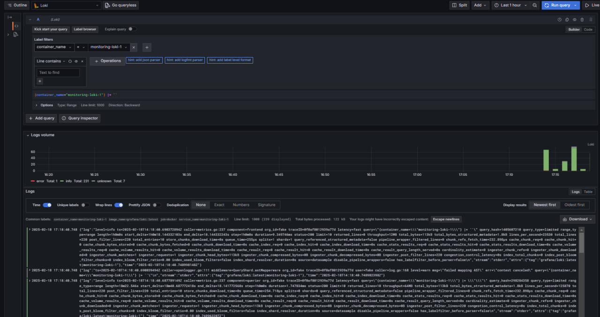
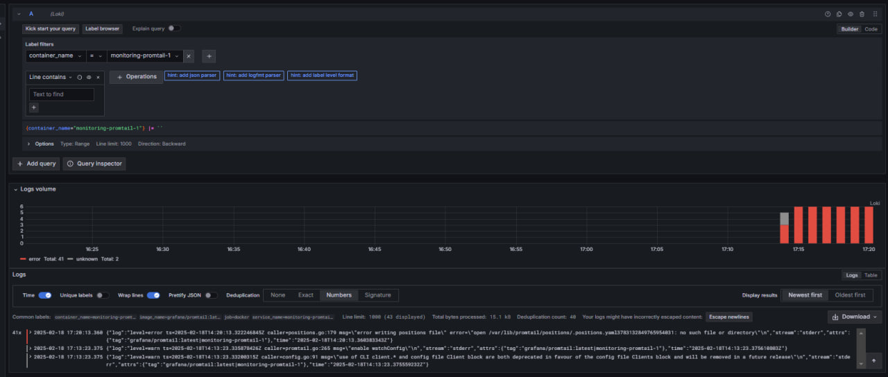

# Logging

1. web_app:
   - Python web application
2. loki:
   - Service that collects logs from `Promtail`
3. promtail:
   - Agent that reads Docker container logs & sends to `Loki`
4. grafana:
   - Visualization tool working on port 3000

## Screenshots

### Web App

### Grafana

### Loki

### Promtail

