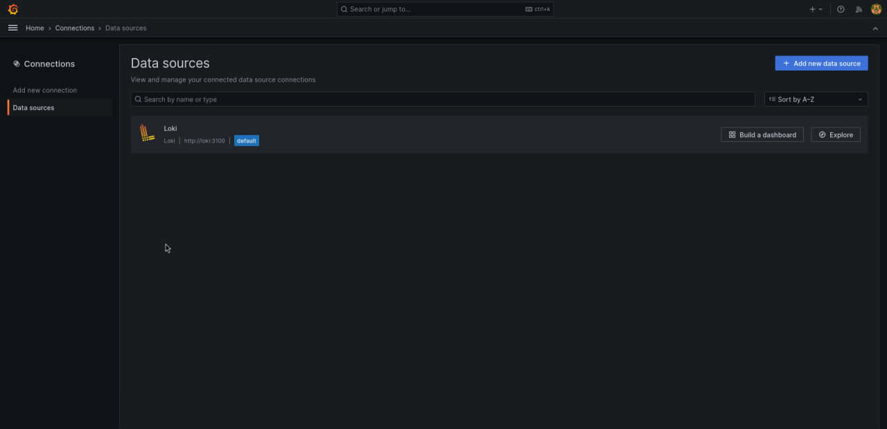
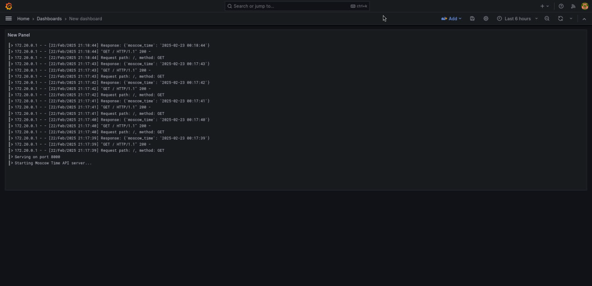

# Logging Stack Documentation

## Overview

This document describes the logging stack implementation for application, which consists of four main components:

- Promtail (log collector)
- Loki (log aggregation system)
- Grafana (visualization platform)
- Python Application

## Components

### 1. Promtail
[Promtail Documentation](https://grafana.com/docs/loki/latest/clients/promtail/)

> [!WARNING]
> Promtail is deprecated in favor of Grafana Alloy.

Promtail is the log collector component responsible for gathering logs and sending them to Loki. In setup, it:

- Runs as a Docker container with access to Docker's socket
- Monitors container logs in real-time
- Adds metadata labels to logs (container name, stream type)
- Handles log shipping with retry mechanisms and buffering
- Configuration:
  - Listens on port 9080
  - Discovers Docker containers automatically
  - Filters to only collect logs from application
  - Adds container name and stream (stdout/stderr) labels
  - Configures batching for efficient log shipping


### 2. Loki
[Loki Documentation](https://grafana.com/docs/loki/latest/)


Loki is a horizontally scalable, highly available, multi-tenant log aggregation system. In setup, it:

- Runs on port 3100
- Uses file system storage for logs
- Configured with reasonable rate limits
- Features:
    - Log storage and indexing
    - Query capability via LogQL
    - Labels-based log organization
    - Efficient storage using compression
    - Configuration includes:
      - Retention period: 744h (31 days)
      - Per stream rate limits: 32MB/s
      - Write-Ahead Log (WAL) enabled
      - BoltDB shipper for index storage

### 3. Grafana
[Grafana Documentation](https://grafana.com/docs/)

Grafana is visualization platform that allows us to:

- View and query logs collected by Loki
- Create dashboards and alerts
- Access the interface at http://localhost:3000
- Default credentials:
    - Username: admin
    - Password: admin
- Features:
    - Pre-configured Loki data source
    - Support for LogQL queries
    - Real-time log viewing
    - Custom dashboard creation







### 4. Application

Python application is configured to:

- Output logs to stdout/stderr
- Log HTTP requests and responses
- Include timestamps and request details
- Automatically collected by Promtail

## Setup Instructions

1. Start the entire stack:
    
    ```bash
    docker compose up -d
    ```

2. Access Grafana:

   - Open http://localhost:3000 in your browser
   - Log in with admin/admin credentials
   - The Loki data source is pre-configured

3. View Logs:
    
   - Go to Explore in Grafana
   - Select Loki as the data source
   - Use LogQL to query logs, examples:
     ```
     # All application logs
     {container="app"}
  
     # Only HTTP requests
     {container="app"} |= "GET /"
  
     # Error logs
     {container="app"} |= "ERROR"
  
     # Separate stdout/stderr
     {container="app", stream="stdout"}
     {container="app", stream="stderr"}
     ```
    [LogQL Documentation](https://grafana.com/docs/loki/latest/logql/)
    

## Monitoring Configuration

The logging stack is configured with the following key features:

1. **Log Collection (Promtail)**:
    - Real-time Docker log monitoring
    - Automatic container discovery
    - Label addition for better organization
    - Efficient batching and retry mechanisms

2. **Log Storage (Loki)**:
    - Persistent storage using local volumes
    - Configurable retention period
    - Rate limiting to prevent overwhelming
    - Write-Ahead Logging for reliability

3. **Visualization (Grafana)**:
    - Pre-configured data source
    - Ready-to-use dashboards
    - Custom query capability
    - Alert configuration options

4. **Security**:
    - Basic authentication enabled for Grafana
    - Network isolation using Docker network
    - Configurable access controls
