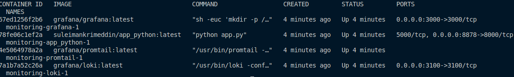
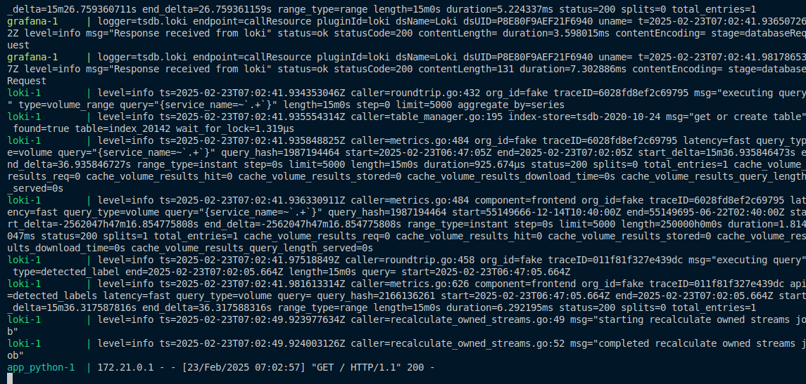
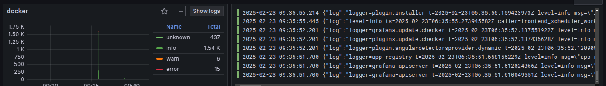

# **Logging Stack Overview**

The logging stack consists of **Loki, Promtail, and Grafana**, working together to efficiently collect, store, and visualize logs. This setup helps in monitoring applications, diagnosing issues, and debugging.

## **Components**

The system includes the following services, as defined in the `docker-compose` file:

### **1. Grafana (Dashboard & Visualization)**

* **Purpose:** Grafana provides a web-based dashboard for visualizing logs and metrics.
* **Role in the Stack:** It connects to Loki, allowing users to query and analyze logs.

### **2. Loki (Log Aggregation & Storage)**

* **Purpose:** Loki acts as a central log aggregator, collecting and storing logs from various sources.
* **Role in the Stack:** Instead of indexing the full log content, Loki indexes metadata, making log storage efficient.

### **3. Promtail (Log Collector & Forwarder)**

* **Purpose:** Promtail collects log data from Docker containers and forwards it to Loki.
* **Role in the Stack:** It retrieves logs from containerized applications and infrastructure services instead of collecting them directly from the applications.

### **4. app\_python (Python Web App)**

* **Purpose:** A Python-based web application that returns the **current Moscow Time** when accessed.
* **Logging:** Any logs generated by this app (such as access logs or errors) are collected by Promtail from the container logs.

Screenshot 

* docker container
  
*
* loki and python_app log
* 
*
* Grafana Logs
* 
