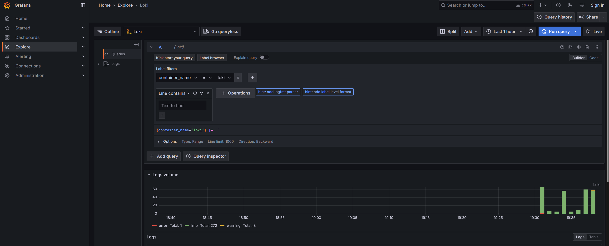
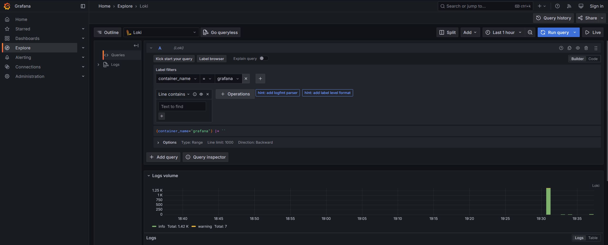
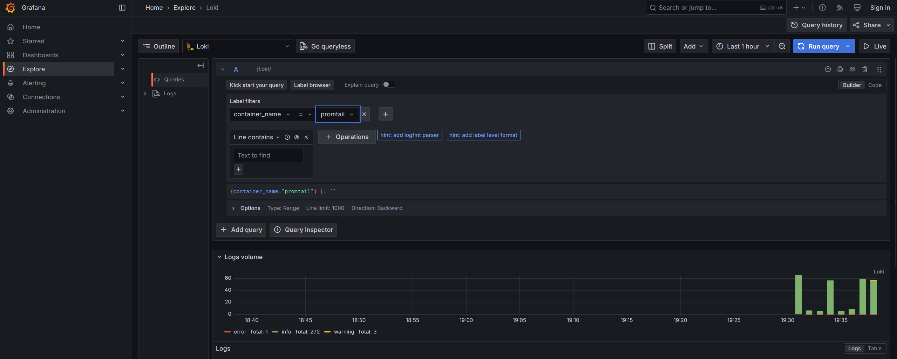
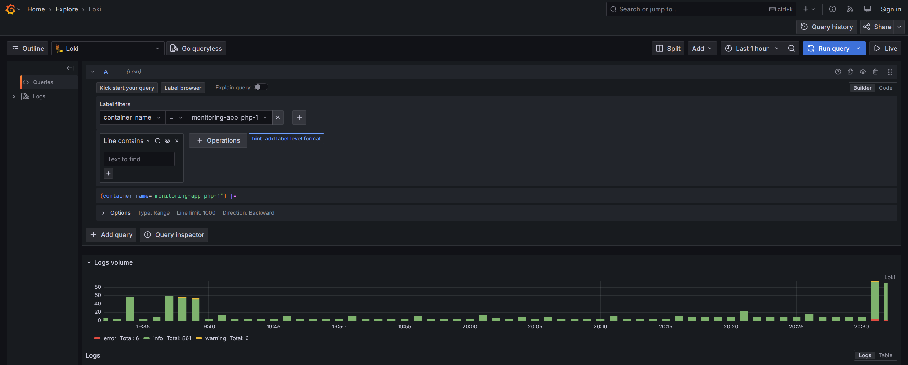

# Lab 7: Monitoring and Logging

## Stack

### Grafana

Grafana is an open-source platform for monitoring and observability, widely used for visualizing and analyzing metrics,
logs, and traces. It allows users to create interactive and customizable dashboards to display data from various sources,
such as databases, cloud services, and monitoring tools.

### Loki

Loki is an open-source, horizontally-scalable, and highly efficient log aggregation system designed to store and
query logs. It is part of the Grafana ecosystem and is specifically optimized for working with Grafana for log 
visualization and analysis. Loki is inspired by Prometheus (a metrics monitoring tool) and uses a similar labeling 
system, making it a natural fit for teams already using Prometheus and Grafana.

### Promtail

Promtail is an agent designed to collect, process, and ship logs to Loki.
It is a key component of the Loki stack and is responsible for gathering logs from various sources, 
attaching metadata (labels) to them, and sending them to Loki for storage and querying. 
Promtail is lightweight, efficient, and specifically optimized for use with Loki.

## Screenshots

### app_python

### loki

### grafana

### promtail

### app_typescript

