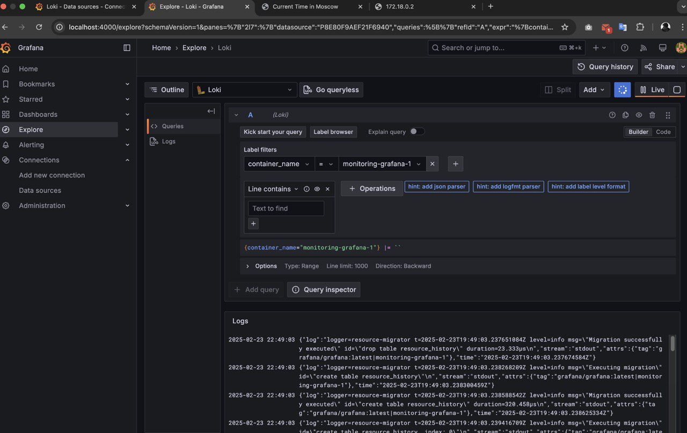
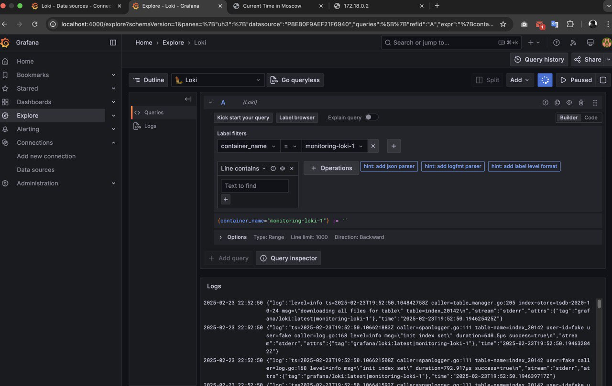
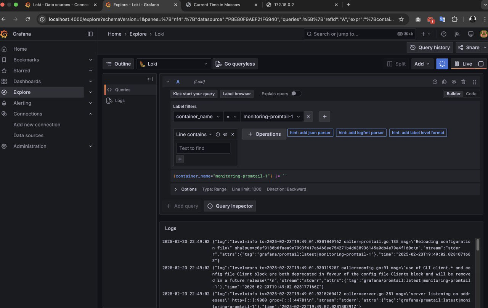
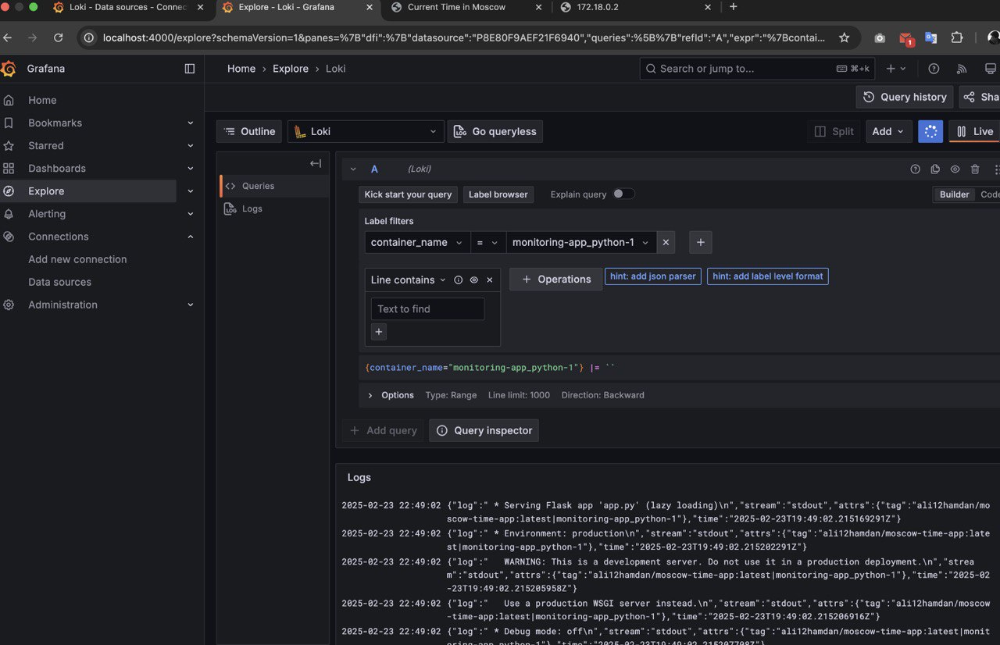

# Logging Stack Documentation

## Overview

This LOGGING.md provides details of my sffors in solvig this lab like the logging stack setup, detailing its components, configuration, and how logs are collected and visualized.

---

## Logging Stack Components

The logging stack consists of the following components:

### 1- **Grafana**
- **Purpose:** Visualization and querying of logs.
- **Port:** Accessible at `http://localhost:4000`.
- **Usage:**
  - Connects to Loki as the data source.
  - Provides an interactive UI for searching and analyzing logs.



### 2️- **Loki**
- **Purpose:** A log aggregation system that stores logs efficiently.
- **Port:** Runs on `http://localhost:3100`.
- **Usage:**
  - Receives logs from Promtail.
  - Stores logs in a structured format for efficient querying.



### 3️- **Promtail**
- **Purpose:** Log collector that forwards container logs to Loki.
- **Configuration:** Uses `promtail.yml` to define log sources.
- **Usage:**
  - Monitors logs from all running containers.
  - Pushes logs to Loki for indexing.



### 4- **Application (`app_python`)**
- **Purpose:** A sample application (`moscow-time-app`) whose logs are monitored.
- **Port:** Runs on `http://localhost:5001` (beacuse the port 5000 is occupied on on my machine for the system).
- **Logging:** Logs requests and internal events using JSON logging.



---

## 🛠 **Configuration Details**

### **1️- `docker-compose.yml` (Logging Stack)**
```yaml
version: "3.3"

networks:
  loki:

services:

  app_python:
    image: "ali12hamdan/moscow-time-app:latest"
    ports:
      - "5001:5001"
    logging:
      driver: "json-file"
      options:
        max-size: "100m"
        max-file: "10"
        tag: "{{.ImageName}}|{{.Name}}"


  

  # app_go:
  #   image: "ali12hamdan/moscow-time-app-go"
  #   ports:
  #     - "3000:3000"
  #   logging:
  #     driver: "json-file"
  #     options:
  #       max-size: "100m"
  #       max-file: "10"
  #       tag: "{{.ImageName}}|{{.Name}}"
    

  loki:
    image: grafana/loki:latest
    ports:
      - "3100:3100"
    command: -config.file=/etc/loki/local-config.yaml
    networks:
      - loki
    logging:
      driver: "json-file"
      options:
        max-size: "100m"
        max-file: "10"
        tag: "{{.ImageName}}|{{.Name}}"
    

  promtail:
    image: grafana/promtail:latest
    volumes:
      - /var/log:/var/log
      - ./promtail.yml:/etc/promtail/config.yml
      - /var/lib/docker/containers:/var/lib/docker/containers
    command: -config.file=/etc/promtail/config.yml
    networks:
      - loki
    logging:
      driver: "json-file"
      options:
        max-size: "100m"
        max-file: "10"
        tag: "{{.ImageName}}|{{.Name}}"

  grafana:
    environment:
      - GF_PATHS_PROVISIONING=/etc/grafana/provisioning
      - GF_AUTH_ANONYMOUS_ENABLED=true
      - GF_AUTH_ANONYMOUS_ORG_ROLE=Admin
      - GF_FEATURE_TOGGLES_ENABLE=alertingSimplifiedRouting,alertingQueryAndExpressionsStepMode
    entrypoint:
      - sh
      - -euc
      - |
        mkdir -p /etc/grafana/provisioning/datasources
        cat <<EOF > /etc/grafana/provisioning/datasources/ds.yaml
        apiVersion: 1
        datasources:
        - name: Loki
          type: loki
          access: proxy 
          orgId: 1
          url: http://loki:3100
          basicAuth: false
          isDefault: true
          version: 1
          editable: false
        EOF
        /run.sh
    image: grafana/grafana:latest
    ports:
      - "4000:3000"
    networks:
      - loki
    logging:
      driver: "json-file"
      options:
        max-size: "100m"
        max-file: "10"
        tag: "{{.ImageName}}|{{.Name}}"
