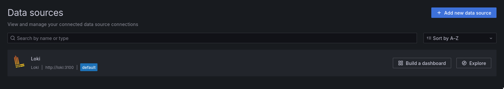
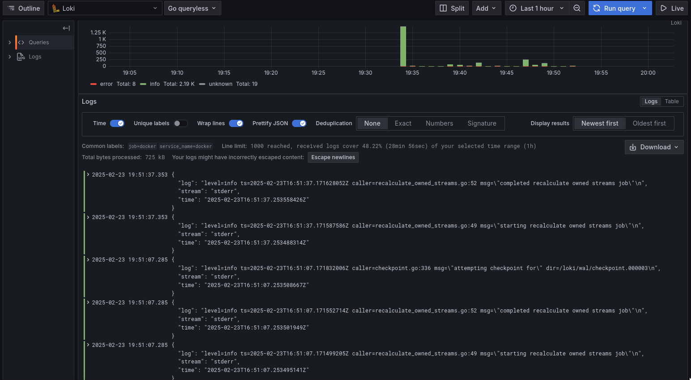

# Logging

## Stack

- *Loki*
  - Log aggregation and storage
- *Promtail*
  - Log collection and forwarding to Loki
- *Grafana*
  - Visualization tool that connects to Loki and provides a user-friendly interface for querying and visualizing logs.
- *Applications*
  - `app_rust` and `app_python`.

## Screenshots

### Data Sources

### Working logging stack

