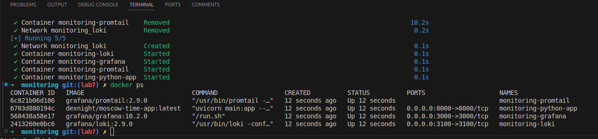
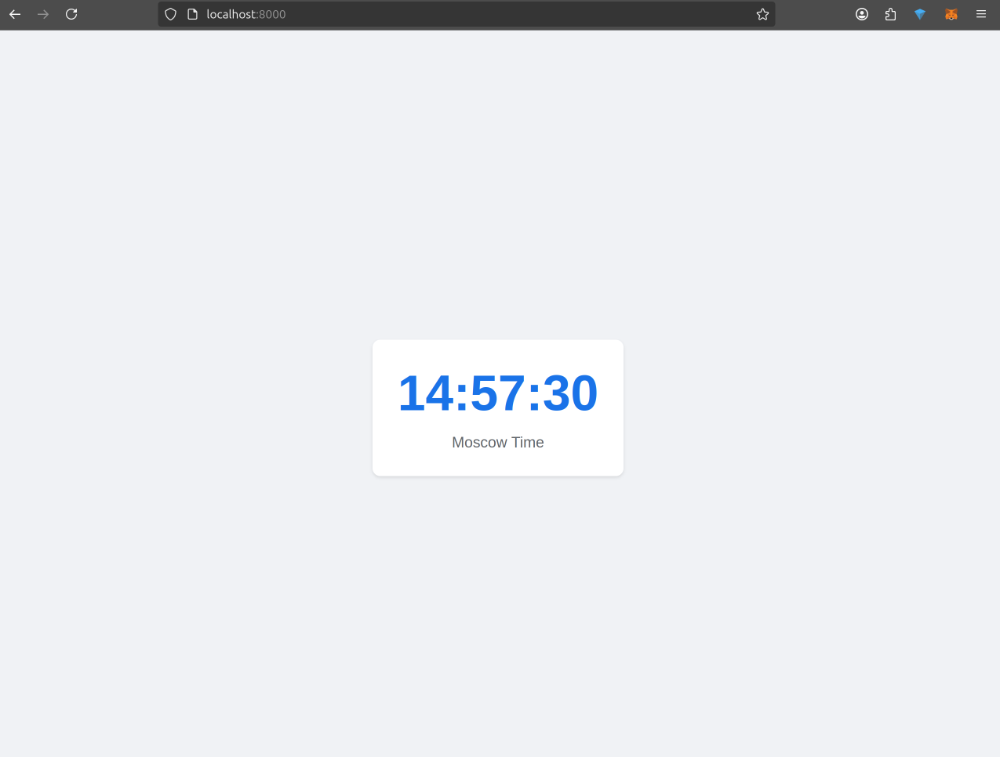
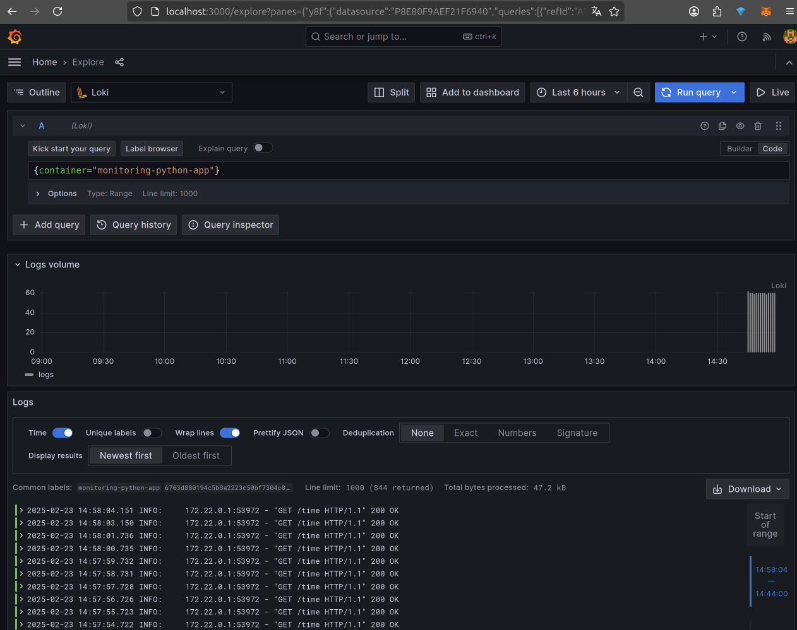
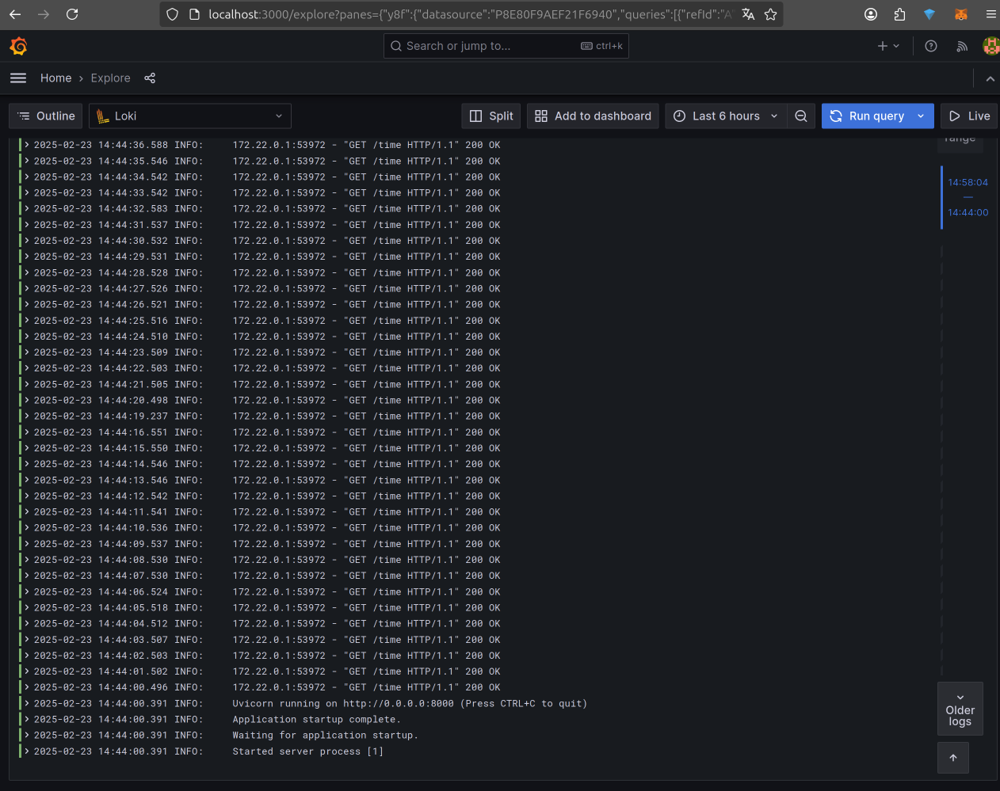

# Logging stack documentation

## Stack Components Overview

Logging stack consisting of:
- **Grafana Loki**: Log aggregation and storage system
- **Promtail**: Log collection agent
- **Grafana**: Visualization interface

## Architecture Details

### Loki Configuration
- Primary log storage and indexing system
- Port: 3100
- Configuration file: `loki-config.yaml`
- Storage path: `/loki`

### Promtail Setup
- Log collection agent
- Monitors Docker containers
- Configuration file: `promtail-config.yaml`
- Features:
  - Docker API integration for container discovery
  - Automatic log shipping to Loki
  - JSON parsing pipeline
  - Container label extraction

### Grafana Integration
- Access port: 3000
- Anonymous access with admin rights
- Pre-configured Loki data source
- Real-time log visualization

## Log Queries

### Basic Queries
```python
# All Python application logs
{container="monitoring-python-app"}

# Filter successful requests
{container="monitoring-python-app"} |= "200 OK"

# Error tracking
{container="monitoring-python-app"} |= "ERROR"
```

## Monitoring Configuration

### Docker Compose Setup
```yaml
services:
  python-app:
    logging:
      driver: "json-file"
      options:
        max-size: "10m"
        max-file: "3"
```

### Access Points

- Grafana Dashboard: http://localhost:3000
- Loki: http://localhost:3100
- Promtail Service: http://localhost:9080

### Implementation Steps

1. Infrastructure Setup:
   - Created logging stack directory structure
   - Configured Docker Compose for all services
   - Set up volume mappings for persistence


2. Log Collection Configuration:
   - Implemented Promtail configuration
   - Set up Docker log access
   - Configured log parsing rules


3. Visualization Setup:
   - Configured Grafana data sources
   - Set up basic log queries
   - Implemented monitoring dashboards


### Screenshots

#### Running containers


#### Moscow time fastapi application


#### Grafana Query


#### Grafana Output



### Best Practices Implemented

1. Log Retention:
   - Configured log rotation
   - Set size limits for log files
   - Implemented cleanup policies


2. Security:
   - Non-root user configurations
   - Limited volume access
   - Controlled port exposure


3. Performance:
   - Optimized log collection rules
   - Efficient label usage
   - Query optimization


### Maintenance

1. Log volume monitoring
2. Performance metrics review