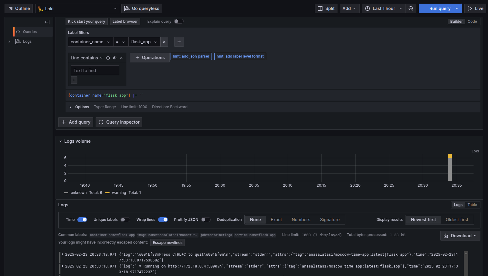
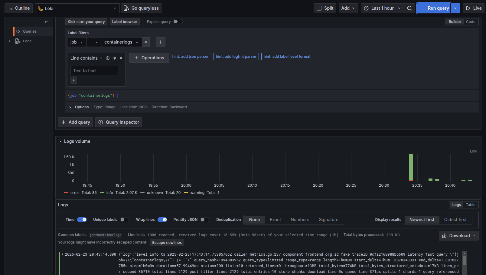
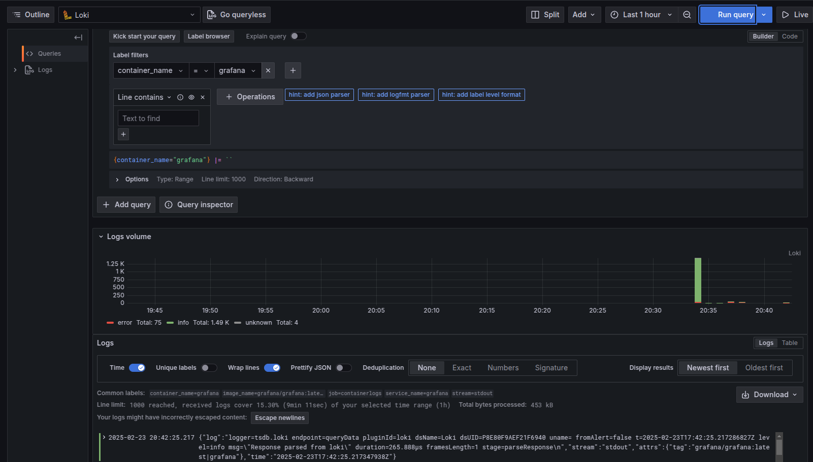
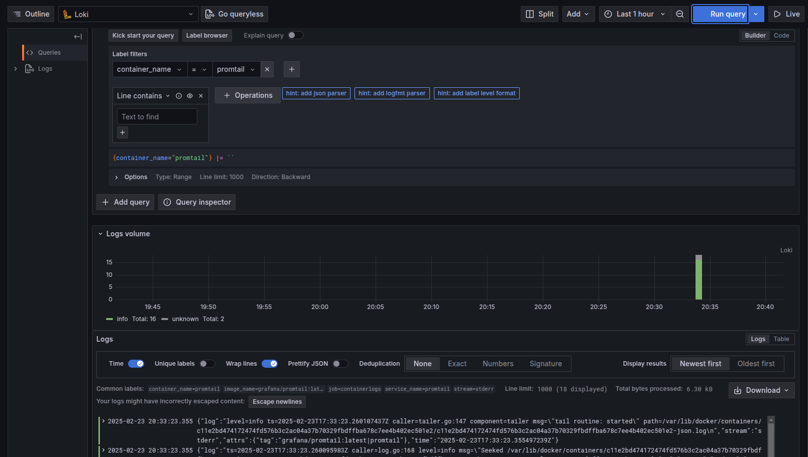

#  Logging Report

## **Overview**

This document provides an overview of the logging stack set up for monitoring the containerized applications. The stack includes **Grafana**, **Loki**, and **Promtail** to collect, visualize, and manage logs from various services running in Docker containers.

## ⚙️ **Logging Stack Components**

The stack consists of the following key components:

1. **Grafana**  
   Grafana is a powerful open-source analytics platform used to visualize and monitor logs, metrics, and other time-series data. In this setup, Grafana is used as the frontend for viewing and querying the logs collected by Loki.

2. **Loki**  
   Loki is a log aggregation system that is highly scalable and designed to work with Grafana. It efficiently collects logs from various sources (in this case, Docker containers) and makes them available for querying. Loki stores logs in a structured way for easy querying and visualization in Grafana.

3. **Promtail**  
   Promtail is an agent that collects logs from various sources and sends them to Loki. In this setup, Promtail is configured to scrape logs from Docker containers by reading the logs from the `/var/lib/docker/containers/` directory. Promtail parses the logs and adds metadata labels such as `container_name` and `image_name` to allow for better filtering and querying in Grafana.

---

## **Configuration Details**

The logging stack is orchestrated using **Docker Compose**, which ensures the proper linking and networking of each component. Here's how each service is configured:

1. **Grafana Service**  
   - **Image**: `grafana/grafana:latest`
   - **Ports**: Exposes port `3000` for the Grafana web interface.
   - **Environment Variables**: Allows anonymous access to Grafana and sets up a default user role.
   - **Provisioning**: Automatically configures Loki as a data source through a shell script in the entry point.

   **Role in the Stack**:  
   Grafana serves as the visualization platform that allows users to explore and query logs stored in Loki.

2. **Loki Service**  
   - **Image**: `grafana/loki:latest`
   - **Ports**: Exposes port `3100` to receive log data.
   - **Command**: Uses the default Loki configuration (`-config.file=/etc/loki/local-config.yaml`).
   - **Role in the Stack**:  
   Loki receives and stores logs, making them queryable through Grafana. Logs are sent to Loki via Promtail.

3. **Promtail Service**  
   - **Image**: `grafana/promtail:latest`
   - **Volumes**:  
     - `/var/log:/var/log` to access system logs.
     - `./promtail-config.yml:/etc/promtail/config.yml:ro` to use the custom Promtail configuration.
   - **Command**: Runs with a custom configuration file to specify which logs to scrape and where to send them (Loki).
   
   **Role in the Stack**:  
   Promtail is responsible for collecting logs from containers and sending them to Loki. It also adds labels to the logs for better identification and querying.

---

## **Data Flow in the Logging Stack**

1. **Logs Collection**:  
   Promtail scrapes the log files from Docker containers located in `/var/lib/docker/containers/`.

2. **Log Forwarding to Loki**:  
   Promtail forwards the logs to Loki's API endpoint (`http://loki:3100/loki/api/v1/push`).

3. **Logs Querying and Visualization**:  
   Grafana queries the Loki database and visualizes the logs on the web interface, making it easy to explore the log data.

---

## **Screenshots**

#### 1. 
     

#### 2. 
     

#### 3.
     

#### 4.
     
   
---
