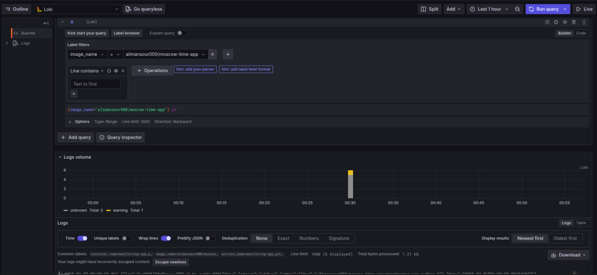
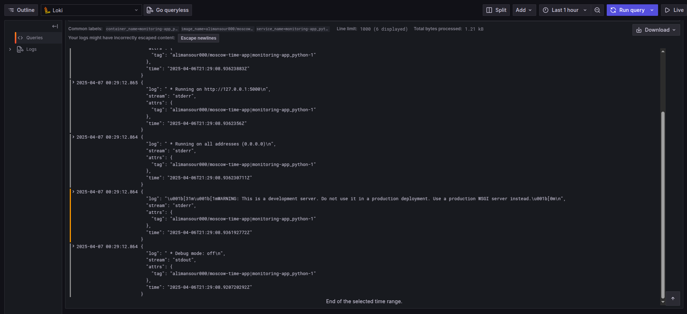
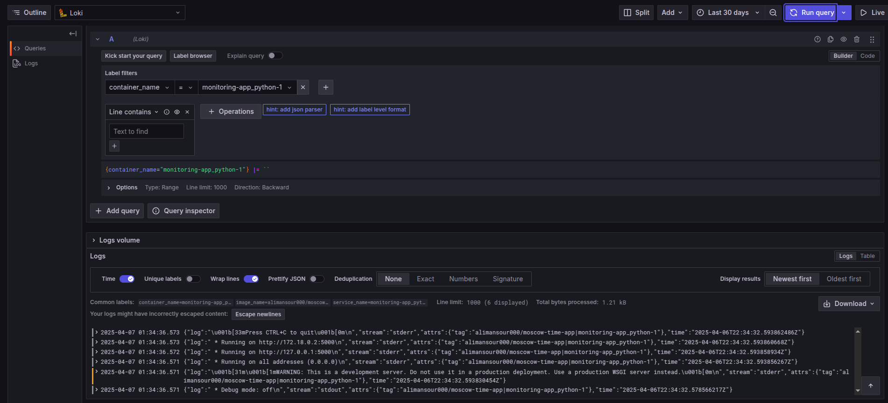
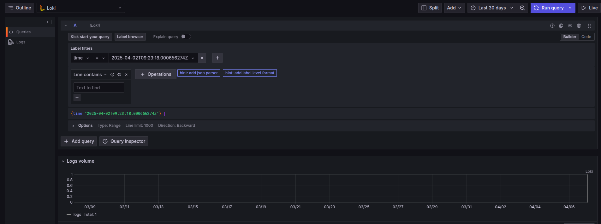
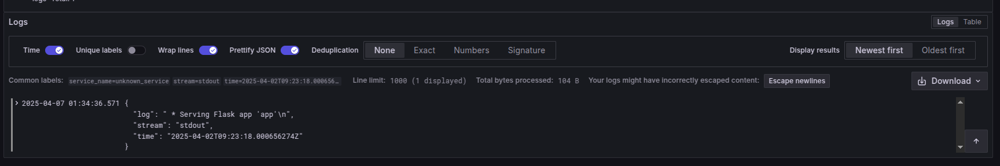
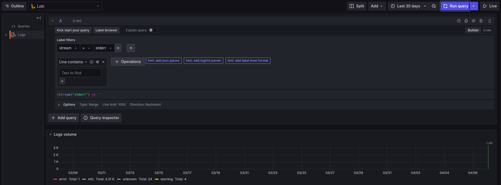
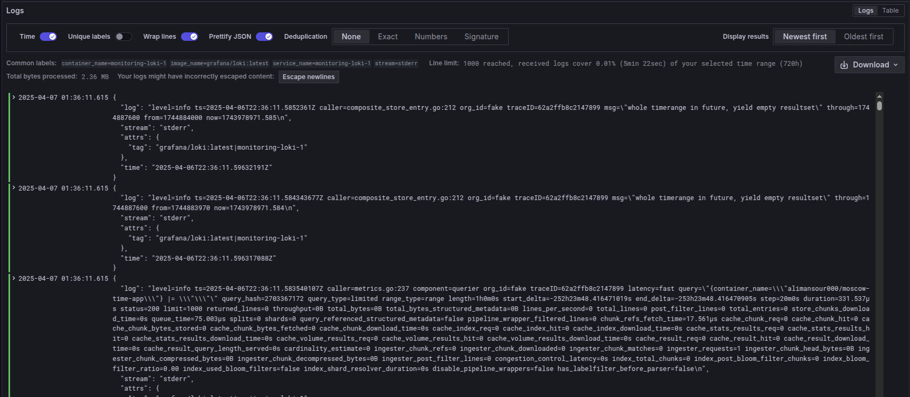

# Logging Stack Summary

## Overview

This document outlines the setup and functionality of a log monitoring stack powered by **Promtail**, **Loki**, and **Grafana**. It describes how logs are gathered, stored, and visualized for easier debugging and observability.

---

## Core Components

### 1. Promtail – Log Forwarder
- **Role**: Collects container logs and forwards them to Loki.
- **Setup Highlights**:
  - Watches logs under `/var/lib/docker/containers/*/*log`.
  - Extracts metadata such as `image_name` and `container_name`.
  - Pushes logs to Loki’s HTTP endpoint: `http://loki:3100/loki/api/v1/push`.
- **Pipeline Functionality**:
  - Parses incoming logs as JSON.
  - Enriches logs with timestamps and labels for efficient indexing.

### 2. Loki – Log Storage & Indexing
- **Role**: Central component that stores and organizes logs from Promtail.
- **Configuration**:
  - Accepts log data on port `3100`.
  - Efficiently stores logs using stream-based architecture.
  - Uses labels for sorting logs, including `image_name` and `container_name`.

### 3. Grafana – Data Visualization
- **Role**: Serves as the dashboard for querying and viewing logs from Loki.
- **Setup**:
  - Loki is registered as a data source via `http://loki:3100`.
  - Provides rich filtering and visualization capabilities.
  - Available at port `3000`.

---

## How to Launch the Stack

Start all components using Docker Compose:

```bash
docker-compose up -d
```

**Access Points**:
- App: [http://localhost:5000](http://localhost:5000)
- Grafana UI: [http://localhost:3000](http://localhost:3000)

---

## Sample Queries in Grafana

Grafana enables querying logs using various labels. Below are examples with corresponding screenshots.

### Query by `image_name`
- Filter logs by the Docker image being used.
- 
- 

### Query by `container_name`
- Show logs from a specific container.
- 

### Query by `time`
- Narrow log results to a specific time window.
- 
- 

### Query by `stream` Type
- View standard vs error logs.
- 
- 

---
