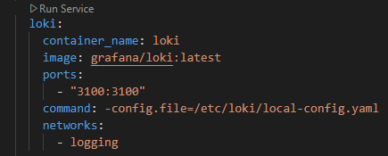
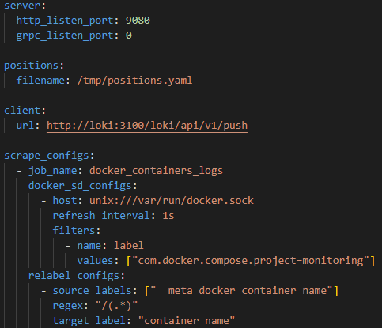
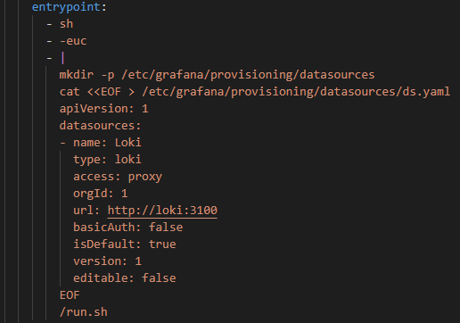
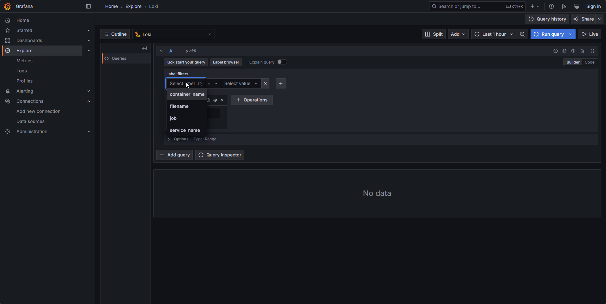
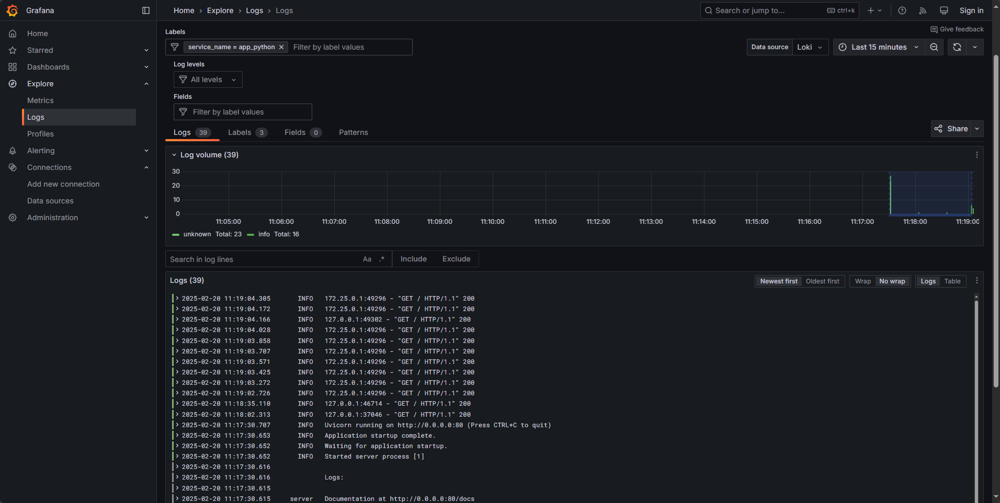
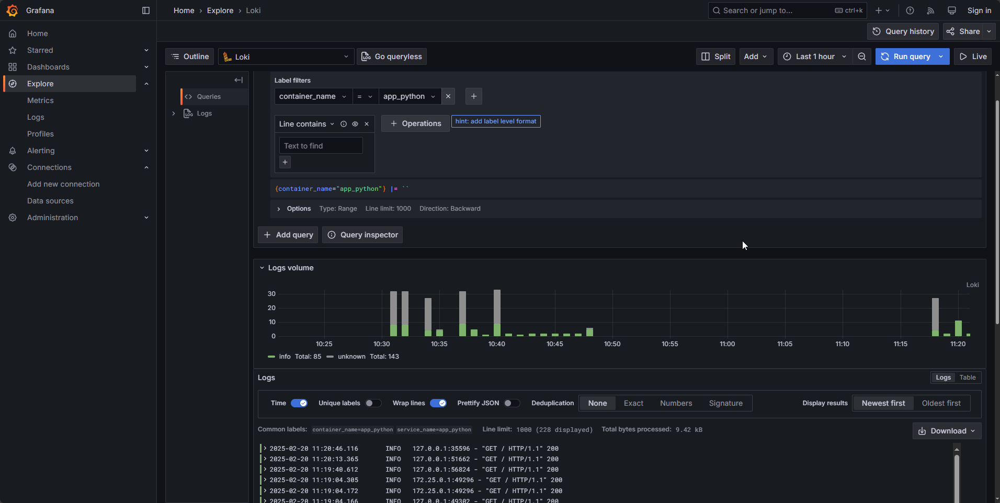
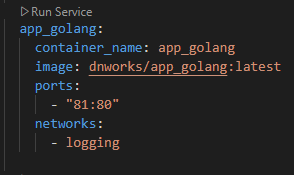
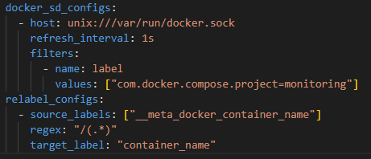
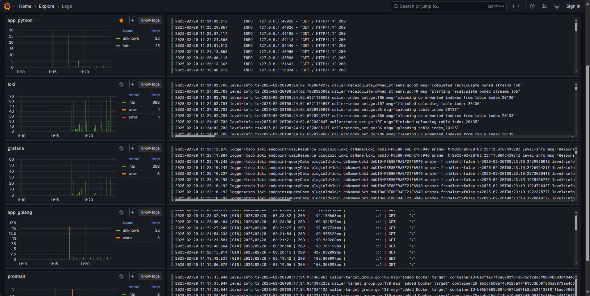
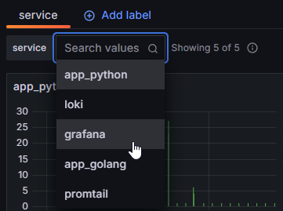

# Logging stack

## Components

The logging stack, which is used in this assignment, consists of three main components:

1. Loki
2. Promtail
3. Grafana

Let's consider each component in detail.

### Loki

Loki is the multiple-source log aggregation system, which is inspired by Prometheus. This system indexes only the metadata and stores unstructured compressed logs, which reduces operation costs and improves simplicity. \
In this particular case, it is used for log aggregation, query processing, and also as a datasource (source of logs) for Grafana.

I used the default config because there is no need in custom config for now.

### Promtail

Promtail is the agent that collects logs from specified sources and sends them to Loki via its interface. Usually, this agent is running on every machine that contains operating applications, which should be monitored.
Promtail discovers targets, attaches labels and pushes them to Loki instance via API.

I used custom config because I need to specify the sources of logs that should be collected by Promtail.
In the config, I specified:

- the endpoint for logs pushing (`http://loki:3100/loki/api/v1/push`)
- `docker` backend configuration — it is used here for collecting the logs primarly from the Docker Compose project containers.
- `relabel_configs` - to label the logs by the container's name

### Grafana

Grafana is an open source platform that allows to monitor and analyze data from various databases with a rich visualization functionality. \
In this particular case, we can use it for querying and viewing the logs.

I added Loki as the datasource by specifying its address and basic settings.

## Operation of logging stack

## Bonus task

### Extra app integration

I have extended the `docker-compose.yml` configuration to include my additional application.

### Collecting logs from all containers

I have configured Promtail to collect logs from all containers from `docker-compose.yml` file.

