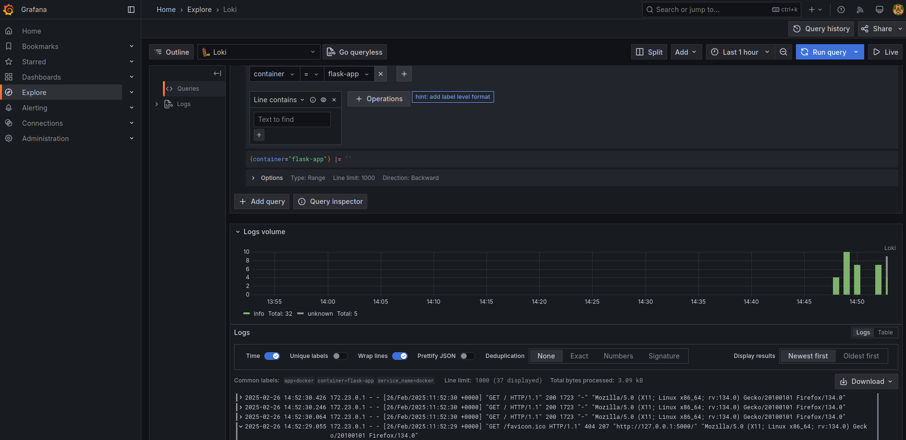

# Docker Compose and Networking

**Docker Compose** orchestrates the startup and configuration of all services in stack. By defining services, networks, and volumes in a single file, Compose ensures that all containers have consistent configurations and can communicate properly.

I created a **logging-network** as user-defined bridge network that facilitates communication between services. All containers in this stack share this network so they can easily talk to each other.

By default, Docker redirects the container’s `stdout` and `stderr` to Docker’s logging system. Notice the label `log_collect: "true"`. This label is critical—Alloy looks for containers with this label to know that it should collect logs from them.

When the app writes log statements (e.g., Flask logs, print statements), those logs go to the container’s standard output. Docker captures those and makes them available to any log collector that can read from the Docker daemon (Alloy).

Alloy is a log collection and forwarding agent developed by Grafana. It can discover running containers, tail their logs, process or transform them if configured, and ship them to Loki (or other destinations).

## How it works:

1. Alloy periodically inspects the Docker daemon to find containers that have been labeled for log collection. In my setup there is only one such container
2. Once identified, Alloy opens a log stream from these containers’ stdout/stderr.
3. Alloy applies relabeling, to make it easier to search the logs in grafana.
4. Alloy forwards the structured (or raw) logs to the Loki service.

Loki is a horizontally scalable, highly available, and multi-tenant log aggregation system. It’s designed for low-cost, high-volume ingestion of log data.

Grafana is the visualization and dashboarding platform.

For grafana, I created a **grafana-storage** volume - it persists Grafana’s internal database (dashboards, users, etc.). If you remove the Grafana container, you can redeploy without losing your dashboards and configurations.

This architecture provides a clean, scalable way to monitor and troubleshoot the Flask application by centralizing logs, making them searchable, and displaying them on customizable dashboards.
