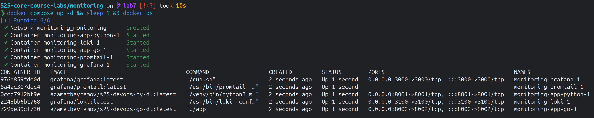
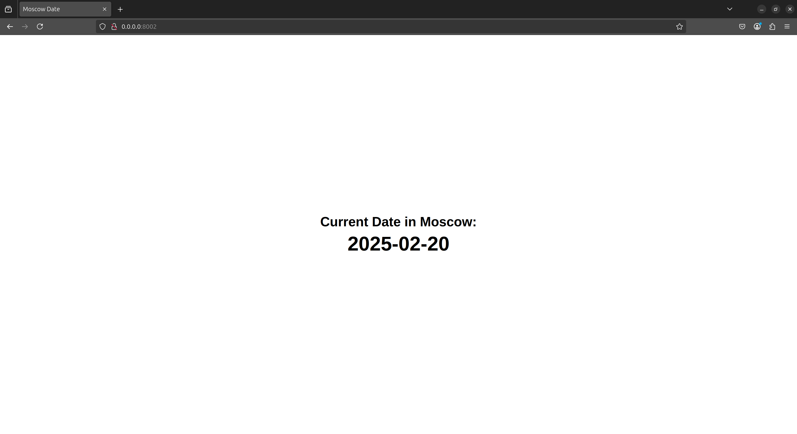
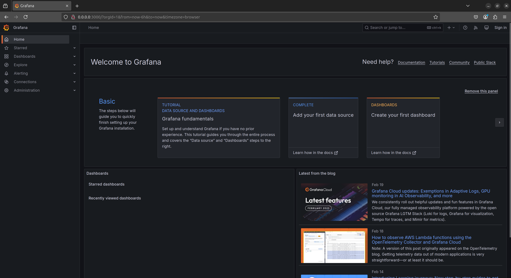
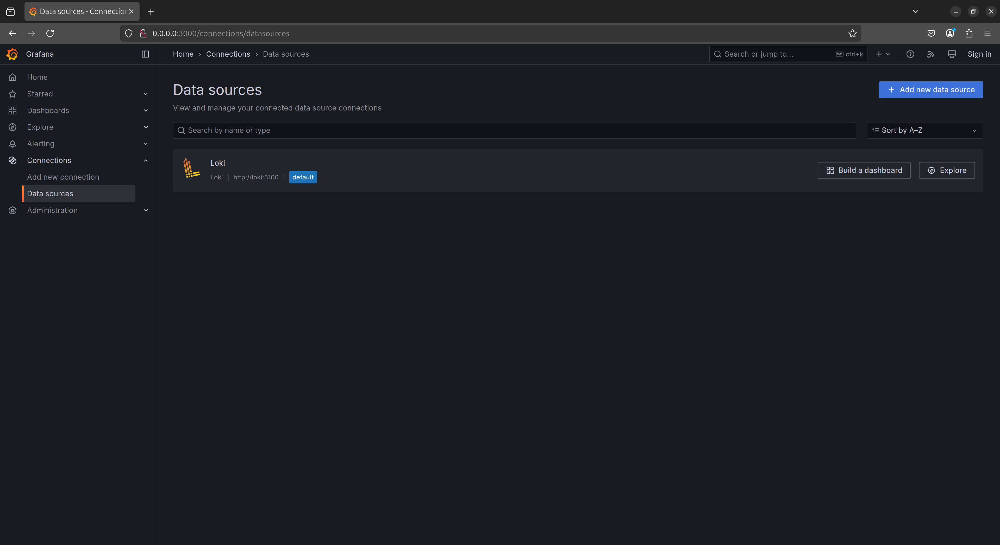
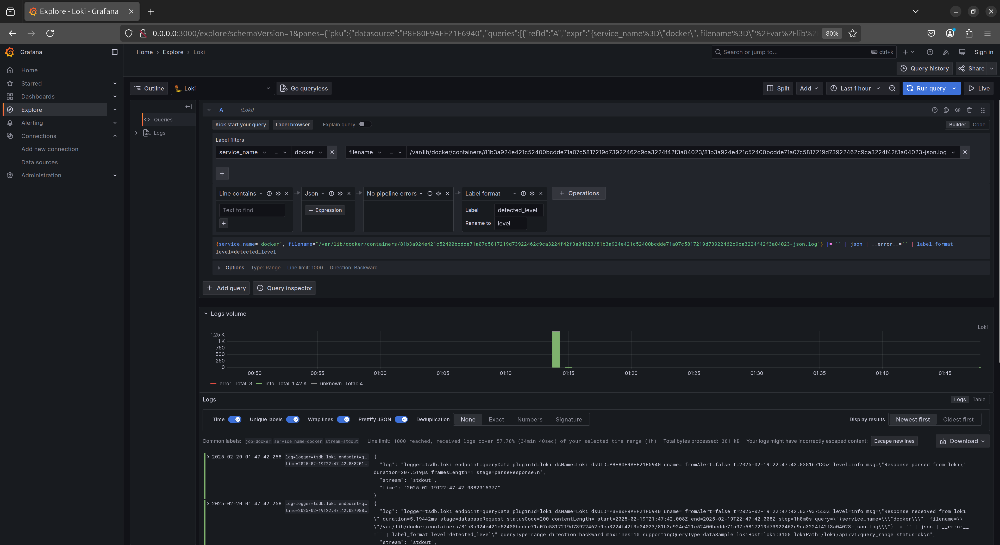
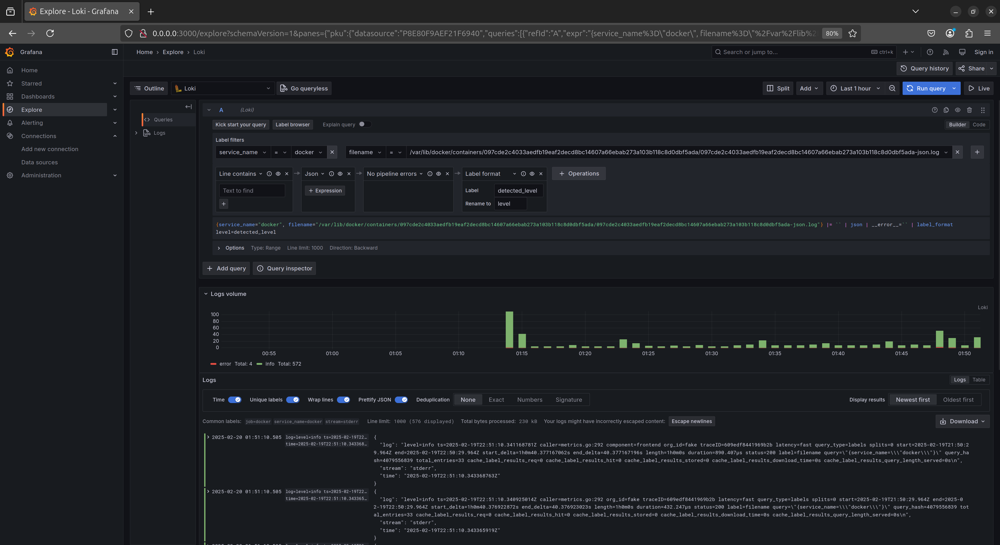
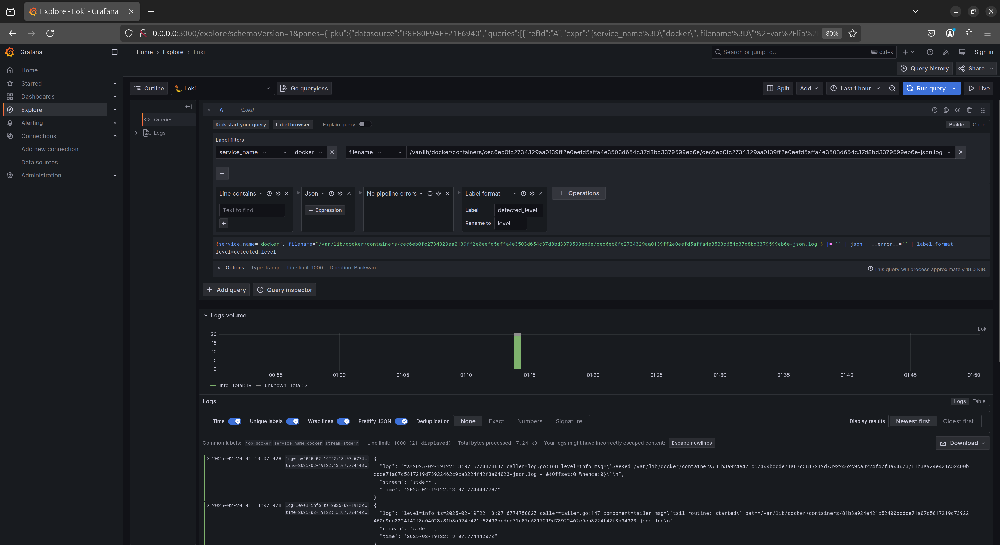
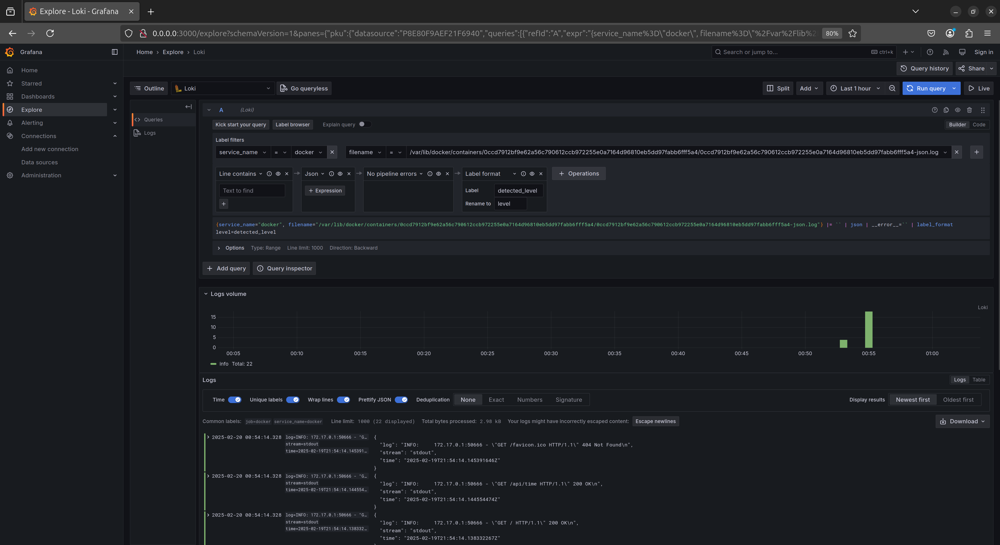
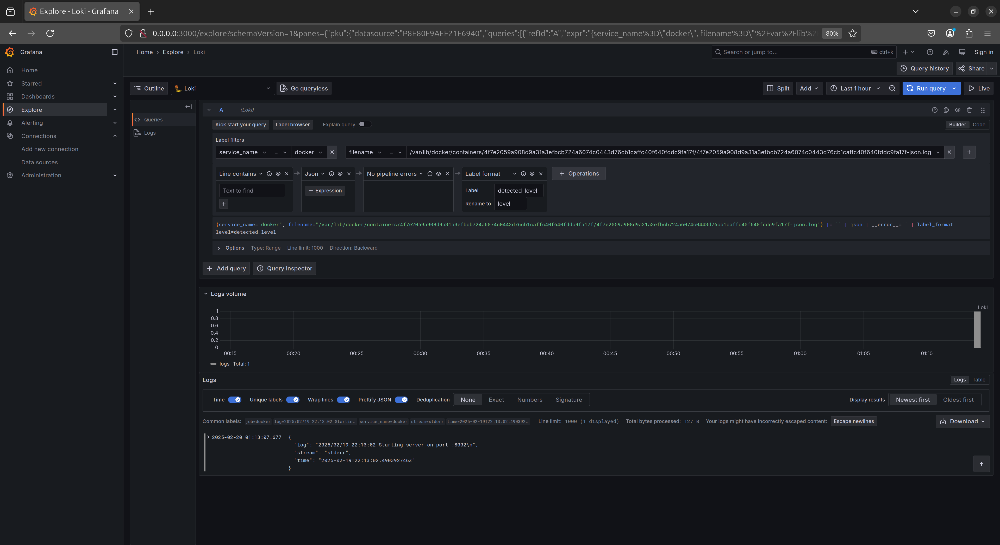

# Logging Stack Report

## Stack Components

### Loki

It is a scalable log aggregator. It indexes logs and stores them in a time-series database.

It listens on port `3100` for incoming log data. Logs are stored persistently in the `loki-data` volume.

### Promtail

It is an agent that collects logs from the Docker container and forwards them to Loki. It scrapes log files using the given config.

`promtail.yml` file is configured to scrape logs from the Docker container and forward them to Loki.

### Grafana

Grafana provides UI for the logging stack. It queries Loki for log data and shows dashboards and query results.

It listens on **port** `3000` and is accessible without authentication.

## Screenshots

Start using docker compose up:

Browser App Python:

Browser App Go:

Grafana Main Page:

Grafana Data Sources:

Grafana Logs Grafana:

Grafana Logs Loki:

Grafana Logs Promtail:

Grafana Logs Python:

Grafana Logs Go:

