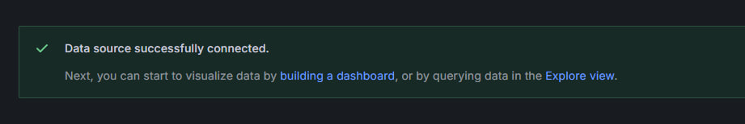

## Stack

- Grafana — A platform for visualizing and analyzing data.
  In this setup, it is used to explore logs and efficiently identify errors through an intuitive interface.

- Loki — A log aggregation system designed for Grafana.
  In this setup, it is used to store logs and enable efficient searching and querying.

- Promtail — An agent responsible for collecting and forwarding local logs to Loki.
  In this setup, it is used to gather logs from the app_python application and send them to Loki for exploration.

## Logs

Unfortunately, I do not know how to monitor separate things
