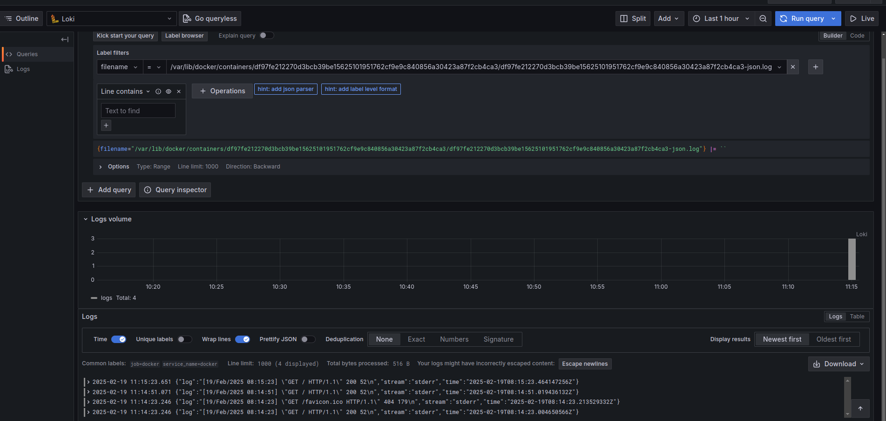
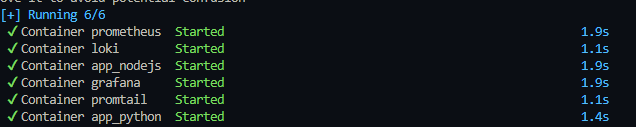
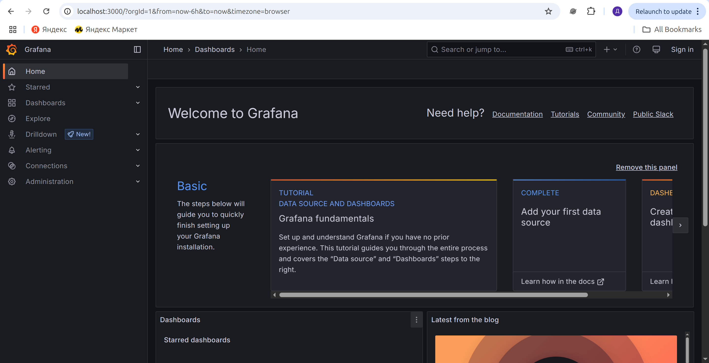
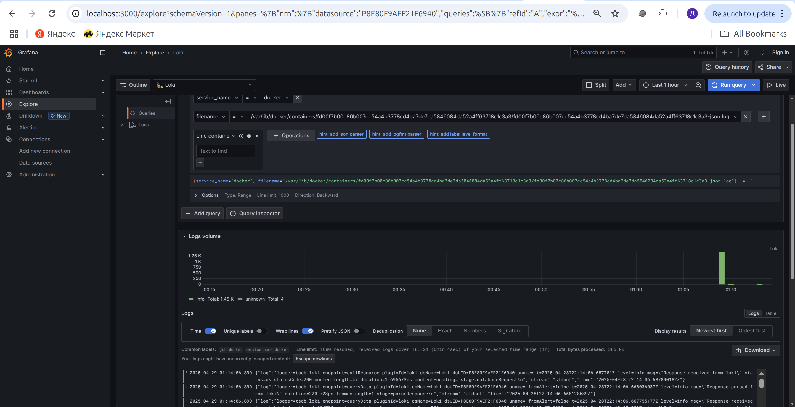
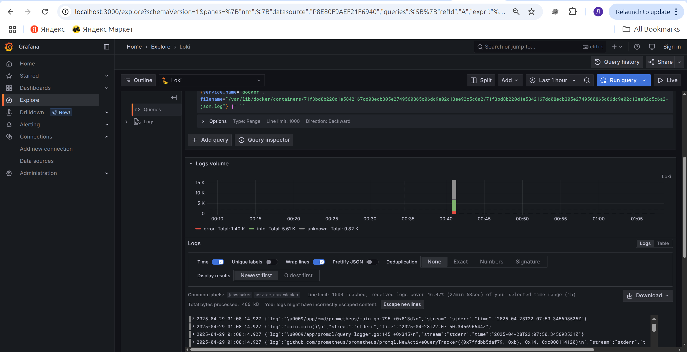
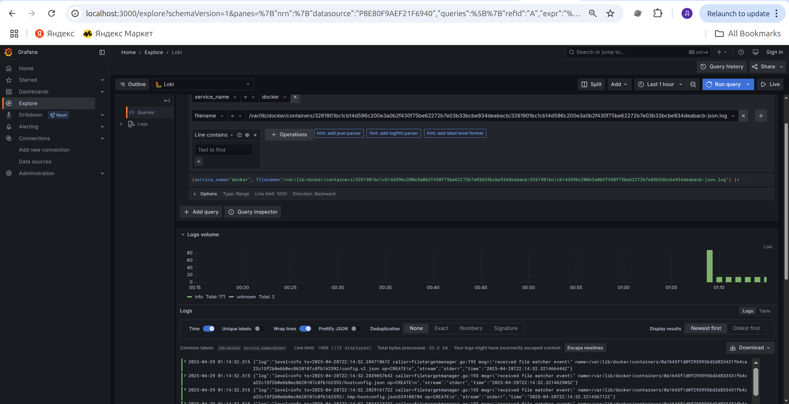

# Logging

### Promtail

Promtail scrapes log files as specified in the `promtail-config.yml`
file and forwards them to Loki for storage.

### Loki

Loki indexes incoming log streams and stores them in a time-series database.
It listens for log input on port `4000`.

### Grafana

Grafana connects to Loki as a data source,
enabling users to view dashboards and run queries on log data.
Grafana is accessible via port `3000`.

## Screenshots

Python Web Application in Browser:

Start with Docker Compose:

Grafana Home Page:

Grafana Data Sources Configuration:

Grafana Logs - Grafana Service:

Grafana Logs - Loki Service:

Grafana Logs - Promtail Service:

