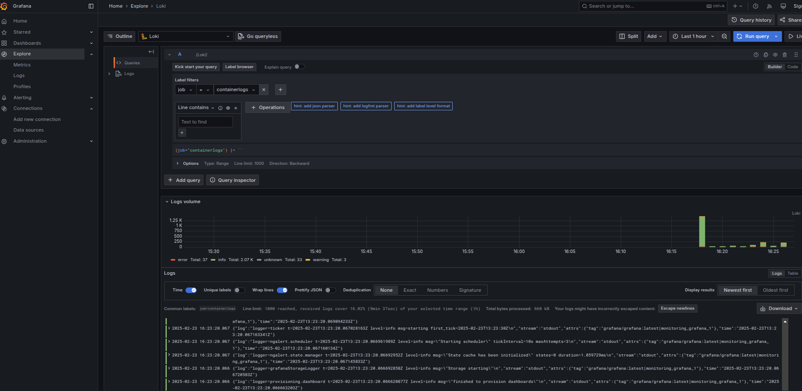
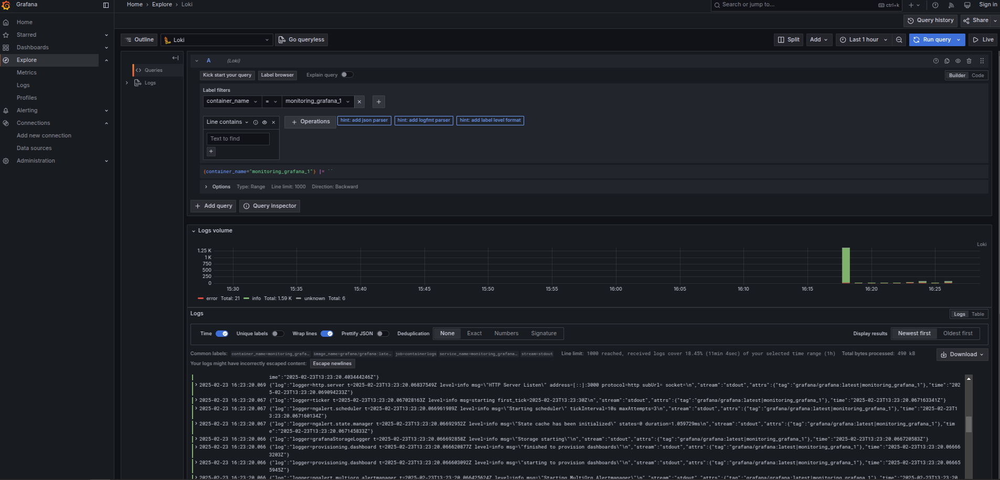
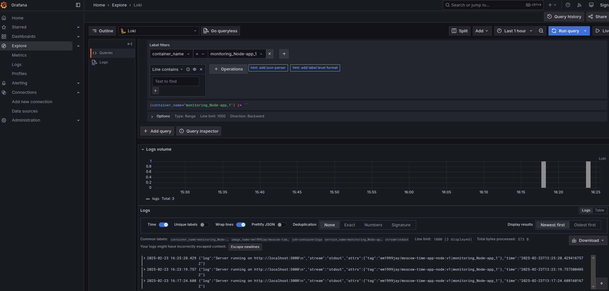
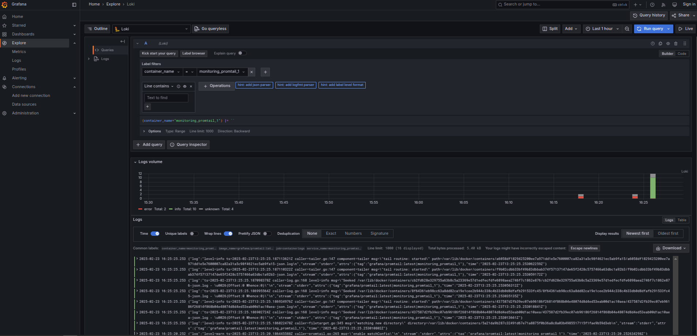
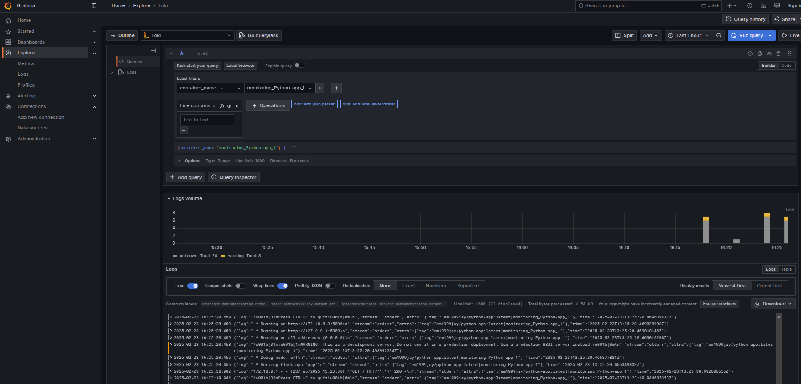

# Logging Stack Report

## Overview

This document outlines the logging stack implemented for Lab 7. The stack comprises three primary components—**Loki**, **Promtail**, and **Grafana**—which together enable centralized collection, storage, and visualization of container logs. In addition, the configuration has been extended (bonus task) to include an extra application for comprehensive logging across all services.

## Components

### Loki

- **Role:**  
  Loki is the backend log aggregation system. It stores and indexes logs sent by Promtail, making them queryable via Grafana.
- **Configuration:**  
  - Runs on port **3100**.
  - Configured with a local configuration file (e.g., local-config.yaml).
  - Receives logs at the endpoint: /loki/api/v1/push.

### Promtail

- **Role:**  
  Promtail acts as a log collector. It scrapes logs from Docker containers and forwards them to Loki.
- **Configuration Details:**
  - **Positions File:**  
    Tracks which log entries have been processed (configured with /tmp/positions.yaml or a persistent file).
  - **Scrape Target:**  
    Reads logs from /var/lib/docker/containers/*/*log.
  - **Pipeline Stages:**  
    - Parses JSON log entries.
    - Extracts labels (such as image_name and container_name) from the Docker logging tag formatted as {{.ImageName}}|{{.Name}}.
    - Uses start_position: end to only process new log entries, avoiding the ingestion of old logs.

### Grafana

- **Role:**  
  Grafana is used for log visualization and analysis. It provides a dashboard to explore logs stored in Loki.
- **Configuration Details:**
  - Auto-provisions Loki as a data source.
  - Runs on port **4000** (accessible via <http://localhost:4000>).
  - Offers query and visualization capabilities to monitor application performance and troubleshoot issues.

### Application Containers

- **Role:**  
  These are the main application services that generate logs.
- **Configuration Details:**
  - **Python App:** em1999jay/python-app:latest
  - **Node App:** em1999jay/moscow-time-app-node:v1
  - Both are configured to use the json-file logging driver with a custom tag.
  
    (Insert a code block here with the following content:)  
    tag: "{{.ImageName}}|{{.Name}}"  
    (End code block)

  - This tagging allows Promtail to extract meaningful labels while avoiding high cardinality.

### Bonus: Extra Application Integration

- **Role:**  
  An additional application has been integrated into the Docker Compose configuration to demonstrate comprehensive logging.
- **Configuration Details:**
  - The extra application is added as an independent service in docker-compose.yml.
  - Promtail is configured to scrape logs from all containers defined in the Compose file.
  - This ensures that every log, regardless of origin, is available for analysis in Grafana.

## Setup and Testing

### Directory Structure

(Sample directory tree)

S25-core-course-labss/  
├── monitoring/  
│  ├── docker-compose.yml  
│  ├── promtail.yml  
└── LOGGING.md

### Running the Stack

1. **Start the Stack:**  
   Navigate to the monitoring directory and run:  

   (Insert a code block here with the command:)  
   docker-compose up  
   (End code block)

2. **Verify Component Operation:**
   - **Loki:** Confirm that logs are being received on port **3100**.
   - **Promtail:** Check container logs to ensure that log scraping is occurring.
   - **Grafana:** Open your browser at <http://localhost:4000> to verify that the Loki data source is correctly configured and logs are visible.
   - **Extra Application:** Ensure that logs from the extra app are visible, demonstrating that the logging stack collects logs from every container.

### Screenshots

Include the following screenshots in your report (update the paths if necessary):

- **Container Logs:**  
  (Insert an image block here with: )
- **Grafana Logs:**  
  (Insert an image block here with: )
- **Node Logs:**  
  (Insert an image block here with: )
- **Promtail Logs:**  
  (Insert an image block here with: )
- **Python Logs:**  
  (Insert an image block here with: )

## Conclusion

The logging stack successfully aggregates logs from multiple application containers (including the bonus extra application), processes them with Promtail, stores them in Loki, and provides visualization through Grafana. This setup not only meets the requirements of Lab 7 but also demonstrates a robust logging solution suitable for production environments.
