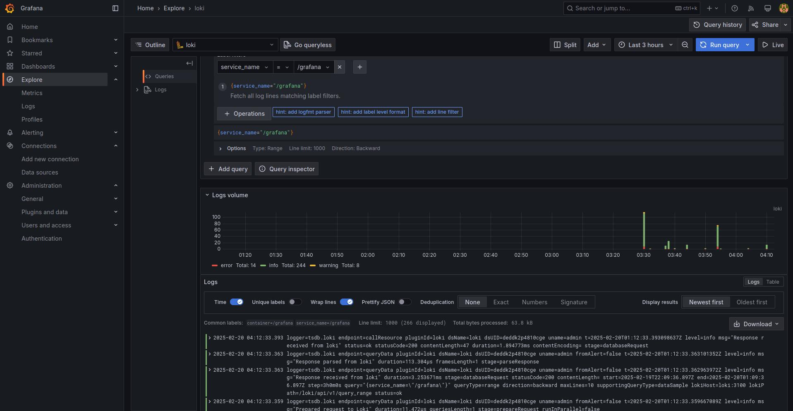
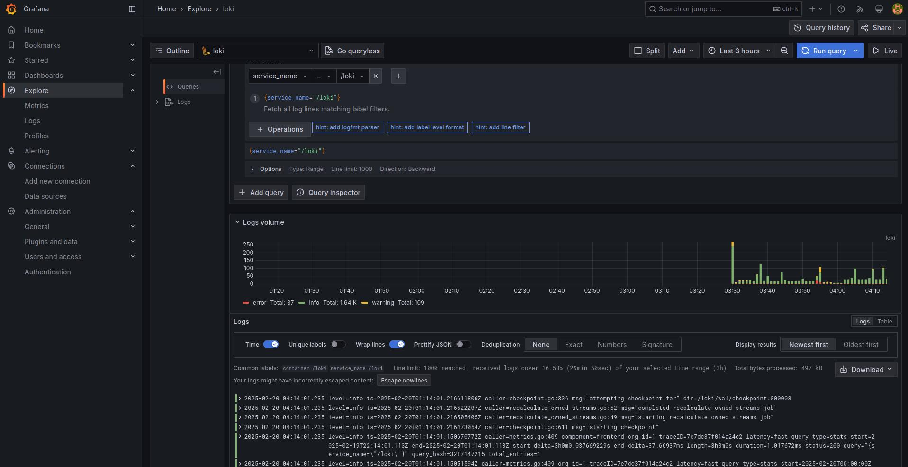
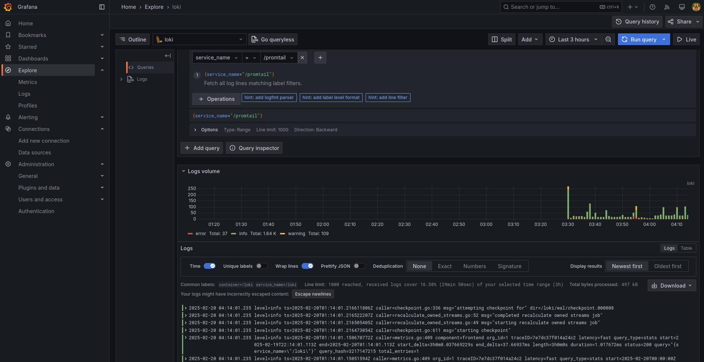

# Logging Overview

## Components

### Loki

Loki is an open-source log aggregation system developed by Grafana Labs. Instead of indexing full log content, it indexes only the metadata, making it cost-effective at large scale. Loki is horizontally scalable, highly available, and supports multi-tenancy, allowing multiple teams or customers to work with their logs securely. By default, it listens on port **3100**.

### Promtail

Promtail is a lightweight agent that forwards local log data to either a private Grafana Loki instance or Grafana Cloud.

### Grafana

Grafana is an open-source platform for analytics and interactive data visualization. By default, it listens on port **3000**.

## Sreenshots

### My app

### Grafana Screen

### Loki Screen

### Promtail Screen

